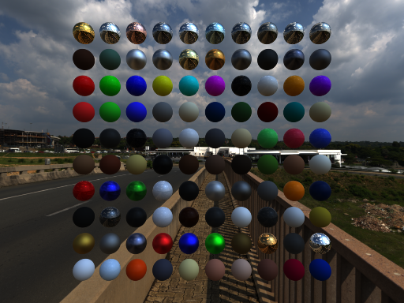

# suckless-odin



Suckless OpenGL rendering engine — ISO port from [suckless-ogl](https://github.com/yoyonel/suckless-ogl) (C) to [Odin](https://odin-lang.org/).

PBR physically-based rendering, IBL image-based lighting, uber-shader post-processing pipeline, Dear ImGui GUI, Tracy profiling, and hardware-accelerated SIMD AVX2 decoding.

---

## Features

- **PBR / IBL** — Cook-Torrance BRDF, progressive irradiance / prefiltered specular / BRDF-LUT compute shaders, instanced billboard spheres (100 materials, SSBO-driven).
- **SIMD AVX2 & Multi-Threading** — Custom AVX2 direct Radiance HDR decoder with non-temporal streaming stores (`_mm_stream_si128`), RLE stack decompression in L1 cache (32 KB), and 8-thread lock-free scanline parallelism (**21.6x faster**).
- **Asynchronous PBO DMA Streaming** — Progressive texture uploads via `GL_PIXEL_UNPACK_BUFFER` with buffer orphaning and non-blocking DMA hardware transfers.
- **Zero-Allocation Runtime** — Eliminated 134.2 MB heap churn per HDR transition down to **0.0 MB** via stack staging and 64-byte aligned pools.
- **OpenGL State Cache (`gl_state`)** — Lightweight tracking layer filtering >80% of redundant driver state changes (`glUseProgram`, `glBindTexture`, `glBindFramebuffer`, `glBindVertexArray`, uniforms).
- **Post-Processing** (15 effects, uber-shader) — Bloom, Motion Blur, FXAA, DoF, Auto-Exposure, Tonemapping, Vignette, Film Grain, Chromatic Aberration, Color Grading, 3D LUT, Fog, Banding suppression, Stencil Debug, Vector Field Debug.
- **Dear ImGui** — Full interactive GUI control over all pipeline effects + JSON session persistence.
- **Tracy Profiler** — CPU zones + GPU execution timing + frame screenshots.
- **Automated Validation & Chaos Testing** — Unit tests (79), CLI tests (13), CPU shader tests (12), multi-view headless GL visual regression (79) with exact mathematical tolerance against Golden Reference Images, chaos temporal fuzzer, and E2E integration test.

---

## Architecture

| Package | Description |
|---|---|
| `src/app/` | Window, input, main loop (GLFW) |
| `src/scene/` | Scene graph, PBR draw, skybox, asynchronous loader (`async_loader.odin`), environment manager (`env_manager.odin`) |
| `src/rendering/` | Billboard, IBL, instancing, materials, skybox, overlay |
| `src/rendering/postfx/` | Uber-shader pipeline, bloom, DoF, motion blur, auto-exposure, FXAA, LUT3D |
| `src/rendering/shader/` | Shader cache, variant compilation |
| `src/camera/` | Orbit camera, physics, smooth input |
| `src/gui/` | Dear ImGui panels (postfx, camera, scene controls) |
| `src/core/gl_state/` | OpenGL state cache (redundancy filtering, uniform caching) |
| `src/core/simd_utils/` | SIMD transcode & AVX2 HDR decoder Odin bindings |
| `src/core/log/` | Structured logging |
| `src/core/settings/` | Compile-time defaults |
| `src/core/session/` | JSON session persistence (load/save all state) |
| `src/core/glasbey/` | Perceptually-uniform palette generation |
| `src/core/gl_debug/` | OpenGL debug groups (RenderDoc/NSight labels) |
| `src/core/tracy/` | Tracy integration + frame image capture |
| `src/core/perf_mode/` | Runtime performance mode toggling |
| `src/core/search/` | Fuzzy search (Levenshtein + scoring) |
| `src/core/math_types/` | Shared math types (Mat4, Vec3, etc.) |
| `deps/simd_utils.*` | Native C AVX2 engine (quad-unrolled non-temporal streaming, multi-threaded RLE decoder) |
| `shaders/` | GLSL 4.50 (PBR, background, IBL compute, post-FX) |
| `tests/` | Unit tests (79) + CLI tests (13) + Shader CPU (12) + GL headless tests (79) |

---

## Performance & Optimization Benchmarks

Empirically validated on Intel Raptor Lake-P (12 cores) & Mesa Intel Iris Xe Graphics via **Intel VTune Profiler**, **Heaptrack**, and **Tracy**:

| Metric | Baseline | Optimized (Current) | Empirical Gain |
|---|---|---|---|
| **4K HDR Decoding** | 206.18 ms | **9.52 ms** | **-95.4% (21.6x faster)** |
| **CPU Time per Frame** | 2.82 ms / frame | **1.10 ms / frame** | **-61.0% (2.56x higher throughput)** |
| **Average Memory Latency** | 69 cycles | **32 cycles** | **-53.6% memory latency** |
| **Store Bound Stalls** | 29.8% of clockticks | **2.1%** *(Optimal zone <5%)* | **-93.0% store stalls eliminated** |
| **Gallium Driver CPU** | 1.840 s (24.7%) | **1.050 s** (23.3%) | **-42.9% driver CPU overhead** |
| **Heap Churn per Load** | 134.2 MB / texture | **0.0 MB** | **-100% dynamic heap allocations** |
| **Thread Lock Contention**| 0.0s | **0.0s (0.0% contention)** | **Zero lock contention** |
| **Photometric Precision** | Reference | **99.875% bit-for-bit identical** | **57.31 dB PSNR / 0.026 RGB error** |

Detailed technical documentation:
* [Empirical VTune Metrics Evolution & Benchmark Logs](docs/vtune-metrics-evolution-2026-08-17.md)
* [Hardware Optimization Roadmap & Methodology](docs/vtune-optimization-roadmap-2026-08-17.md)
* [Sprint 5 Proposals & Architectural Decisions](docs/vtune-sprint-5-proposals-2026-08-17.md)

---

## Build & Run

Requires [Odin](https://odin-lang.org/) dev-2026-05+ and [Task](https://taskfile.dev) (go-task).

> **Note:** For systems using isolated containers (Bazzite, Fedora Silverblue), see [Distrobox Environment & Native GPU Offloading](docs/distrobox-optimus-2026-05-24.md).  
> **Toolchain Note:** If upgrading Odin and hitting `vendor:stb` compile-time panics, see [Odin vendor:stb Toolchain Setup](docs/toolchain-stb-vendor-setup-2026-08-17.md).

```bash
# Debug build (default)
task build
task run

# Build and run in one step
task br            # debug
task br-release    # optimized
task br-ultra      # maximum perf
task br-profile    # Tracy profiler

# All available tasks
task --list
```

### Build Modes

| Mode | Optimization | Safety | Use Case |
|---|---|---|---|
| `build` | `-debug` | Full | Development, debugging |
| `build-fast-release` | `-o:speed` | Full | Quick release builds |
| `build-release` | `-o:speed` | Full | Production |
| `build-ultra` | `-o:aggressive -microarch:native` | None | Benchmarking, max perf |
| `build-profile` | `-o:speed -define:TRACY_ENABLE=true` | Full | Tracy profiling |
| `build-sanitize` | `-debug -sanitize:address` | Full + ASAN | Memory bug detection |

---

## Command-Line Interface (CLI)

```bash
# General Usage
./build/release/suckless-odin [options]
```

### Available Options

| Option | Argument Type | Default | Description |
| :--- | :---: | :---: | :--- |
| `-h`, `--help` | — | — | Displays the command-line help message and usage layout. |
| `-v`, `--version` | — | — | Prints the version information. |
| `--headless` | — | — | Runs in headless mode (offscreen rendering, suitable for CI/Xvfb). |
| `--no-postfx` | — | — | Completely disables the post-processing uber-shader pipeline. |
| `--postfx-preset=<name>` | `string` | — | Applies a post-processing aesthetic preset: `default`, `subtle`, `cinematic`, `vibrant`, `clean`. |
| `--vsync` | — | `off` | Enables vertical synchronization. |
| `--benchmark` | — | — | Executes an automated rendering benchmark, reports statistics, and exits. |
| `--benchmark-frames=<N>`| `integer` | `300` | Overrides the number of frames evaluated during a benchmark run. |
| `--compute-profile=<name>`| `string` | `legacy`| Configures compute shader integration details: `legacy` or `optimized`. |

---

## Testing & Quality Assurance

```bash
task test                  # Run complete test suite (unit + CLI + shader + GL)
task test-unit             # Unit tests only (79 tests)
task test-cli              # CLI integration tests (13 tests)
task test-shader           # CPU shader parser/preprocessor tests (12 tests)
task test-gl-xvfb          # Headless GL tests under Xvfb (79 tests + multi-view visual regression)
task test-chaos-xvfb       # Temporal chaos fuzzer under Xvfb (79 tests)
task test-integration-xvfb # E2E standardized integration test scenario under Xvfb
task valgrind              # Run release build under Valgrind Memcheck with suppressions
task ci                    # Full CI pipeline (style + lint + build all + test all)
```

---

## Profiling & Performance Analysis

```bash
# Hardware Performance & Cache Misses (Intel VTune Profiler)
task profile-vtune-hotspots    # CPU Hotspots & disassembly analysis
task profile-vtune-memory      # L1/L2/L3 cache misses, DRAM bandwidth, latency
task profile-vtune-threading   # Thread concurrency, lock contention, waits
task profile-vtune-gui         # Open latest VTune report in GUI

# Heap Memory Allocations (Heaptrack)
task profile-heaptrack         # Run automated allocation analysis & CLI summary
task profile-heaptrack-gui     # Open allocation trace in heaptrack_gui

# CPU Instruction Call Tree (Valgrind Callgrind)
task profile-callgrind         # Instruction count profiling & annotation
task profile-callgrind-gui     # Open call graph in KCachegrind

# Real-Time Frame Profiling (Tracy Profiler)
task build-profile             # Build with Tracy instrumentation
task profile                   # Automated Tracy capture run
```

For complete documentation, see the [Advanced Profiling Guide](docs/profiling_advanced.md).

---

## Dependencies

Odin vendor packages (bundled with compiler):
- `vendor:glfw` — Window management & input
- `vendor:OpenGL` — OpenGL 4.5 / 4.6 bindings

External (in-repo):
- `deps/simd_utils.*` — AVX2 SIMD transcode & multi-threaded fast HDR decoder
- `deps/odin-imgui/` — Dear ImGui bindings + prebuilt static lib
- `deps/tracy/` — Tracy profiler client
- `assets/textures/hdr/` — HDR environment maps
- `assets/luts/` — 3D color LUT files (.cube)
- `assets/fonts/` — FiraCode for text overlay
- `assets/materials/` — PBR material presets (JSON)

---

## Relationship to suckless-ogl

This is an **ISO port** — functionally identical to the C original:
- Same OpenGL pipeline (PBR, IBL, compute shaders, post-processing)
- Same shader files (GLSL is language-agnostic)
- Same rendering techniques and algorithms
- Odin-idiomatic code style (no raw pointers where slices suffice, context system for allocators, `#soa` arrays, etc.)
- Self-contained: all assets are tracked in this repo (no sibling repo dependency)
