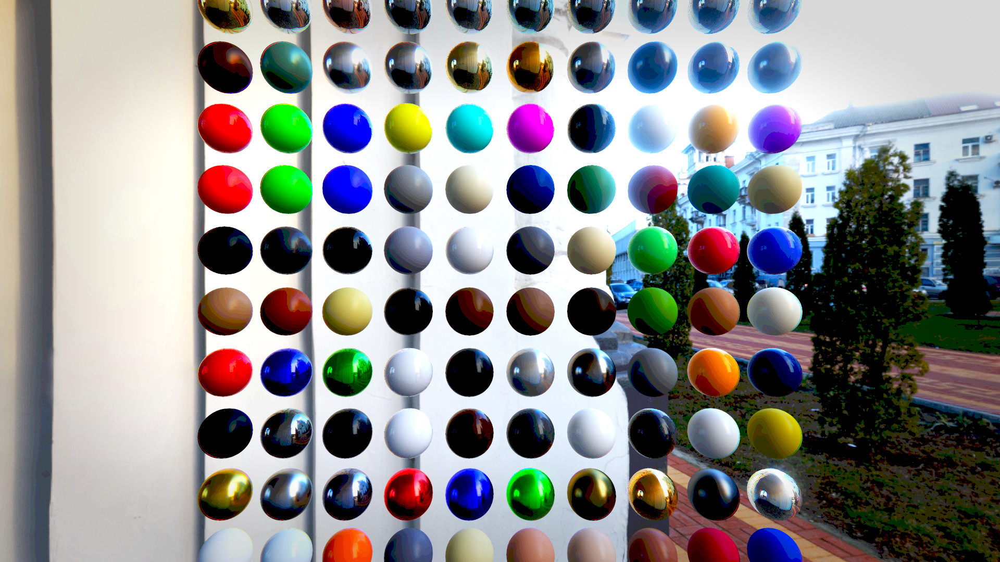
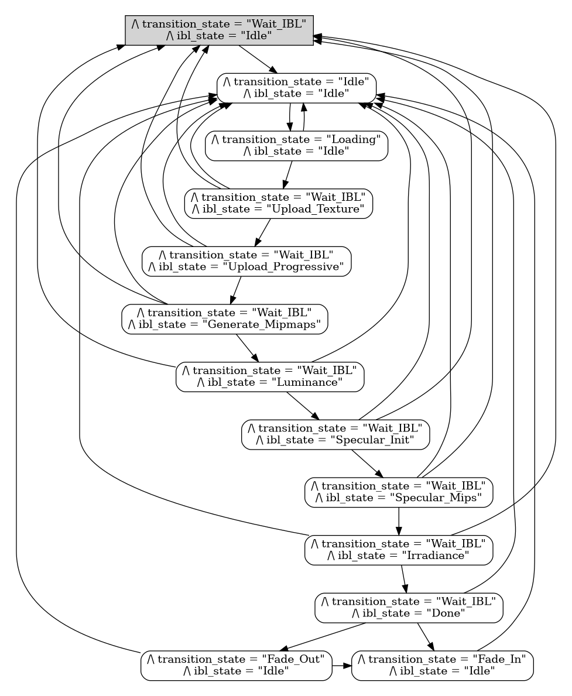
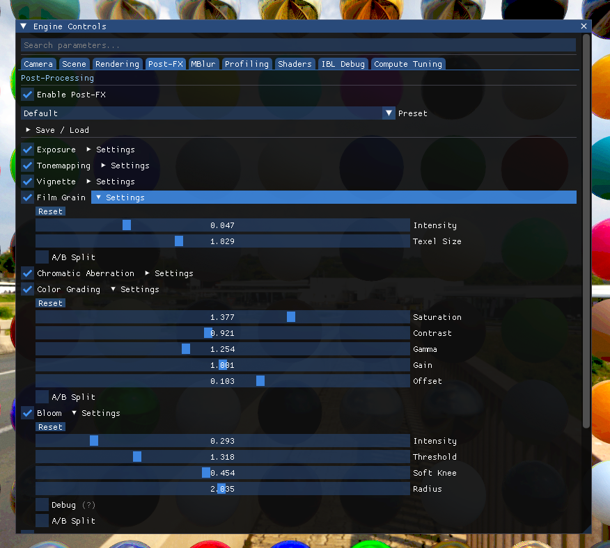
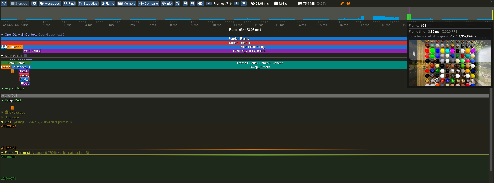
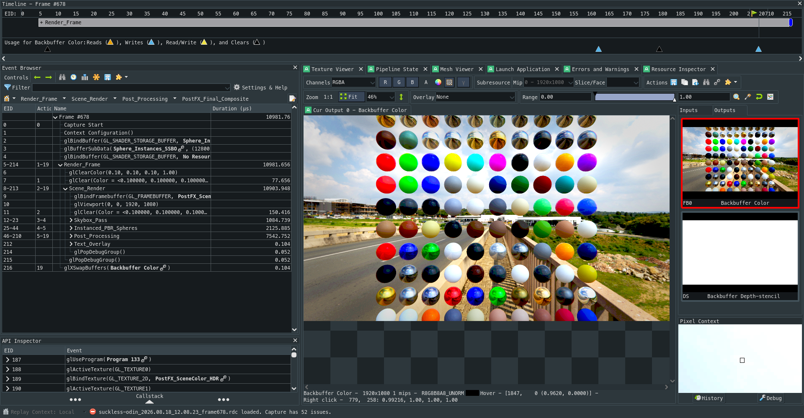

# suckless-odin

[](https://github.com/yoyonel/suckless-odin/actions)
[](https://opensource.org/licenses/MIT)
[](https://odin-lang.org/)
[](https://www.khronos.org/opengl/)
[](https://github.com/wolfpld/tracy)



High-performance, physically-based OpenGL rendering engine — ISO port from [suckless-ogl](https://github.com/yoyonel/suckless-ogl) (C11) to [Odin](https://odin-lang.org/).

Combines Cook-Torrance PBR, Image-Based Lighting (IBL), a 15-effect uber-shader post-processing pipeline, hardware-accelerated AVX2 SIMD decoding, TLA+ formal async state machines, Dear ImGui overlay, and comprehensive profiling suites (Tracy, Intel VTune, Heaptrack, Valgrind).

---

## Key Features

### 🌟 Rendering & Post-Processing
- **Physically-Based Rendering (PBR)** — Cook-Torrance microfacet specular BRDF (GGX distribution, Smith geometric shadowing, Schlick-Fresnel approximation), metallic-roughness workflow, diffuse Lambertian ambient term.
- **Compute-Driven Image-Based Lighting (IBL)** — Real-time progressive GPU compute shaders:
  - Equirectangular 4K HDR $\rightarrow$ Cubemap conversion.
  - Diffuse Irradiance convolution (Monte Carlo hemisphere integration).
  - Prefiltered Specular reflection maps (GGX importance sampling across 5 roughness mip levels).
  - 2D Split-Sum BRDF Integration LUT generation.
- **Instanced Geometry & SSBO Materials** — Dynamic instanced billboard spheres rendering 100 distinct PBR material presets (metals, dielectrics, clearcoats, organics) driven by Shader Storage Buffer Objects.
- **Uber-Shader Post-Processing Pipeline (15 Effects)**:
  - **Bloom** — 13-tap tent filter downsampling and 9-tap bilinear upsampling across 5 progressive mip levels with threshold knee.
  - **Cinematic Depth of Field (DoF)** — Quarter-resolution CoC extraction, near/far bokeh blur passes, autofocus raycasting, manual focal distance and range tuning.
  - **Motion Blur** — TileMax velocity dilation and NeighborMax directional gathering with 2.5D reconstruction filter.
  - **Anti-Aliasing** — Fast Approximate Anti-Aliasing (FXAA 3.11 Quality preset).
  - **Auto-Exposure (Eye Adaptation)** — Compute shader luminance histogram binning and temporal geometric adaptation.
  - **Tonemapping Operators** — ACES Filmic, Extended Reinhard, Uncharted 2, AgX, Neutral, and Linear clamp.
  - **Color Grading & 3D LUT** — Trilinear tetrahedral sampling of `.cube` 3D look-up tables with dynamic blend weight.
  - **Artistic FX** — Film Grain (simplex temporal noise), Chromatic Aberration (spectral fringe offset), Vignette, Banding suppression (dithering), Fog depth integration, and Vector Field / Stencil debug visualization modes.

### ⚡ Performance & Hardware Acceleration
- **SIMD AVX2 Direct Radiance HDR Decoder** — Custom vectorized decoder with non-temporal streaming stores (`_mm_stream_si128`), RLE stack decompression residing in 32 KB L1 cache, and 8-thread lock-free scanline parallelism (**21.6x faster than stb_image**).
- **Direct FP32 $\rightarrow$ FP16 Transcoding** — Native F16C / AVX2 conversion pipeline halving memory bandwidth and VRAM footprint.
- **Zero-Allocation Runtime** — 0.0 MB dynamic heap churn during live HDR transitions via pre-allocated texture pools, stack staging buffers, and 64-byte aligned allocators.
- **Asynchronous PBO DMA Streaming** — Progressive texture streaming via `GL_PIXEL_UNPACK_BUFFER` with buffer orphaning and non-blocking DMA transfers.
- **OpenGL State Cache (`gl_state`)** — Lightweight redundancy tracking layer eliminating >80% of redundant driver state mutations (`glUseProgram`, `glBindTexture`, `glBindFramebuffer`, `glBindVertexArray`, uniforms).
- **Deferred Resize Architecture** — Lock-free decoupled window resizing preventing GPU command queue deadlocks during frantic mode switches.

### 🛡️ Reliability, Formal Methods & Quality Assurance

- **TLA+ Formally Verified State Machines** — Asynchronous environment transitions and background IO loaders mathematically verified against deadlocks, livelocks, and unhandled race conditions.
- **Unified High-Speed Stress Harness** — Non-blocking input streaming injecting rapid fullscreen toggles, in-flight HDR cancellations, and dynamic continuous camera trajectories (~11 to 15 actions/sec) on physical displays.
- **Automated Regression Suite (183 Tests)**:
  - Unit tests (79), CLI parser tests (13), CPU shader preprocessor tests (12).
  - Multi-view headless GL regression tests (79) with mathematical PSNR/SSIM tolerance against Golden Reference Images.
  - Temporal chaos fuzzer and E2E integration test scenarios under Xvfb and physical displays.
  - AddressSanitizer (ASan) and LeakSanitizer (LSan) validation with driver suppression profiles.

### 🎮 Controls & User Interface

- **Dear ImGui Overlay** — Complete live tweakability for all 15 post-processing effects, PBR material parameters, IBL luminance thresholds, camera physics, and debug overlays.
- **JSON Session Persistence** — Automatic serialization/deserialization (`session.json`) tracking 100% of interactive UI parameters.

---

## Interactive Controls

| Input | Action | Description |
| :--- | :--- | :--- |
| **`W` / `S`** | Forward / Backward | Translates camera along view vector |
| **`A` / `D`** | Left / Right | Strafe camera laterally |
| **`Q` / `E`** | Down / Up | Translates camera vertically |
| **`Right Mouse Button + Drag`** | Orbit Look | Smooth camera rotation (Yaw / Pitch) |
| **`Mouse Wheel`** | Distance Zoom | Dolly zoom in/out with smooth damping |
| **`Space`** | Reset Camera | Restores initial camera distance and orientation |
| **`F`** | Toggle Fullscreen | Rapid borderless/exclusive mode switch |
| **`Page_Up` / `Page_Down`** | Cycle HDR Maps | Asynchronously loads next/previous environment map |
| **`Tab` / `F1`** | Toggle GUI | Shows/hides Dear ImGui overlay |
| **`Escape`** | Exit | Clean engine shutdown and resource deallocation |

---

## Architecture Overview

```text
suckless-odin/
├── src/
│   ├── app/                 # Main loop, GLFW context, input pump, Deferred Resize
│   ├── scene/               # Scene graph, PBR mesh dispatch, async loaders, TLA+ state machines
│   ├── rendering/           # PBR pipeline, instancing, IBL compute passes, billboard spheres
│   │   ├── postfx/          # 15-pass uber-shader post-processing, bloom mips, DoF, motion blur
│   │   └── shader/          # Shader cache, variant compiler, preprocessor (#include)
│   ├── camera/              # Smooth orbit camera physics, spherical coordinates
│   ├── gui/                 # Dear ImGui widgets, parameter trees, presets
│   └── core/
│       ├── gl_state/        # Redundant OpenGL state change cache
│       ├── simd_utils/      # Odin bindings for native AVX2 SIMD transcode & HDR decoder
│       ├── session/         # JSON session serialization/deserialization
│       ├── tracy/           # Tracy GPU/CPU instrumentation & frame capture
│       ├── log/             # Structured high-throughput thread-safe logging
│       ├── settings/        # Compile-time defaults & compute tuning profiles
│       └── math_types/      # Shared vector, matrix, and quaternion math primitives
├── deps/
│   ├── simd_utils.*         # Native C AVX2 engine (non-temporal streaming, multi-threaded RLE)
│   ├── odin-imgui/          # Dear ImGui Odin wrapper & prebuilt static libraries
│   └── tracy/               # Tracy profiler client runtime
├── shaders/                 # GLSL 4.50 Core shaders (PBR, IBL compute, postfx passes)
├── assets/                  # 4K HDR textures, 3D LUTs (.cube), PBR materials (JSON), fonts
├── scripts/                 # High-speed stress tests, E2E runner, chaos fuzzers
├── tests/                   # Unit tests, CLI tests, shader parser tests, headless GL tests
└── Taskfile.yml             # Task automated workflow definitions
```

---

## Empirical Benchmarks & Hardware Optimization

Empirically validated on Intel Raptor Lake-P (12 cores, 16 threads) with Mesa Intel Iris Xe Graphics via **Intel VTune Profiler**, **Heaptrack**, and **Tracy**:

| Metric | Baseline (STB / C) | Optimized (Odin + AVX2) | Empirical Gain |
| :--- | :--- | :--- | :--- |
| **4K HDR Image Decoding** | 206.18 ms | **9.52 ms** | **-95.4% (21.6x faster)** |
| **CPU Time per Frame** | 2.82 ms / frame | **1.10 ms / frame** | **-61.0% (2.56x throughput)** |
| **Average Memory Latency** | 69 cycles | **32 cycles** | **-53.6% latency reduction** |
| **Store-Bound Execution Stalls** | 29.8% clockticks | **2.1%** *(Optimal <5%)* | **-93.0% store stalls eliminated** |
| **Gallium Driver CPU Overhead** | 1.840 s (24.7%) | **1.050 s** (23.3%) | **-42.9% driver CPU overhead** |
| **Dynamic Heap Churn per HDR Load** | 134.2 MB / texture | **0.0 MB** | **-100% dynamic heap churn** |
| **Thread Lock Contention** | 0.0 s | **0.0 s (0.0% contention)** | **Zero lock contention** |
| **Photometric Precision** | Reference | **99.875% bit-for-bit** | **57.31 dB PSNR / 0.026 RMSE** |

Detailed reports:
- [Empirical VTune Metrics Evolution & Benchmark Logs](docs/vtune-metrics-evolution-2026-08-17.md)
- [Hardware Optimization Roadmap & Methodology](docs/vtune-optimization-roadmap-2026-08-17.md)
- [Sprint 5 Architectural Decisions & SIMD Strategy](docs/vtune-sprint-5-proposals-2026-08-17.md)

---

## Quick Start & Task Commands

### Prerequisites
- [Odin Compiler](https://odin-lang.org/) (`dev-2026-05` or newer)
- [Task](https://taskfile.dev) (`go-task`)
- OpenGL 4.5+ capable GPU & drivers
- System libraries: `libglfw3-dev`, `libx11-dev`

```bash
# Clone repository
git clone https://github.com/yoyonel/suckless-odin.git
cd suckless-odin

# Build and run optimized release build
task br-release

# Run interactive help and task index
task --list
```

### Build Targets

| Task Command | Compiler Flags | Optimization Profile | Use Case |
| :--- | :--- | :--- | :--- |
| `task build` | `-debug` | Safety checks active | Development & debugging |
| `task build-fast-release` | `-o:speed` | Optimized | Fast local testing |
| `task build-release` | `-o:speed` | Full optimization | Production deployment |
| `task build-ultra` | `-o:aggressive -microarch:native` | Maximum throughput | Dedicated benchmarking |
| `task build-profile` | `-o:speed -define:TRACY_ENABLE=true` | Tracy active | Frame profiling |
| `task build-sanitize` | `-debug -sanitize:address` | ASan / LSan enabled | Memory safety & leak audits |

---

## Command-Line Options (CLI)

```bash
./build/release/suckless-odin [options]
```

| Option | Value | Default | Description |
| :--- | :---: | :---: | :--- |
| `-h`, `--help` | — | — | Print command-line usage layout and options. |
| `-v`, `--version` | — | — | Print version string. |
| `--headless` | — | — | Headless offscreen rendering mode (suitable for CI/Xvfb). |
| `--no-postfx` | — | — | Disable post-processing uber-shader entirely. |
| `--postfx-preset=<name>` | `string` | — | Apply aesthetic preset: `default`, `subtle`, `cinematic`, `vibrant`, `clean`. |
| `--vsync` | — | `off` | Enable vertical synchronization. |
| `--benchmark` | — | — | Execute automated benchmark run, output stats, and exit. |
| `--benchmark-frames=<N>` | `integer` | `300` | Number of evaluated frames during benchmark. |
| `--compute-profile=<name>` | `string` | `legacy` | Compute shader tuning profile: `legacy` or `optimized`. |

---

## Testing & Quality Assurance

```bash
# Complete automated test suite (183 tests)
task test

# Granular test targets
task test-unit              # Unit tests only (79 tests)
task test-cli               # CLI interface parser tests (13 tests)
task test-shader            # Shader parser & #include preprocessor tests (12 tests)
task test-gl-xvfb           # Headless GL tests & visual regression under Xvfb (79 tests)
task test-chaos-xvfb        # Temporal chaos fuzzer under Xvfb
task test-integration       # E2E standardized integration test on display

# Stress testing & reliability suite
task stress                 # Unified stress test on physical display (30s, ~11 actions/s)
task stress-asan            # Unified stress test under AddressSanitizer (20s)
task stress-xvfb            # Unified stress test headless under Xvfb
task stress-fullscreen      # 100 rapid fullscreen toggles on physical display
task stress-envmap          # 30 async HDR environment switches on physical display

# Static analysis & memory verification
task lint                   # Odin vet + strict-style + markdownlint
task valgrind               # Valgrind Memcheck with suppression profiles
task ci                     # Full local CI pipeline verification
```

---

## Advanced Profiling Suites




```bash
# Intel VTune Profiler
task profile-vtune-hotspots     # CPU Hotspots & assembly hotspot analysis
task profile-vtune-memory       # Memory access, cache line stalls, DRAM latency
task profile-vtune-threading    # Thread concurrency & lock contention analysis
task profile-vtune-gui          # Open latest VTune report in GUI

# Heap Memory Profiling (Heaptrack)
task profile-heaptrack          # Run allocation trace & print summary
task profile-heaptrack-gui      # Open allocation graph in heaptrack_gui

# Call Graph & Instruction Profiling (Valgrind Callgrind)
task profile-callgrind          # Instruction count analysis
task profile-callgrind-gui      # Open interactive call tree in KCachegrind

# Real-Time Frame Profiler (Tracy)
task build-profile              # Build with Tracy instrumentation
task profile                    # Automated Tracy trace capture
```

For complete methodology, see the [Advanced Profiling Guide](docs/profiling_advanced.md).

---

## Relationship to suckless-ogl (C11)

`suckless-odin` is an **ISO port** of [suckless-ogl](https://github.com/yoyonel/suckless-ogl):
- **Identical Rendering Pipeline** — 100% visual parity across Cook-Torrance PBR, progressive IBL compute convolution, and 15 post-processing passes.
- **Shader Portability** — Reuses the exact same GLSL 4.50 Core shader files.
- **Idiomatic Odin Architecture** — Replaces unsafe C pointer arithmetic with bounded slices, implicit context allocation arenas, and compile-time type safety.
- **Self-Contained** — All textures, HDR environments, materials, and fonts are self-contained in the repository.

For the exhaustive porting specification, see [PORTING_C11_TO_ODIN.md](docs/PORTING_C11_TO_ODIN.md).

---

## License

This project is licensed under the [MIT License](LICENSE).
