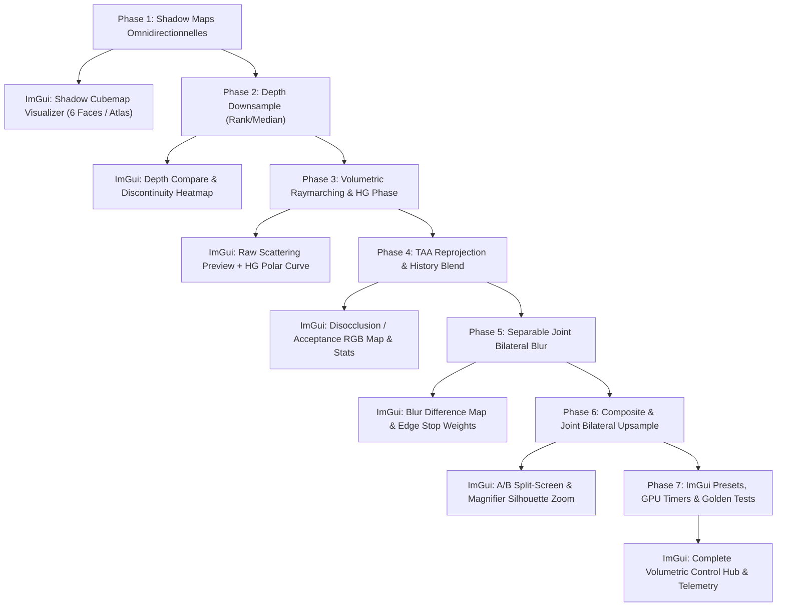

# Plan d'Intégration & Protocole de Validation : Volumetric Dynamic Lights & TAA

**Date** : 31 Août 2026  
**Projet Source** : [`/home/latty/Prog/__PERSO__/Volumetric_Dynamic_Lights`](file:///home/latty/Prog/__PERSO__/Volumetric_Dynamic_Lights)  
**Projet Cible** : [`suckless-odin`](file:///home/latty/Prog/__PERSO__/suckless-odin) (`OpenGL 4.4 Core`)  
**Statut** : 📋 Prévu / Spécification & Plan de Suivi

---

## 🎯 1. Objectifs & Périmètre Technique

1. **Rendu Volumétrique Complet** : Intégrer l'effet d'in-scattering volumétrique dynamique pour les sphères instanciées et les sources lumineuses ponctuelles de la scène.
2. **Modernisation OpenGL 4.4 Core** : Remplacer l'ancien pipeline hybride (OpenGL 2.x/3.x legacy) par une implémentation moderne pure GLSL 430/440, UBO, SSBO AZDO, FBO MRT et textures flottantes standardisées.
3. **Optimisation Temporelle & Spatiale (TAA / Bilateral)** :
   - Échantillonnage à résolution réduite ($1/2$ ou $1/4$ de résolution).
   - TAA Reprojection historique basée sur la vitesse caméra et la validation de profondeur géométrique.
   - Flou bilatéral séparable 9-tap conscient de la profondeur.
   - Joint Bilateral Upsampling $2 \times 2$ lors de la passe composite plein écran.
4. **Zéro Régression & Traçabilité** : Fournir pour **chaque étape** un contrôle programmatique (tests unitaires / tests dorés headless) et un contrôle visuel direct (vues debug dédiées et hub de visualisation ImGui).

---

## 🏗️ 2. Matrice des Phases d'Intégration, Contrôles & Intégration ImGui



---

### Phase 1 : Système d'Ombres Omnidirectionnelles Modernes & Ombres Portées de Surface (Point Light Shadow Cubemaps)

- **Description** : Génération des shadow maps cubiques pour les lumières ponctuelles de la scène (`GL_DEPTH_COMPONENT32F` et `GL_R32F` radial). Rendu des ombres directes volumétriques et réception des ombres portées de surface sur les sphères PBR (`shaders/pbr_billboard.frag`). Rendu du gizmo émissif d'ampoule (`shaders/light_bulb.*`).
- **Composants** :
  - Modules Odin : `src/rendering/shadow_cubemap.odin`, `src/rendering/fullscreen_triangle.odin`.
  - Shaders : `shaders/shadow_cube.vert`, `shaders/shadow_cube.frag`, `shaders/light_bulb.vert`, `shaders/light_bulb.frag`.
- **Contrôle Programmatique** :
  - Test unitaire CPU : Projection perspective cubique ($90^\circ$, aspect $1.0$), matrices de vue des 6 faces.
  - Test FBO : Validation `glCheckFramebufferStatus`.
- **Intégration & Contrôle Visuel ImGui** :
  - **Widget `ImGui_Shadow_Cube_Inspector`** :
    - Dépliage visuel en grille 3x2 des 6 faces (`+X, -X, +Y, -Y, +Z, -Z`) avec `imgui.Image()`.
    - Sélecteur et inspection interactive de face au survol du curseur (lecture UV et face).
    - Contrôle dynamique de la résolution ($256, 512, 1024, 2048$), du near/far clip et du shadow bias.
    - Toggle `Shadow Cache` et indicateur visuel "Face Invalidated / Updated This Frame" (LED verte/rouge).

---

### Phase 2 : Depth Downsampling Pass (Rank/Median Filter)

- **Description** : Downsample du buffer de profondeur principal (`scene_fbo.depth_tex`) vers un buffer demi-résolution (`GL_R32F` linéaire). Filtre médian 4-tap et calcul du seuil de discontinuité de profondeur relatif et invariant d'échelle $(\Delta Z / Z_{\min} > \epsilon)$.
- **Composants** :
  - Shaders : `shaders/depth_downsample.frag`, `shaders/debug_depth_preview.frag`.
  - Pipeline : `src/rendering/depth_downsample.odin`.
- **Contrôle Programmatique** :
  - Test de non-régression numérique : Comparaison CPU de la formule Rank/Median vs implémentation GPU sur buffer synthétique.
  - Vérification de la conservation des limites géométriques ($Z_{\text{near}} \le Z \le Z_{\text{far}}$).
- **Intégration & Contrôle Visuel ImGui** :
  - **Widget `ImGui_Depth_Downsample_Inspector`** :
    - Aperçu linéaire / thermique demi-résolution avec sélecteur de mode (Turbo Heatmap, Linear Grayscale, Discontinuity Mask).
    - Slider interactif du seuil de discontinuité relative ($\epsilon \in [0.001, 0.100]$, default $0.030$) pour ajuster en temps réel la sensibilité de détection des silhouettes.

---

### Phase 3 : Raymarching Volumétrique & Phase Henyey-Greenstein

- **Description** : Raymarching screen-space borné par la sphère d'influence lumineuse (`intersectSphere`) et le depth buffer opaque. Calcul de l'atténuation, échantillonnage de l'ombre cubique, fonction de phase $P(\theta, g)$ et dithering spatial/temporel via bruit IGN.
- **Composants** :
  - Module Odin : `src/rendering/volumetric.odin`.
  - Shader : `shaders/postfx/volumetric_raymarch.frag`.
- **Contrôle Programmatique** :
  - Test unitaire CPU de la fonction de phase Henyey-Greenstein : $P(\theta, 0) = 1.0$, conservation d'énergie pour différentes valeurs de $g \in [-0.9, 0.9]$.
  - Test unitaire CPU de l'intersection rayon-sphère analytique.
- **Intégration & Contrôle Visuel ImGui** :
  - **Widget `ImGui_Volumetric_Raymarch_Inspector`** :
    - Vignette plein écran du buffer volumétrique avec 10 modes d'analyse (Output, Raw IGN, Heatmap, TAA Accept, Post-Blur HDR, Bilateral Diff, Edge Overlay Magenta, Silhouette Only, Weight Attenuation, Transmittance) et loupe UV grossissante $1\times..16\times$.
    - **Courbe Polaire Interactive Henyey-Greenstein** : Tracé en temps réel dans ImGui du diagramme de rayonnement $P(\theta, g)$ en fonction du slider d'anisotropie $g \in [-0.90, +0.90]$.
    - Sliders interactifs : Nombre de pas ($N \in [4, 64]$), coefficient de diffusion $\sigma_s$, atténuation lumineuse.
    - Presets cinématiques : `[Isotropic Gas]`, `[Morning Fog]`, `[God Rays]`, `[Torch]`, `[Headlights]`, `[Dust]`.

---

### Phase 4 : TAA Reprojection & Accumulation Historique

- **Description** : Ping-pong entre deux FBOs volumétriques demi-résolution. Reprojection du texel de la frame précédente via $\mathbf{VP}_{\text{prev}}$ avec reconstruction exacte par vecteur directionnel vers le Far Plane, test de disocclusion géométrique ($\Delta z_w$) et clamping 3x3.
- **Composants** :
  - Pipeline : Suivi de `prev_inv_view_proj`, `prev_view_proj`, `prev_cam_pos` dans `volumetric.odin`.
  - Shader : `shaders/postfx/volumetric_taa.frag`.
- **Contrôle Programmatique** :
  - Test de stabilité temporelle : Vérification de décroissance de variance inter-trames sur caméra fixe.
  - Test de reset de l'historique lors des téléportations de caméra (`history_reset = true`).
- **Intégration & Contrôle Visuel ImGui** :
  - **Widget `ImGui_TAA_Reprojection_Inspector`** :
    - **Carte RVB d'Acceptance Historique** :
      - 🟩 **Vert** : Historique valide réutilisé ($>80\%$).
      - 🟥 **Rouge** : Disocclusion détectée ($\Delta z > \text{seuil}$, rejet complet).
      - 🟦 **Bleu** : Pixels hors champ à la trame précédente.
    - **Télémétrie en temps réel** : Diagnostic ping-pong et statut d'accumulation.
    - Bouton d'action immédiate : `[Force History Reset]` pour vérifier la vitesse de convergence.
    - Sliders : Facteur de contribution frame courante $\alpha$, seuil de rejet $\Delta z_{\text{threshold}}$.

---

### Phase 5 : Joint Bilateral Blur Séparable (9-tap)

- **Description** : Floutage séparable (horizontal puis vertical) à basse résolution pondéré par la profondeur afin de lisser le bruit résiduel du raymarching sans baver à travers les arêtes de la géométrie.
- **Composants** :
  - FBOs temporaires : `blur_fbo[2]` ($W/2 \times H/2$).
  - Shaders : `shaders/postfx/volumetric_bilateral_blur.frag`.
- **Contrôle Programmatique** :
  - Test de conservation d'énergie du noyau gaussien 9-tap.
  - Vérification des poids nuls à travers une marche d'escalier de profondeur abrupte.
- **Intégration & Contrôle Visuel ImGui** :
  - **Widget `ImGui_Bilateral_Blur_Inspector`** :
    - **Vue Différence Thermique & Atténuation** : Affichage de $|\text{Color}_{\text{blurred}} - \text{Color}_{\text{raw}}|$ et de la carte d'atténuation de poids pour identifier les zones lissées vs bloquées.
    - Sélecteur de noyau : `Pass-through (Off)`, `5-tap Separable`, `9-tap Separable`.
    - Slider de raideur de profondeur : Facteur d'atténuation bilatérale ($k_{\text{bilat}} \in [0.0, 2000.0]$).
    - Presets : `Gaussian (0)`, `Soft (100)`, `Standard (500)`, `Strict (2000)`.

---

### Phase 6 : Composite & Joint Bilateral Upsampling (Pass Finale)

- **Description** : Réintégration de la lumière volumétrique basse résolution dans le buffer HDR haute résolution de la scène (`scene_color_tex`) avec upsampling guidé par la profondeur pleine résolution pour éliminer tout aliasing / crénelage demi-résolution sur les silhouettes des objets opaques (sphères).
- **Algorithmes & Modes d'Upsampling** :
  1. **Mode 0 : Bilinéaire Standard (Legacy / Baseline)** : Échantillonnage matériel standard `texture(u_volumetric, uv)`. Rapide mais crée des bavures et un crénelage demi-résolution ($W/2 \times H/2$) sur les arêtes des sphères où la profondeur varie brusquement.
  2. **Mode 1 : Nearest-Depth Heuristic (Fast JBU / Vulkan & Unreal style)** : Compare la profondeur pleine résolution $Z_{\text{full}}$ aux 4 profondeurs demi-résolution voisines $Z_0..Z_3$. Si une discontinuité est détectée, sélectionne directement le tap volumétrique dont la profondeur est la plus proche de $Z_{\text{full}}$, évitant tout mélange entre avant-plan et arrière-plan.
  3. **Mode 2 : Joint Bilateral Upsampling (JBU 2x2 Depth-Guided)** : Calcule pour les 4 taps voisins un poids combinant l'interpolation spatiale bilinéaire et l'écart relatif de profondeur :
     $$w_i = w_{\text{spatial}, i} \cdot \frac{1.0}{1.0 + k_{\text{upsample}} \cdot \frac{|Z_{\text{full}} - Z_i|}{\max(Z_{\text{full}}, Z_{\text{near}})}}$$
     Avec normalisation $\frac{\sum w_i C_i}{\sum w_i}$ et fallback automatique sur Nearest-Depth si la somme des poids est nulle.
- **Composants** :
  - Shaders : `shaders/postfx/volumetric_composite_simple.frag`.
  - Modules Odin : `src/rendering/volumetric.odin`, `src/scene/scene.odin`, `src/gui/gui_volumetric.odin`.
- **Contrôle Programmatique** :
  - Test de non-régression numérique : Validation des poids bilatéraux unitaires sur surface plane et rejet strict à travers une discontinuité de profondeur.
- **Intégration & Contrôle Visuel ImGui** :
  - **Widget `ImGui_Composite_Upsample_Inspector`** :
    - Sélecteur de mode d'upsampling : `[Bilinear Standard]`, `[Nearest-Depth Fast JBU]`, `[Joint Bilateral Upsampling 2x2]`.
    - Slider de raideur de l'upsampling bilatéral $k_{\text{upsample}} \in [10.0, 2000.0]$.
    - A/B Split Screen et loupe grossissante ($1\times..16\times$) sur les silhouettes.

---

### Phase 7 : Hub de Contrôle Global ImGui, Presets & Tests Automatisés

- **Description** : Panneau de contrôle centralisé dans l'interface ImGui (`gui/gui.odin`), presets physiques (Brouillard matinal, God Rays, Lampe torche, Isotropie, Poussière), monitoring GPU complet et tests dorés headless (`task test-cli`).
- **Composants** :
  - Onglet dédié ImGui : `Volumetric Fog & Lighting`.
  - Presets physiques natifs compilés dans `src/rendering/volumetric_presets.odin` (zéro I/O tas, performance instantanée et persistance automatique dans `session.json`).
  - Validation par suites de tests unitaires dédiées (`tests/test_volumetric.odin`) et tests GL de liaison des shaders (`tests/gl/test_gl_shaders.odin`).
- **Contrôle Programmatique** :
  - `task test-unit` / `task test-shader` : Validation mathématique, conservation énergétique et continuité du modèle.
- **Intégration & Contrôle Visuel ImGui** :
  - **Hub Global ImGui** :
    - Sélecteur de Presets Rapides : `[Isotropic Gas]`, `[Morning Fog]`, `[God Rays]`, `[Flashlight]`, `[Dense Dust]`.
    - **Monitoring GPU Détaillé (Gpu_Timers)** : Barres de progression et métriques en microsecondes ($\mu s$) pour chaque sous-passe :
      - *Shadow Pass* | *Depth Downsample* | *Raymarching* | *TAA Blend* | *Bilateral Blur* | *Composite Upsample*.

---

## 🎛️ 3. Spécification des Types & Vues Débogage ImGui (Odin)

```odin
// Modes de prévisualisation dans l'inspecteur de textures ImGui
Volumetric_Preview_Mode :: enum i32 {
    Final_Output       = 0, // In-scattering actif filtré / composite
    Raw_Raymarching    = 1, // Bruit brut du raymarching sans TAA ni flou
    Heatmap            = 2, // Carte de chaleur Turbo colormap
    TAA_Acceptance_Map = 3, // Carte RVB d'acceptation historique TAA
    Post_Blur_HDR      = 4, // Tampon HDR filtré bilatéral
    Bilateral_Diff     = 5, // Différence bilatérale (|flouté - brut| x 10)
    Edge_Overlay       = 6, // Masque de discontinuité magenta
    Silhouette_Only    = 7, // Silhouettes géométriques isolées
    Weight_Attenuation = 8, // Atténuation des poids bilatéraux
    Transmittance      = 9, // Carte de transmittance alpha du milieu
}

// Modes de débogage pour le compositing dans le viewport 3D plein écran
Volumetric_Composite_Mode :: enum i32 {
    Normal_Scene         = 0, // Composite additif standard dans la scène
    Neon_Silhouette      = 1, // Surlignage néon vert/magenta des arêtes
    Isolated_Silhouettes = 2, // Scène noire avec silhouettes isolées
    Difference_Map       = 3, // Carte de différence en direct
    Weight_Attenuation   = 4, // Visualisation des poids de l'upsampling
}

Volumetric_Params :: struct {
    enabled:                      bool,
    composite_in_scene:           bool,
    isolate_in_scene:             bool,
    shadows_enabled:              bool,

    // Raymarching & Phase
    step_count:                   i32,  // [4..64]
    scattering_coeff:             f32,  // [0.01..1.0]
    extinction_coeff:             f32,  // [0.01..1.0]
    anisotropy_g:                 f32,  // [-0.90..+0.90] (Henyey-Greenstein)
    intensity_mult:               f32,
    jitter_enabled:               bool,

    // TAA Reprojection
    taa_mode:                     i32,  // 0: Off, 1: EMA, 2: Motion-Aware TAA
    taa_alpha:                    f32,  // [0.02..1.0]
    taa_depth_threshold:          f32,
    taa_clamping_enabled:         bool,

    // Bilateral Filtering
    blur_mode:                    i32,  // 0=Off, 1=5-tap, 2=9-tap
    blur_sharpness:               f32,  // [0.0..2000.0]
    viewport_debug_mode:          i32,

    // Preview / Inspector tools
    preview_mode:                 i32,
    preview_exposure_boost:       f32,
    zoom_scale:                   f32,
    zoom_center:                  mt.Vec2,
}
```

---

## 📅 4. Journal de Suivi d'Avancement

| Jalon | Tâche / Phase | ImGui Debug View | Statut | Date Validation | Sign-off |
| :--- | :--- | :--- | :---: | :---: | :---: |
| **M1** | Analyse technique & document de cadrage | Spécification Hub ImGui | ✅ Terminé | 31/08/2026 | Antigravity |
| **M2** | Phase 1 : Shadow Cubemap moderne (`samplerCubeShadow`) | `Shadow_Cubemap_Cross` | ✅ Terminé | 31/08/2026 | User / Antigravity |
| **M3** | Phase 2 : Depth Downsample (Rank/Median 4-tap) | `Low_Res_Depth` & `Depth_Discontinuities` | ✅ Terminé | 31/08/2026 | Antigravity |
| **M4** | Phase 3 : Raymarching volumétrique & Henyey-Greenstein | `Raw_Raymarching` + Courbe polaire HG | ✅ Terminé | 31/08/2026 | Antigravity |
| **M5** | Phase 4 : TAA Reprojection & History Blending | `TAA_Acceptance_Map` (🟩/🟥/🟦) | ✅ Terminé | 31/08/2026 | Antigravity |
| **M6** | Phase 5 : Joint Bilateral Blur 9-tap séparable | `Bilateral_Blur_Diff` | ✅ Terminé | 31/08/2026 | Antigravity |
| **M7** | Phase 6 : Composite pass & Joint Bilateral Upsampling | `AB_Split_Comparison` + Loupe $8\times$ | ✅ Terminé | 01/09/2026 | Antigravity |
| **M8** | Phase 7 : Hub ImGui, Presets & Tests dorés headless | Panel complet + Gpu_Timers $\mu s$ | ✅ Terminé | 01/09/2026 | Antigravity |
