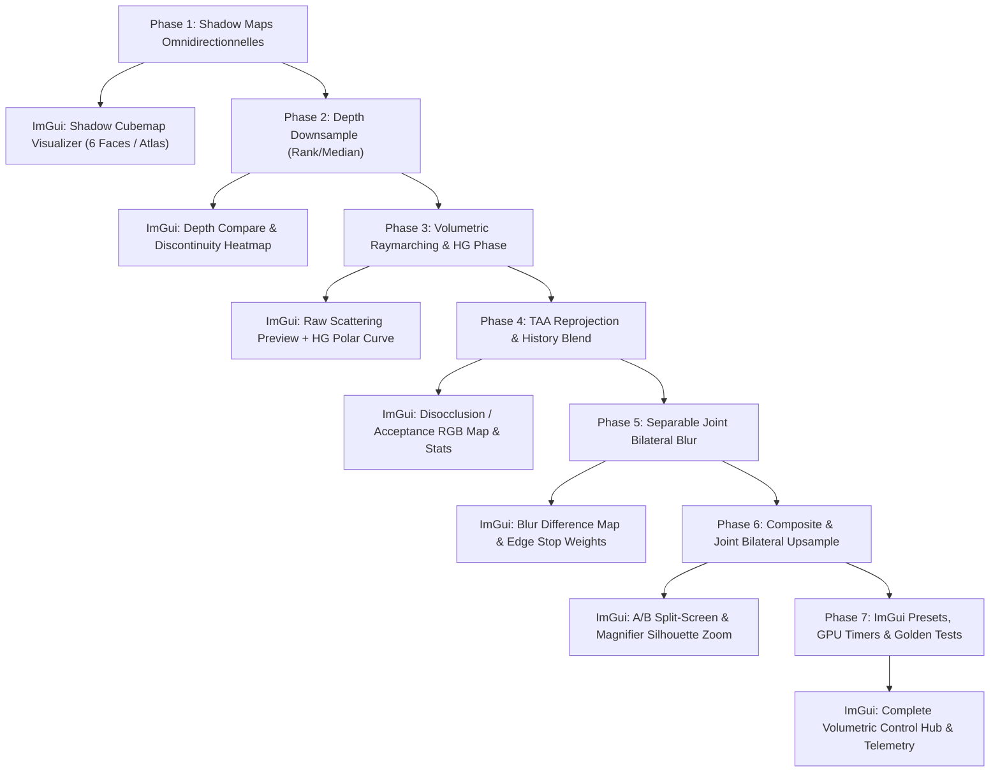

# Plan d'Intégration & Protocole de Validation : Volumetric Dynamic Lights & TAA

**Date** : 31 Août 2026  
**Projet Source** : [`/home/latty/Prog/__PERSO__/Volumetric_Dynamic_Lights`](file:///home/latty/Prog/__PERSO__/Volumetric_Dynamic_Lights)  
**Projet Cible** : [`suckless-odin`](file:///home/latty/Prog/__PERSO__/suckless-odin) (`OpenGL 4.4 Core`)  
**Statut** : 📋 Prévu / Spécification & Plan de Suivi

---

## 🎯 1. Objectifs & Périmètre Technique

1. **Rendu Volumétrique Complet** : Intégrer l'effet d'in-scattering volumétrique dynamique pour les sphères instanciées et les sources lumineuses ponctuelles de la scène.
2. **Modernisation OpenGL 4.4 Core** : Remplacer l'ancien pipeline hybride (OpenGL 2.x/3.x legacy) par une implémentation moderne pure GLSL 430/440, UBO, SSBO AZDO, FBO MRT et textures flottantes standardisées.
3. **Optimisation Temporelle & Spatiale (TAA / Bilateral)** :
   - Échantillonnage à résolution réduite ($1/2$ ou $1/4$ de résolution).
   - TAA Reprojection historique basée sur la vitesse caméra et la validation de profondeur géométrique.
   - Flou bilatéral séparable 9-tap conscient de la profondeur.
   - Joint Bilateral Upsampling $2 \times 2$ lors de la passe composite plein écran.
4. **Zéro Régression & Traçabilité** : Fournir pour **chaque étape** un contrôle programmatique (tests unitaires / tests dorés headless) et un contrôle visuel direct (vues debug dédiées et hub de visualisation ImGui).

---

## 🏗️ 2. Matrice des Phases d'Intégration, Contrôles & Intégration ImGui



---

### Phase 1 : Système d'Ombres Omnidirectionnelles Modernes (Point Light Shadow Cubemaps)

- **Description** : Génération des shadow maps cubiques pour les lumières ponctuelles de la scène. Élimination de l'Atlas 2D + Texture d'Indirection legacy au profit de `samplerCubeShadow` ou `samplerCube` flottant direct (`GL_DEPTH_COMPONENT32F` ou `GL_R32F`).
- **Composants** :
  - Module Odin : `src/rendering/shadow_cubemap.odin`.
  - Shaders : `shaders/shadow_cube.vert`, `shaders/shadow_cube.frag` (ou geometry shader multi-face en 1 draw call).
- **Contrôle Programmatique** :
  - Test unitaire CPU : Projection perspective cubique ($90^\circ$, aspect $1.0$), matrices de vue des 6 faces.
  - Test FBO : Validation `glCheckFramebufferStatus`.
- **Intégration & Contrôle Visuel ImGui** :
  - **Widget `ImGui_Shadow_Cube_Inspector`** :
    - Dépliage visuel en croix des 6 faces (`+X, -X, +Y, -Y, +Z, -Z`) avec `imgui.Image()`.
    - Sélecteur de face individuelle avec zoom et affichage des valeurs de profondeur linéarisées sous le curseur (`inspect_pixel`).
    - Contrôle dynamique de la résolution ($256, 512, 1024, 2048$), du near/far clip et du shadow bias.
    - Toggle `Shadow Cache` et indicateur visuel "Face Invalidated / Updated This Frame" (LED verte/rouge).

---

### Phase 2 : Depth Downsampling Pass (Rank/Median Filter)

- **Description** : Downsample du buffer de profondeur principal (`scene_fbo.depth_tex`) vers un buffer demi/quart de résolution (`GL_R16F` ou `GL_R32F`). Utilisation du filtre médian 4-tap pour éliminer l'érosion des silhouettes fines.
- **Composants** :
  - Shaders : `shaders/postfx/volumetric_depth_downsample.frag` (ou compute shader `volumetric_depth_downsample.comp`).
  - Pipeline : Allocation des FBOs demi/quart de résolution dans `postfx/pipeline.odin`.
- **Contrôle Programmatique** :
  - Test de non-régression numérique : Comparaison CPU de la formule Rank/Median vs implémentation GPU sur buffer synthétique.
  - Vérification de la conservation des limites géométriques ($Z_{\text{near}} \le Z \le Z_{\text{far}}$).
- **Intégration & Contrôle Visuel ImGui** :
  - **Widget `ImGui_Depth_Downsample_Inspector`** :
    - Aperçu côte à côte : Buffer de profondeur pleine résolution vs demi/quart de résolution.
    - **Mode Vue `Depth_Discontinuities`** : Masque binaire/thermique des pixels où $(\max - \min > \text{threshold})$ affiché en surimpression rouge vif sur la scène.
    - Slider interactif du seuil de discontinuité ($\epsilon \in [0.001, 0.100]$) pour ajuster en temps réel la sensibilité de détection des silhouettes.

---

### Phase 3 : Raymarching Volumétrique & Phase Henyey-Greenstein

- **Description** : Raymarching screen-space borné par la sphère d'influence lumineuse (`intersectSphere`) et le depth buffer opaque. Calcul de l'atténuation, échantillonnage de l'ombre cubique, fonction de phase $P(\theta, g)$ et dithering spatial/temporel via texture de bruit.
- **Composants** :
  - Module Odin : `src/rendering/postfx/volumetric.odin`.
  - Shader : `shaders/postfx/volumetric_raymarch.frag`.
- **Contrôle Programmatique** :
  - Test unitaire CPU de la fonction de phase Henyey-Greenstein : $P(\theta, 0) = 1.0$, conservation d'énergie pour différentes valeurs de $g \in [-0.9, 0.9]$.
  - Test unitaire CPU de l'intersection rayon-sphère analytique.
- **Intégration & Contrôle Visuel ImGui** :
  - **Widget `ImGui_Volumetric_Raymarch_Inspector`** :
    - Vignette plein écran du buffer volumétrique brut (Raw In-Scattering) avec boost d'exposition réglable ($\times 1$ à $\times 10$) pour analyser les zones sombres.
    - **Courbe Polaire Interactive Henyey-Greenstein** : Tracé en temps réel dans ImGui du diagramme de rayonnement $P(\theta, g)$ en fonction du slider d'anisotropie $g \in [-0.90, +0.90]$.
    - Sliders interactifs : Nombre de pas ($N \in [4, 64]$), coefficient de diffusion $\sigma_s$, atténuation lumineuse.
    - Toggles : Bruit de jittering On/Off, Dithering temporel On/Off.

---

### Phase 4 : TAA Reprojection & Accumulation Historique

- **Description** : Ping-pong entre deux FBOs volumétriques demi-résolution. Reprojection du texel de la frame précédente via $\mathbf{VP}_{\text{prev}}$, test de disocclusion géométrique ($\Delta z_w$) et accumulation alpha hardware adaptative au framerate.
- **Composants** :
  - Pipeline : Suivi de `prev_inv_view_proj`, `prev_view_proj`, `prev_cam_pos` dans `postfx/pipeline.odin`.
  - Shader : `shaders/postfx/volumetric_temporal.frag`.
- **Contrôle Programmatique** :
  - Test de stabilité temporelle : Vérification de décroissance de variance inter-trames sur caméra fixe.
  - Test de reset de l'historique lors des téléportations de caméra (`history_reset = true`).
- **Intégration & Contrôle Visuel ImGui** :
  - **Widget `ImGui_TAA_Reprojection_Inspector`** :
    - **Carte RVB d'Acceptance Historique** :
      - 🟩 **Vert** : Historique valide réutilisé ($>80\%$).
      - 🟥 **Rouge** : Disocclusion détectée ($\Delta z > \text{seuil}$, rejet complet).
      - 🟦 **Bleu** : Pixels hors champ à la trame précédente.
    - **Télémétrie en temps réel** : Histogramme / jauge du pourcentage de pixels réutilisés vs rejetés par trame.
    - Bouton d'action immédiate : `[Force History Reset]` pour vérifier la vitesse de convergence.
    - Sliders : Facteur de contribution max $\alpha_{\text{max}}$, échelle de rejet $\sigma_{\text{disocclusion}}$.

---

### Phase 5 : Joint Bilateral Blur Séparable (9-tap)

- **Description** : Floutage séparable (horizontal puis vertical) à basse résolution pondéré par la profondeur afin de lisser le bruit résiduel du raymarching sans baver à travers les arêtes de la géométrie.
- **Composants** :
  - FBOs temporaires : `vol_blur_temp_fbo` ($W/2 \times H/2$).
  - Shaders : `shaders/postfx/volumetric_bilateral_blur.frag`.
- **Contrôle Programmatique** :
  - Test de conservation d'énergie du noyau gaussien 9-tap.
  - Vérification des poids nuls à travers une marche d'escalier de profondeur abrupte.
- **Intégration & Contrôle Visuel ImGui** :
  - **Widget `ImGui_Bilateral_Blur_Inspector`** :
    - **Vue Différence Thermique** : Affichage de $|\text{Color}_{\text{blurred}} - \text{Color}_{\text{raw}}|$ pour identifier exactement les zones lissées.
    - **Visualisation des Poids de Silhouette** : Affichage des zones où la différence de profondeur bloque la propagation du flou (arêtes des sphères).
    - Sélecteur de noyau : `Pass-through (Off)`, `5-tap Separable`, `9-tap Separable`.
    - Slider de raideur de profondeur : Facteur d'atténuation bilatérale ($k_{\text{bilat}} \in [100.0, 5000.0]$).

---

### Phase 6 : Composite & Joint Bilateral Upsampling (Pass Finale)

- **Description** : Réintégration de la lumière volumétrique basse résolution dans le buffer HDR haute résolution de la scène (`scene_color_tex`) avec upsampling bilatéral guidé $2 \times 2$.
- **Composants** :
  - Intégration dans `shaders/postfx/postfx.frag` (ou passe dédiée avant le tone mapping).
  - Support de l'accumulation additive d'éclairage direct + ambiant + volumétrique.
- **Contrôle Programmatique** :
  - Test de validation du format pixel HDR (aucun clamp à $1.0$ avant tone mapping).
  - Validation du pipeline postfx global (interaction avec Bloom, DOF, Motion Blur et Tonemapping ACES).
- **Intégration & Contrôle Visuel ImGui** :
  - **Widget `ImGui_Composite_Upsample_Inspector`** :
    - **A/B Split Screen Interactif** : Ligne de séparation déplaçable à la souris ou via slider ImGui (Gauche = Scène Finale Complète, Droite = Scène Brute sans volumétrique).
    - **Loupe Grossissante Silhouettes ($4\times / 8\times$)** : Fenêtre zoomée centrée sur le curseur pour inspecter au pixel près les arêtes des sphères et vérifier l'absence d'artefacts d'escalier ou de halo sombre.
    - Toggle comparatif : `Bilinear Standard` vs `Joint Bilateral Upsampling`.

---

### Phase 7 : Hub de Contrôle Global ImGui, Presets & Tests Automatisés

- **Description** : Panneau de contrôle centralisé dans l'interface ImGui (`gui/gui.odin`), presets physiques (Brouillard matinal, God Rays, Lampe torche, Isotropie, Poussière), monitoring GPU complet et tests dorés headless (`task test-cli`).
- **Composants** :
  - Onglet dédié ImGui : `Volumetric Fog & Lighting`.
  - Sauvegarde/chargement JSON dans `assets/postfx/`.
  - Captures de référence dorées dans `tests/references/ref_volumetric_*.png`.
- **Contrôle Programmatique** :
  - `task test-cli` : Rendu headless de 10 trames et validation du code de retour.
  - Comparaison d'images automatisée (SSIM / MSE) contre l'image dorée de référence.
- **Intégration & Contrôle Visuel ImGui** :
  - **Hub Global ImGui** :
    - Sélecteur de Presets Rapides : `[Isotropic Gas]`, `[Morning Fog]`, `[God Rays]`, `[Flashlight]`, `[Dense Dust]`.
    - **Monitoring GPU Détaillé (Gpu_Timers)** : Barres de progression et métriques en microsecondes ($\mu s$) pour chaque sous-passe :
      - *Shadow Pass* | *Depth Downsample* | *Raymarching* | *TAA Blend* | *Bilateral Blur* | *Composite Upsample*.

---

## 🎛️ 3. Spécification des Types & Vues Débogage ImGui (Odin)

```odin
// Types pour le système de débogage volumétrique
Volumetric_Debug_View :: enum u32 {
    Disabled               = 0,
    Shadow_Cubemap_Cross   = 1, // Phase 1 : Vue en croix des 6 faces du shadow map
    Low_Res_Depth          = 2, // Phase 2 : Profondeur basse résolution
    Depth_Discontinuities  = 3, // Phase 2 : Carte des arêtes géométriques
    Raw_Raymarching        = 4, // Phase 3 : In-scattering brut (sans TAA/flou)
    TAA_Acceptance_Map     = 5, // Phase 4 : Carte RVB réutilisation historique
    Bilateral_Blur_Diff    = 6, // Phase 5 : Différence avant/après floutage
    Volumetric_Only        = 7, // Phase 6 : Lumière volumétrique isolée
    AB_Split_Comparison    = 8, // Phase 6 : Comparaison A/B split-screen
}

Volumetric_Params :: struct {
    enabled:               bool,
    debug_view:            Volumetric_Debug_View,
    split_position:        f32,  // Position écran de la ligne de split A/B [0.0..1.0]
    
    // Raymarching & Phase
    raymarch_steps:        i32,  // [4..64]
    scattering_coeff:      f32,  // [0.01..1.0]
    anisotropy_g:          f32,  // [-0.90..+0.90] (Henyey-Greenstein)
    use_temporal_dither:   bool,
    
    // TAA Reprojection
    enable_taa:            bool,
    max_current_contrib:   f32,  // [0.05..1.0]
    disocclusion_depth_threshold: f32,
    
    // Bilateral Filtering
    blur_mode:             i32,  // 0=Off, 1=5-tap, 2=9-tap
    bilateral_sharpness:   f32,  // [100.0..5000.0]
    enable_bilat_upsample: bool,
}
```

---

## 📅 4. Journal de Suivi d'Avancement

| Jalon | Tâche / Phase | ImGui Debug View | Statut | Date Validation | Sign-off |
| :--- | :--- | :--- | :---: | :---: | :---: |
| **M1** | Analyse technique & document de cadrage | Spécification Hub ImGui | ✅ Terminé | 31/08/2026 | Antigravity |
| **M2** | Phase 1 : Shadow Cubemap moderne (`samplerCubeShadow`) | `Shadow_Cubemap_Cross` | ✅ Terminé | 31/08/2026 | User / Antigravity |
| **M3** | Phase 2 : Depth Downsample (Rank/Median 4-tap) | `Low_Res_Depth` & `Depth_Discontinuities` | ✅ Terminé | 31/08/2026 | Antigravity |
| **M4** | Phase 3 : Raymarching volumétrique & Henyey-Greenstein | `Raw_Raymarching` + Courbe polaire HG | ✅ Terminé | 31/08/2026 | Antigravity |
| **M5** | Phase 4 : TAA Reprojection & History Blending | `TAA_Acceptance_Map` (🟩/🟥/🟦) | ✅ Terminé | 31/08/2026 | Antigravity |
| **M6** | Phase 5 : Joint Bilateral Blur 9-tap séparable | `Bilateral_Blur_Diff` | ⏳ À faire | - | - |
| **M7** | Phase 6 : Composite pass & Joint Bilateral Upsampling | `AB_Split_Comparison` + Loupe $8\times$ | ⏳ À faire | - | - |
| **M8** | Phase 7 : Hub ImGui, Presets & Tests dorés headless | Panel complet + Gpu_Timers $\mu s$ | ⏳ À faire | - | - |
