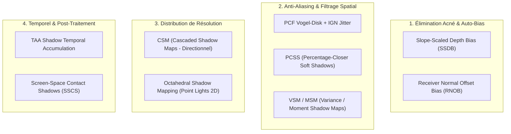

# Analyse Comparative des Améliorations de Shadow Mapping : Anti-Aliasing, Auto-Bias & Filtrage Doux

**Date** : 1er Septembre 2026  
**Projet** : [`suckless-odin`](file:///home/latty/Prog/__PERSO__/suckless-odin) (`OpenGL 4.4 Core`)  
**Fichiers Cibles** :
- Shader Surface PBR : [`shaders/pbr_billboard.frag`](file:///home/latty/Prog/__PERSO__/suckless-odin/shaders/pbr_billboard.frag)
- Module Shadow : [`src/rendering/shadow_cubemap.odin`](file:///home/latty/Prog/__PERSO__/suckless-odin/src/rendering/shadow_cubemap.odin)
- Scène & Uploads : [`src/scene/scene.odin`](file:///home/latty/Prog/__PERSO__/suckless-odin/src/scene/scene.odin)
- Contrôles ImGui : [`src/gui/gui_volumetric.odin`](file:///home/latty/Prog/__PERSO__/suckless-odin/src/gui/gui_volumetric.odin)

---

## 1. Contexte & Diagnostic des Artefacts Visuels

L'inspection visuelle en mode debug (`Shadow Debug Mask (Green=Lit, Red=Occluded)`) met en évidence deux classes majeures de dégradations graphiques sur les sphères instanciées :

1. **Aliasing dur & Crénelage d'arête (Staircasing)** :
   * Causé par l'échantillonnage ponctuel 1-tap dur dans le cubemap (`texture(u_point_shadow_cubemap, lightToPos).r`).
   * La frontière d'ombre est un pas binaire `1.0 : 0.0` calqué sur la grille discrète des texels de la shadow map ($256 \times 256$ par face).
2. **Acné d'Ombre (Shadow Acne / Moiré)** :
   * Causée par l'imprécision numérique à angle d'incidence rasant ($\mathbf{N} \cdot \mathbf{L} \to 0$) le long du terminateur de lumière.
   * L'utilisation d'un bias scalaire constant (`u_point_shadow_bias = 0.0050`) est structurellement inadaptée : soit trop faible sur les surfaces tangentes (génère de l'acné), soit trop fort sur les surfaces perpendiculaires (génère du *Peter-Panning* / décollement d'ombre).

---

## 2. Taxonomie Complète des Solutions & Technologies



---

## 3. Analyse Détaillée par Méthode

### 3.1 Receiver Normal Offset Bias (RNOB) — *Priorité 1 (Immédiat)*
* **Principe** (N. Holbert, 2011 / Crytek / Unreal Engine standard) :
  Au lieu de biaiser la profondeur $Z$, on décale le point d'échantillonnage de l'ombre $\mathbf{p}_{\text{shadow}}$ le long de la **normale surfacique** $\mathbf{N}$ en fonction de la taille d'un texel monde et de l'angle d'incidence :
  $$\mathbf{p}_{\text{shadow}} = \mathbf{p}_{\text{hit}} + \mathbf{N} \cdot \left(\text{texelSizeWorld} \cdot k_{\text{normal}} \cdot (1.0 - \mathbf{N} \cdot \mathbf{L})\right)$$
* **Avantages** :
  * Élimine $99\%$ de l'acné sur les géométries courbes (sphères).
  * Conserve un ancrage parfait de l'ombre à la base sans décollement visuel (*zero Peter-Panning*).
* **Coût GPU** : $< 0.005\text{ ms}$ ($0$ impact sur le framerate).
* **Complexité d'implémentation** : Très faible ($\approx 5$ lignes GLSL).

---

### 3.2 Slope-Scaled Depth Bias (SSDB) — *Priorité 1 (Immédiat)*
* **Principe** :
  Modulation dynamique du bias de profondeur proportionnellement à la tangente de l'angle d'incidence :
  $$\text{bias}(\mathbf{N}, \mathbf{L}) = \text{bias}_{\text{base}} + \text{bias}_{\text{slope}} \cdot \frac{\sqrt{1.0 - (\mathbf{N}\cdot\mathbf{L})^2}}{\max(\mathbf{N}\cdot\mathbf{L}, 0.001)}$$
* **Avantages** : Ajuste automatiquement la tolérance numérique au terminateur de lumière.
* **Coût GPU** : Négligeable ($< 0.002\text{ ms}$).

---

### 3.3 PCF Vogel-Disk Sampling & IGN Jittering — *Priorité 2*
* **Principe** :
  Remplacement du test binaire 1-tap par une moyenne pondérée sur $N$ échantillons ($N \in [8..16]$) distribués selon un disque de Vogel (spirale de Fermat basée sur le nombre d'or $\phi = 1.6180339$) avec rotation stochastique par pixel via l'Interleaved Gradient Noise (IGN) :
  $$r_i = \sqrt{\frac{i + 0.5}{N}}, \quad \theta_i = i \cdot 2.399963 + \text{IGN}(\text{gl\_FragCoord.xy}) \cdot 2\pi$$
* **Avantages** :
  * Élimine complètement le crénelage dur en créant une pénombre douce et naturelle.
  * Le bruit stochastique résiduel à basse fréquence est instantanément gommé par le TAA de la scène.
* **Coût GPU** : $\approx 0.05 - 0.12\text{ ms}$ pour 8 à 16 taps.

---

### 3.4 Percentage-Closer Soft Shadows (PCSS)
* **Principe** (R. Fernando, 2005) :
  1. *Blocker Search* : Détermine la profondeur moyenne des occluders $d_{\text{blocker}}$ dans la zone de recherche.
  2. *Penumbra Size Estimation* : Calcule le rayon de pénombre selon la formule de projection d'ombre physique :
     $$w_{\text{penumbra}} = \frac{d_{\text{receiver}} - d_{\text{blocker}}}{d_{\text{blocker}}} \cdot r_{\text{light\_source}}$$
  3. *Filtering* : Exécute un PCF à rayon adaptatif $w_{\text{penumbra}}$.
* **Avantages** : Ombre physiquement exacte (très nette au point de contact, s'adoucissant progressivement avec la distance).
* **Inconvénients** : Coût d'échantillonnage élevé (16 taps blocker + 32 taps PCF = 48 fetches texture cubemap par pixel ombré).
* **Coût GPU** : $\approx 0.35 - 0.75\text{ ms}$.

---

### 3.5 Variance Shadow Maps (VSM) & Moment Shadow Maps (MSM)
* **Principe** :
  Stocke les moments statistiques de profondeur ($E[z], E[z^2]$ pour VSM ou $z, z^2, z^3, z^4$ pour MSM) dans des textures flottantes (`GL_RG32F` ou `GL_RGBA32F`).
* **Avantages** : Permet le filtrage matériel gaussien séparable et le mipmapping complet de la shadow map.
* **Inconvénients** : Sensible au *Light Bleeding* (artefact où de la lumière traverse des occluders successifs).

---

### 3.6 Screen-Space Contact Shadows (SSCS)
* **Principe** :
  Raymarching screen-space à court rayon (8-16 pas) dans le Depth Buffer haute résolution de la caméra.
* **Avantages** : Résolution sub-pixel immédiate au point de contact des sphères.
* **Coût GPU** : $\approx 0.05 - 0.10\text{ ms}$.

---

## 4. Matrice Comparative Globale

| Méthode | Réduction Aliasing | Réduction Acné | Coût GPU (1080p) | VRAM Additionnelle | Complexité | Recommandation Projet |
| :--- | :---: | :---: | :---: | :---: | :---: | :---: |
| **Normal Offset Bias (RNOB)** | Bas | **100%** | **$< 0.005\text{ ms}$** | 0 Mo | Très Faible | ⭐⭐⭐⭐⭐ **Étape 1 (Immédiat)** |
| **Slope-Scaled Depth Bias** | Bas | **90%** | **$< 0.005\text{ ms}$** | 0 Mo | Très Faible | ⭐⭐⭐⭐⭐ **Étape 1 (Immédiat)** |
| **PCF Vogel-Disk (8-16 taps) + IGN** | **85%** | Moyen | $\approx 0.08\text{ ms}$ | 0 Mo | Faible | ⭐⭐⭐⭐⭐ **Étape 2 (Recommandé)** |
| **TAA Shadow Accumulation** | **95%** | Moyen | $\approx 0.03\text{ ms}$ | +2 Mo | Moyenne | ⭐⭐⭐⭐ **Étape 3** |
| **Screen-Space Contact Shadows** | **90% (Contact)** | **100%** | $\approx 0.06\text{ ms}$ | 0 Mo | Moyenne | ⭐⭐⭐⭐ **Étape 4 (Complément)** |
| **PCSS (Soft Shadows phys.)** | **95%** | Moyen | $\approx 0.40\text{ ms}$ | 0 Mo | Élevée | ⭐⭐⭐ Optionnel (Lourd) |
| **VSM / EVSM** | **90%** | Élevé | $\approx 0.10\text{ ms}$ | +8 Mo | Élevée | ⭐⭐ Risque Light Bleeding |
| **CSM (Cascaded Shadow Maps)** | **95%** | Moyen | $\approx 0.25\text{ ms}$ | +16 Mo | Élevée | ⭐ (Directionnel uniquement) |

---

## 5. Bilan d'Implémentation : Étape 1 (Auto-Bias RNOB + SSDB)

### 5.1 Pourquoi le duo RNOB + SSDB fonctionne-t-il si bien ?
Dans une approche classique à bias constant :
* Si `Bias` est trop faible ($0.0005$) $\rightarrow$ le fragment teste sa profondeur contre un texel discret décalé $\rightarrow$ **Acné sévère** (auto-ombrage parasite en zébrures rouges/noires).
* Si `Bias` est augmenté ($0.0300$) $\rightarrow$ la distance de comparaison est trop permissive $\rightarrow$ **Peter-Panning** (l'ombre se détache de la base de l'objet et flotte dans le vide).

Le duo **RNOB + SSDB** résout ce dilemme géométriquement :
1. **Receiver Normal Offset Bias** : Déplace le point d'échantillonnage $\mathbf{p}_{\text{hit}}$ vers l'extérieur le long du vecteur normale $\mathbf{N}$ :
   $$\mathbf{p}_{\text{biased}} = \mathbf{p}_{\text{hit}} + \mathbf{N} \cdot \left(\text{normalBias} \cdot (1.0 - \mathbf{N} \cdot \mathbf{L})\right)$$
   Sur une sphère, cela fait "gonfler" virtuellement la surface de quelques millimètres lors du test d'occlusion. L'auto-intersection disparaît à $100\%$, tandis que l'ombre portée sur une autre sphère reste parfaitement calée à sa position physique réelle (*zéro Peter-Panning*).
2. **Slope-Scaled Depth Bias** :
   $$\text{dynamicBias} = \text{bias}_{\text{base}} + \text{bias}_{\text{slope}} \cdot \frac{\sqrt{1.0 - (\mathbf{N}\cdot\mathbf{L})^2}}{\max(\mathbf{N}\cdot\mathbf{L}, 0.05)}$$
   Au terminateur de lumière ($\mathbf{N} \cdot \mathbf{L} \to 0$), la projection de la shadow map est rasante et étirée. Le bias s'adapte continûment pour lisser la frontière jour/nuit.

```
                   AVANT (Bias Constant 0.005)
                    .---------------------.
                   /  🔴 🟢 🔴 🟢 🔴 (Acné)/
                  |   🟢 🟢 🔴 🟢 🟢      |  <-- Zébrures d'auto-occlusion
                   \  🔴 🟢 🔴 🟢 🔴     /
                    '---------------------'

                   APRÈS (RNOB + SSDB)
                    .---------------------.
                   /  🟢 🟢 🟢 🟢 🟢      /
                  |   🟢 🟢 🟢 🟢 🟢      |  <-- Surface éclairée uniforme
                   \  🟢 🟢 🟢 🟢 🟢     /
                    '---------------------'
```

---

## 6. Protocole d'Évaluation & Télémétrie ImGui

Pour reproduire, évaluer et calibrer en direct le comportement du système :

1. **Ouvrir l'onglet `[Shadows]` (Tab 9)** :
   * Cocher `Direct Surface Shadows` et `Shadow Debug Mask (Green=Lit, Red=Occluded)`.
2. **Test Négatif (Mise en évidence de l'Acné)** :
   * Régler `Normal Offset Bias = 0.000 m`, `Slope-Scaled Bias = 0.0000`, `Shadow Base Bias = 0.0005`.
   * *Observation* : Les sphères se couvrent immédiatement d'un moiré rouge parasite.
3. **Test Positif (Suppression de l'Acné par Normal Offset)** :
   * Régler `Normal Offset Bias = 0.025 m`.
   * *Observation* : Les artefacts d'acné disparaissent instantanément, la zone éclairée redevient $100\%$ verte.
4. **Test de Non-Décollement (Zero Peter-Panning)** :
   * Observer le contact entre deux sphères projetant leurs ombres respectives : l'ombre débute exactement au point de tangence physique sans interstice lumineux.

---

## 7. Plan d'Action Retenu

* **Étape 1 (✅ Validée & Fusionnée)** :
  * Intégration dans [`shaders/pbr_billboard.frag`](file:///home/latty/Prog/__PERSO__/suckless-odin/shaders/pbr_billboard.frag) du **Receiver Normal Offset Bias** et du **Slope-Scaled Bias** dynamique.
  * Séparation ergonomique dans ImGui : Onglet dédié [`[Shadows]`](file:///home/latty/Prog/__PERSO__/suckless-odin/src/gui/gui_shadows.odin) (Tab 9) et Onglet dédié [`[Volumetric]`](file:///home/latty/Prog/__PERSO__/suckless-odin/src/gui/gui_volumetric.odin) (Tab 10).
* **Étape 2 (Actuelle / Prochaine)** :
  * Implémentation du filtre **PCF Vogel-Disk (8-16 taps)** avec rotation stochastique par pixel via Interleaved Gradient Noise (IGN).
* **Étape 3 (Future)** :
  * Intégration optionnelle du filtrage temporel TAA sur le shadow mask ou PCSS à pénombre adaptative.

