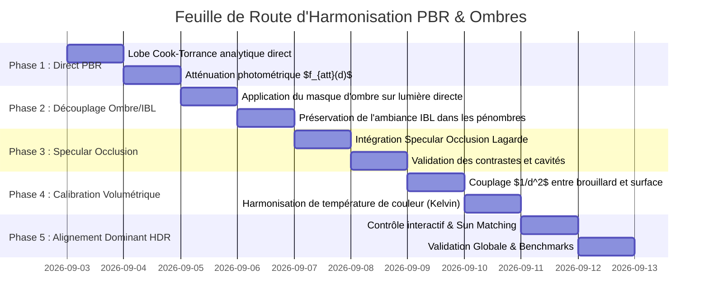

# 📐 Plan Directeur : Harmonisation Physique PBR Direct, Shadow Mapping & Ambiance IBL

**Document de Suivi & Spécification Technique**  
**Date :** 2 Septembre 2026  
**Auteur :** Antigravity Pair-Programming Assistant  
**Branche cible :** `feat/windows-cross-compilation` / `master`  
**Statut :** Spécification & Planification

---

## 1. Contexte & Diagnostic de l'Existant

### 1.1 Constat Visuel et Dissonance de Rendu
Dans l'état actuel du moteur, l'intégration de la source ponctuelle (*Point Light*), de l'éclairage volumétrique (*Volumetric Fog / Light Shafts*), des ombres portées (*Omnidirectional Shadow Maps*) et de l'environnement HDR (*IBL - Image-Based Lighting*) présente un manque de cohésion physique :

1. **Multiplication ad-hoc de l'IBL par le facteur d'ombre** :  
   Dans [`shaders/pbr_billboard.frag`](../shaders/pbr_billboard.frag), l'ombre est appliquée en multipliant la couleur issue de l'IBL par un coefficient d'occlusion `(1.0 - occlusion)`. Cela détruit artificiellement les réflexions spéculaires du ciel et l'irradiance ambiante, transformant les zones d'ombres en "taches noires" sans information photométrique.
2. **Déconnexion entre Faisceau Volumétrique et Surface** :  
   La source ponctuelle génère des puits de lumière volumétriques très intenses dans le brouillard, mais la surface des sphères réceptrices ne reçoit pas de lobe spéculaire direct (Cook-Torrance) ni d'irradiance diffuse directe proportionnelle à la puissance de la source.
3. **Absence d'Occlusion Spéculaire dans les Ombres Profondes** :  
   Les réflexions spéculaires de la skybox à angles rasants fuient dans les zones de contact et dans les zones totalement masquées par d'autres sphères.

```mermaid
graph TD
    subgraph Pipeline Actuel (Découplé)
        A[Skybox HDR] --> B[IBL Diffuse + Specular]
        B --> C[Couleur Surface IBL]
        D[Point Light] --> E[Shadow Map Cubemap]
        E --> F[Facteur d'Occlusion Scalaire]
        F --> G[Atténuation Destructive: Color *= 1 - Occlusion]
        C --> G
        G --> H[Rendu Final Dissonant]
    end

    subgraph Pipeline Cible (PBR Unifié)
        A2[Skybox HDR] --> B2[IBL Diffuse + Specular]
        B2 --> C2[Ambiance IBL Conservée dans l'Ombre]
        D2[Point Light] --> E2[Shadow Map Cubemap]
        D2 --> I2[Radiance Directe Cook-Torrance]
        E2 --> J2[Modulation Ombre Directe Uniquement]
        I2 --> J2
        J2 --> K2[Lumière Directe Atténuée]
        C2 --> L2[Sommation Physique: IBL + Direct * Shadow]
        K2 --> L2
        L2 --> M2[Rendu Harmonieux & Réaliste]
    end
```

---

## 2. Formulation Mathématique & Principes Physiques

### 2.1 Équation Fondamentale de Radiance Intégrée
L'équation de réflectance PBR complète s'exprime comme la somme conservative de la composante ambiante (IBL) et des sources directes modulées par leur visibilité géométrique $V(p, p_{\text{light}})$ :

$$L_o(p, \omega_o) = L_{\text{IBL}}(p, \omega_o) + \sum_{k} L_{\text{Direct}, k}(p, \omega_o) \cdot V_k(p)$$

#### Composante Ambiante IBL (Diffuse + Spéculaire avec Specular Occlusion)
$$L_{\text{IBL}}(p, \omega_o) = \left( k_d \cdot \text{Diffuse}_{\text{IBL}} \cdot \text{Albedo} + \text{Specular}_{\text{IBL}} \cdot \text{SO} \right) \cdot \text{AO}$$

Avec la formule d'occlusion spéculaire de Sébastien Lagarde (Frostbite) :
$$\text{SO} = \text{clamp}\left((\mathbf{n} \cdot \mathbf{v}) + \text{AO}, 0.0, 1.0\right)^2 - 1.0 + \text{AO}$$

#### Composante Directe Cook-Torrance (Point Light)
$$L_{\text{Direct}}(p, \omega_o) = \left( k_d \frac{\text{Albedo}}{\pi} + \frac{D(\omega_h, \alpha) \cdot F(\omega_o, \omega_h, F_0) \cdot G(\omega_o, \omega_i, \alpha)}{4 (\mathbf{n} \cdot \omega_o)(\mathbf{n} \cdot \omega_i)} \right) \cdot \Phi_{\text{light}} \cdot f_{\text{att}}(d) \cdot (\mathbf{n} \cdot \omega_i)$$

Où $f_{\text{att}}(d)$ est l'atténuation photométrique avec cutoff doux à rayon fini (Unreal Engine 4 / Karis) :
$$f_{\text{att}}(d) = \frac{\text{saturate}\left(1 - (d/r)^4\right)^2}{d^2 + 1}$$

---

## 3. Analyse d'Impact et Évaluation des Risques

| Risque Identifié | Gravité | Probabilité | Symptôme Potentiel | Stratégie de Mitigation |
| :--- | :---: | :---: | :--- | :--- |
| **Saturation / Burnout HDR** | Élevée | Moyenne | La somme IBL + Lumière Directe surexpose les sphères claires. | Auto-Exposure adaptative avec tone mapping AgX/ACES calibré ; normalisation de l'intensité de la point light en Lumens/Lux. |
| **Shadow Terminator Acne** | Moyenne | Élevée | Artefacts de facettage ou d'acné sur les sphères lisses à angle rasant. | Maintien du Receiver Normal-Offset Bias (RNOB) combiné au lissage géométrique du terminateur (`smoothstep(0.0, 0.06, NdotL)`). |
| **Régression de Performance GPU** | Moyenne | Faible | Coût additionnel du lobe spéculaire Cook-Torrance par fragment visible. | Optimisation analytique du BRDF (Kelemen/Szirmay-Kalos $V$ approximation) ; branchement dynamique évitant le calcul si $d > r$ ou si la lumière est éteinte. |
| **Divergence Local vs CI** | Élevée | Faible | Échecs de tests visuels sans GPU physique. | Encapsulation systématique des tests de non-régression sous Docker ISO `ubuntu:24.04` et Mesa llvmpipe headless (`xvfb-run`). |

---

## 4. Décomposition en Phases Itératives (Bisect-Safe)



### Phase 1 : Intégration du Lobe Direct Cook-Torrance dans `pbr_billboard.frag`
- **Objectif** : Ajouter le calcul de lumière directe analytique (BRDF spéculaire GGX/Smith + diffusion Lambert) sur la point light.
- **Fichiers modifiés** : [`shaders/pbr_billboard.frag`](../shaders/pbr_billboard.frag), [`src/scene/scene.odin`](../src/scene/scene.odin).
- **Critère de succès** : La point light illumine physiquement la face orientée vers elle, avec un spot spéculaire fidèle à la rugosité du matériau.

### Phase 2 : Découplage Strict de l'Ombre et de l'IBL Ambiant
- **Objectif** : L'ombre portée ne multiplie plus le résultat global, mais module **strictement** le terme direct :
  $$\text{Color} = \text{Color}_{\text{IBL}} + \text{Direct}_{\text{PBR}} \cdot \text{Shadow}$$
- **Fichiers modifiés** : [`shaders/pbr_billboard.frag`](../shaders/pbr_billboard.frag).
- **Critère de succès** : Dans l'ombre d'une sphère, le reflet du ciel et les couleurs HDR restent visibles et physiquement crédibles.

### Phase 3 : Occlusion Spéculaire & Horizon Clipping
- **Objectif** : Empêcher les fuites de reflets spéculaires IBL dans les occlusions de contact profondes.
- **Fichiers modifiés** : [`shaders/pbr_billboard.frag`](../shaders/pbr_billboard.frag).
- **Critère de succès** : Contraste accru et disparition des reflets aberrants dans les jonctions entre sphères occluses.

### Phase 4 : Harmonisation Radiométrique Volumétrique $\leftrightarrow$ Surface
- **Objectif** : Synchroniser l'intensité, la couleur (température Kelvin) et l'atténuation du raymarch volumétrique ([`shaders/postfx/volumetric_raymarch.frag`](../shaders/postfx/volumetric_raymarch.frag)) avec l'illumination de surface.
- **Critère de succès** : Le halo lumineux volumétrique semble émaner de la même entité physique qui frappe les surfaces.

### Phase 5 : Alignement HDR Dominant & Paramétrage UI ImGui
- **Objectif** : Exposer dans l'UI ImGui (onglets *Shadows* et *Volumetric*) un curseur de couplage IBL/Direct, une présélection d'intensité physique (Lux), et assurer la persistance JSON intégrale (`Session_State`).
- **Fichiers modifiés** : [`src/gui/gui_shadows.odin`](../src/gui/gui_shadows.odin), [`src/core/session/session.odin`](../src/core/session/session.odin), [`src/app/session.odin`](../src/app/session.odin).

---

## 5. Protocole d'Assurance Qualité & Benchmarks

### 5.1 Protocole de Test Qualité Visuelle (Rendu)
Pour chaque phase, validation formelle par captures d'écrans comparatives offscreen haute définition :

```bash
# 1. Validation de compilation et strict style
task lint

# 2. Exécution de la suite de tests unitaires et shaders
task test-unit
task test-shader

# 3. Tests de non-régression graphique sous Xvfb
task test-gl-xvfb
```

### 5.2 Protocole de Mesure de Performance GPU (Uncapped)
Mesure comparative avant/après via le profil de benchmark automatisé non-capé (VSync désactivée) :

```bash
# Mesure de référence sur 600 frames
task bench-render FRAMES=600 PROFILE=quality
task bench-render FRAMES=600 PROFILE=balanced
task bench-render FRAMES=600 PROFILE=ultra
```

#### Objectifs Budgétaires GPU (Cible 1080p sur GPU Dédié & iGPU) :
- **Surcoût shader fragment max admissible** : $\le 0.15\text{ ms}$ en 1080p (soit $< 2\%$ du frametime).
- **Consommation mémoire VRAM additionnelle** : $0\text{ Mo}$ (réutilisation des structures de données et UBO existants).
- **Framerate cible** : $> 140\text{ FPS}$ en qualité maximale avec ombres PCF 16-tap et volumétrique Beer-Lambert actif.

---

## 6. Historique des Révisions

| Date | Auteur | Description des Changements | Statut |
| :--- | :--- | :--- | :---: |
| **2026-09-02** | Antigravity AI | Création initiale du plan directeur d'harmonisation PBR, Shadow Mapping et IBL | **Approuvé pour Spécification** |
