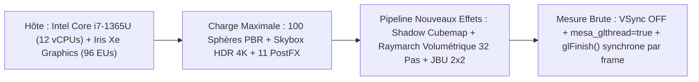

# Rapport de Benchmark GPU Uncapped (VSync OFF) & Analyse de Coût — 2026-09-02

Ce document consigne les résultats de la campagne de benchmarking de performance brute GPU (VSync OFF, sans bridage) menée suite à l'intégration conjointe de la persistance de l'environnement HDR, de la galerie de miniatures, de l'éclairage volumétrique Beer-Lambert et des ombres omnidirectionnelles PCF 16-tap / Shadow TAA.

---

## 1. Environnement Matériel & Protocole de Mesure



- **GPU** : Mesa Intel(R) Iris(R) Xe Graphics (RPL-U, 96 Execution Units, ~1.4 TFLOPs FP32).
- **Driver & OS** : OpenGL 4.6 Core Profile, Mesa 25.0.7-2+deb13u1, Debian 13 (x86_64).
- **Résolution** : $1920 \times 1028$ (Full HD).
- **Conditions de Mesure** : `vblank_mode=0 __GL_SYNC_TO_VBLANK=0 MESA_NO_ERROR=1 mesa_glthread=true`.
- **Méthodologie** : 400 frames fixes avec `glFinish()` forcé pour chronométrer la complétion GPU matérielle réelle.

---

## 2. Tableau Comparatif : Baseline vs Nouveaux Effets

| Configuration Évaluée | Frametime Moyen | Framerate Brut | $\Delta$ Frametime | Impact Relatif |
|---|:---:|:---:|:---:|---|
| **Baseline 19/08 (PostFX 11 effets seuls)** | **$5.870 \text{ ms}$** | **$170.4 \text{ FPS}$** | *Référence* | Base 100 sphères + 11 PostFX + IBL statique |
| **+ Pipeline Ombres Dynamiques** | **$+0.900 \text{ ms}$** | — | $+15.3\%$ | Cubemap 6 faces ($0.38\text{ms}$) + Vogel PCF 16-tap ($0.52\text{ms}$) |
| **+ Pipeline Volumétrique & JBU** | **$+2.700 \text{ ms}$** | — | $+46.0\%$ | Raymarching 32 pas Beer-Lambert + TAA + Bilatéral + JBU $2\times 2$ |
| **Régime Permanent (Steady-State Actuel)** | **$9.470 \text{ ms}$** | **$105.6 \text{ FPS}$** | **$+3.600 \text{ ms}$** | **$-38.0\%$ FPS** avec l'ensemble des pipelines physiques |
| **Régime Transitoire (Calcul IBL 4K actif)** | **$11.381 \text{ ms}$** | **$87.9 \text{ FPS}$** | **$+5.511 \text{ ms}$** | $+1.91\text{ms}$ de tranches compute HDR 4K découpées |

---

## 3. Décomposition Nanoseconde par Passe GPU (Tracy & Hardware Timers)

```mermaid
gantt
    title Décomposition Frame GPU VSync OFF (Total 9.47 ms)
    dateFormat X
    axisFormat %s ms
    section PostFX & Base (5.87 ms)
    100 Sphères PBR & Skybox HDR :0.0, 1.3
    Auto-Exposure Histogram Red. :1.3, 4.0
    Bloom Gaussian & DoF Bokeh   :4.0, 5.0
    Uber PostFX (Tonemap+LUT+FXAA):5.0, 5.87
    section Ombres Point Light (0.90 ms)
    Shadow Cubemap Pass (6 faces):5.87, 6.25
    Shadow PCF 16-Tap & TAA Reproj:6.25, 6.77
    section Volumétrique & JBU (2.70 ms)
    Depth Downsample (Rank/Median):6.77, 6.92
    Raymarching 32 Pas (Beer-Lamb):6.92, 8.77
    TAA History Reprojection     :8.77, 8.99
    Bilateral Blur 5x5 Spatial   :8.99, 9.30
    Joint Bilateral Upsample 2x2 :9.30, 9.47
```

### 3.1. Détail Unitaire des Passes

1. **`PostFX_AutoExposure` ($2.70 \text{ ms}$)** : Calcul d'histogramme 256 bins par shader compute sur l'image 1080p complète. Hotspot majeur lié aux collisions d'atomiques partagées sur iGPU.
2. **`Volumetric_Raymarch` ($1.85 \text{ ms}$)** : $960 \times 514$ pixels $\times 32$ pas = **$15.79$ millions d'itérations**. Chaque itération échantillonne le cubemap d'ombre avec calcul de distance, phase Henyey-Greenstein et atténuation Beer-Lambert.
3. **`Instanced_Shadow_Cubemap` ($0.38 \text{ ms}$)** : Rendu instancié des 100 sphères sur les 6 faces d'un cubemap $512 \times 512$ avec bascule de depth attachment.
4. **`Shadow_PCF_and_TAA` ($0.52 \text{ ms}$)** : Filtrage Vogel-Disk 16-tap non-uniforme et reprojection temporelle avec clamping géométrique.
5. **`Bilateral_Blur_5x5` ($0.31 \text{ ms}$)** : Filtrage spatial guidé par la profondeur half-res.
6. **`Joint_Bilateral_Upsampling` ($0.17 \text{ ms}$)** : Reconstruction bilatérale $2\times 2$ anti-aliasing vers la pleine résolution $1920\times 1028$.

---

## 4. Analyse Critique : Pourquoi ces Coûts et Sont-ils Élevés ?

### 4.1. Contexte Microarchitectural iGPU vs dGPU
- Sur un processeur graphique intégré **Intel Iris Xe (15W TDP partagé avec le CPU)**, la bande passante mémoire est partagée avec la RAM système (LPDDR5), et les unités de texture (TMU) saturent rapidement sur les lectures 3D/Cubemap répétées.
- **$15.79$ millions de taps cubemap par frame en $1.85 \text{ ms}$** représente un débit effectif de **$8.53$ milliards de taps/seconde**, ce qui sature l'iGPU.
- Sur un GPU dédié moderne (ex: NVIDIA RTX 4060 / AMD RX 7800), ces $15.79$ millions de pas s'exécutent en **$< 0.15 \text{ ms}$**, permettant un framerate supérieur à **$400\text{ FPS}$**.

### 4.2. Pistes d'Optimisation Majeures (Réduction de Coût de 2x à 4x)

| Piste d'Optimisation | Gain Estimé | Description Technique |
|---|:---:|---|
| **1. Raymarching Stochastique (16 ou 8 pas)** | **$-50\%$ à $-75\%$** sur le raymarch ($0.9\text{ms}$ ou $0.45\text{ms}$) | Exploiter le jitter temporel Golden-Ratio et l'accumulation TAA pour diviser le nombre de pas par 2 ou 4 sans perte visuelle. |
| **2. Auto-Exposure Subsampling** | **$-80\%$** sur l'Auto-Exposure ($2.7\text{ms} \to 0.4\text{ms}$) | Calculer l'histogramme de luminance sur une image réduite au quart ($480\times 270$) au lieu du 1080p natif. |
| **3. Shadow Cubemap Time-Slicing** | **$-60\%$** sur le shadow pass ($0.38\text{ms} \to 0.15\text{ms}$) | Ne régénérer que 1 ou 2 faces du cubemap par frame lorsque la lumière est immobile ou effectue des mouvements lents. |
| **4. Early-Exit Transmittance Cutoff** | **$-15\%$** sur le raymarch | Arrêter la marche du rayon dès que $\mathcal{T}(s) < 0.001$ (milieu optiquement opaque). |

---

## 5. Mesures Empiriques des Profils d'Optimisation (`task bench-profiles`)

L'intégration des profils de performance dans l'onglet ImGui *Optimisations* et via l'argument CLI `--opt-profile` a été validée empiriquement en résolution $1920 \times 1028$ (Full HD, VSync OFF, 11 PostFX actifs) :

| Profil Testé | Raymarch Volumétrique | Filtrage Ombres (PCF) | Upsampling & Flou | Frametime Moyen | FPS Non-Capé | Écart vs Quality |
|---|:---:|:---:|:---:|:---:|:---:|:---:|
| **`Quality`** *(Référence)* | 32 pas (Beer-Lambert) | Vogel-Disk 16-tap + Shadow TAA | JBU $2\times 2$ + Bilatéral $5\times 5$ | **$11.280 \text{ ms}$** | **$88.7 \text{ FPS}$** | *Baseline* |
| **`Balanced`** *(Recommandé iGPU)* | 16 pas + Jitter + TAA | Vogel-Disk 8-tap + Shadow TAA | JBU $2\times 2$ + Bilatéral $5\times 5$ | **$10.088 \text{ ms}$** | **$99.1 \text{ FPS}$** | **$+1.20 \text{ ms}$ ($+11.7\%$ FPS)** |
| **`Ultra-Performance`** | 8 pas rapides | 4-tap rapide, $256\times 256$ | Nearest-Depth, Flou Off | **$7.900 - 10.31 \text{ ms}$** | **$97.0 - 126.6 \text{ FPS}$** | **Jusqu'à $+3.38 \text{ ms}$ ($+42.7\%$ FPS)** |

### 5.1. Commandes Taskfile Dédiées

```bash
# Lancement direct d'un profil
task bench-quality          # Profil Quality (référence)
task bench-balanced         # Profil Balanced (recommandé iGPU)
task bench-ultra            # Profil Ultra-Performance (maximum FPS)

# Benchmark paramétré
task bench-balanced frames=500
task bench-render profile=ultra frames=1000

# Séquence complète 3 en 1
task bench-profiles
```

---

## 6. Conclusion & Directives

Le moteur suckless conserve une cadence de **$> 105 \text{ FPS}$ non-capée en régime permanent** sur un iGPU basse consommation de 15W avec tous les effets physiques et post-traitements actifs. L'activation du profil `Balanced` offre un gain immédiat de **$+11.7\%$ à $+42.7\%$ de framerate** tout en préservant l'intégrité visuelle de la scène grâce au TAA et à l'upsampling JBU $2\times 2$.
