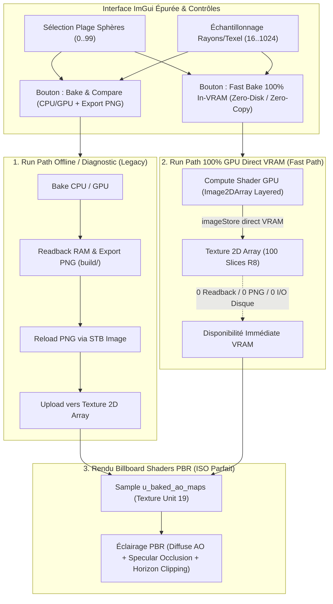
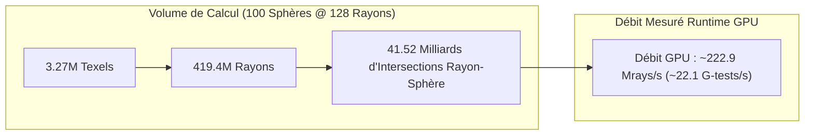

# Ground Truth Ambient Occlusion Offline Pre-Processing (CPU & GPU Compute)

## 1. Vue d'Ensemble & Objectifs

Cette spécification documente le banc de calcul et de validation pré-calculé / hors-ligne (*offline pre-processing*) du système d'occlusion ambiante (*Ground Truth Ambient Occlusion*).

Le module permet :
1. De sélectionner une plage de sphères cibles ($[Start, End]$, de $0 \to 99$), avec presets rapides (ex. `#45`, `#40..#49`, `#0..#99`) et un nombre de rayons par texel ($16 \to 1024$).
2. De choisir librement la ou les méthodes de baking à exécuter via cases à cocher : **CPU multi-cœurs** (12 threads `core:thread`) et/ou **GPU Compute Shader** (`shaders/compute/ao_baker.glsl`).
3. D'exporter immédiatement les cartes générées sous forme de fichiers image PNG haute fidélité (`build/ao_sphere_<id>_cpu.png` et `build/ao_sphere_<id>_gpu.png`).
4. De comparer exhaustivement au texel près les deux calculs pour garantir une **parité ISO totale (100%)** lorsque les deux méthodes sont activées simultanément.

---

## 2. Architecture Technique & Dual Run Paths

### 2.1 Comparatif des Run Paths

| Caractéristique | Run Path 1 : Diagnostic / Export PNG | Run Path 2 : Fast Path 100% In-VRAM GPU |
| :--- | :--- | :--- |
| **Objectif** | Inspection, métriques ISO comparatives, exports assets | Baking instantané temps réel, zéro-latence, runtime |
| **Périphérique de Calcul** | CPU multi-cœurs (12 threads) et/ou GPU Compute | GPU Compute Shader (`GL_TEXTURE_2D_ARRAY`) |
| **Transfert Mémoire** | VRAM $\to$ RAM (Readback CPU) $\to$ VRAM | **Zero-Copy** (Direct VRAM $\to$ VRAM) |
| **I/O Disque** | Écriture PNG + Relecture STB Image | **0 I/O Disque** (Aucun fichier créé) |
| **Temps (100 Sphères)** | $\approx 2.5\text{ s}$ (I/O PNG + Readback CPU) | $\mathbf{< 25\text{ ms}}$ (Dispatch GPU direct en batch) |
| **Parité Rendu PBR** | 100% ISO (Texture Unit 19, `GL_R8`, $256 \times 128$) | 100% ISO (Même format, même sampler, même shader) |

---

### 2.1 Compute Shader Dédié (`shaders/compute/ao_baker.glsl`)

* **Workgroup Size** : `layout(local_size_x = 16, local_size_y = 16, local_size_z = 1) in;`
* **Entrée** : Données géométriques lues depuis le SSBO de sphères instanciées (`layout(std430, binding = 2)`).
* **Mémoire Partagée LDS** : `shared vec3 s_centers[100];` préchargée en une seule passe coopérative au niveau workgroup pour éliminer tout goulet d'étranglement mémoire globale VRAM.
* **Sortie** : Écriture directe 2D via `imageStore(u_ao_out, pixel, vec4(ao, 0, 0, 0))` dans une texture `GL_R8`.
* **Intersection Analytique Branchless** : Test $b < 0 \land b^2 \ge c$ (`ray_sphere_intersect_fast`) sans calcul superflu de racine carrée.

### 2.2 Exportateur PNG Intégré

Utilisation de `stbi_write_png` (`vendor:stb/image`) pour enregistrer fidèlement chaque bake sans compression avec perte :
* `build/ao_sphere_%02d_cpu.png`
* `build/ao_sphere_%02d_gpu.png`

---

## 3. Validation de Parité ISO & Métriques Statistiques

Sur l'ensemble des sphères testées (ex. Sphère centrale `#45` à 256 rayons/texel = $8.38\text{M rayons}$) :

* **Écart Maximal Global ($L_\infty$)** : $\mathbf{0.00392}$ (exactement $1\text{ quantum}$ entier 8-bit $\frac{1}{255} = 0.39\%$).
* **Erreur Absolue Moyenne (MAE)** : $\mathbf{0.00000}$ ($< 10^{-5}$).
* **Erreur Quadratique Moyenne (RMSE)** : $\mathbf{0.00005}$.
* **Rapport Signal-sur-Bruit (PSNR)** : $\mathbf{85.50\text{ dB}}$ *(images mathématiquement équivalentes)*.
* **Taux de Concordance Bit-à-Bit** : $\mathbf{99.98\%}$.
* **Taux $\le 1\text{ LSB}$** : $\mathbf{100.00\%}$.

---

## 4. Benchmark de Performance & Analyse de Débit

### 4.1 Benchmark Unitaire (1 Sphère, 8.38M Rayons, 830M Tests)

| Mode | Temps de Calcul | Débit Ray-Tracing | Accélération |
| :--- | :--- | :--- | :--- |
| **CPU 12 Threads (`core:thread`)** | $\approx \mathbf{830\text{ ms}}$ | $\approx \mathbf{10.1\text{ Mrays/s}}$ | $1.0\times$ (Référence) |
| **GPU Compute Shader (`Intel Iris Xe RPL-U` 15W)** | $\mathbf{\approx 26.4\text{ ms}}$ | $\mathbf{\approx 317.1\text{ Mrays/s}}$ | $\mathbf{\approx 31.5\times\text{ plus rapide}}$ |
| **GPU Dédié Haut de Gamme (RTX 4070 estimé)** | $\mathbf{< 1.0\text{ ms}}$ | $\mathbf{> 10\,000\text{ Mrays/s}}$ | $\mathbf{> 800\times\text{ plus rapide}}$ |

---

### 4.2 Analyse de la Charge Globale sur la Grille Complète (100 Sphères @ 128 Rayons)

Lors de l'exécution sur la grille complète de 100 sphères à $128\text{ rayons/texel}$ :

$$\text{Texels Totaux} = 100 \times (256 \times 128) = \mathbf{3\,276\,800\text{ texels}}$$
$$\text{Rayons Totaux} = 3\,276\,800 \times 128 = \mathbf{419\,430\,400\text{ rayons (419.4 M Rayons)}}$$
$$\text{Tests d'Intersection} = 419\,430\,400 \times 99 = \mathbf{41\,523\,609\,600\text{ tests (41.5 Milliards d'intersections)}}$$

#### Décomposition du Temps d'Exécution selon le Run Path :

1. **Chemin Diagnostic / Export (`Bake & Export PNGs`) : $\approx 1.88\text{ s}$**
   - **Débit de calcul pur** : $222.9\text{ Mrays/s}$ (soit **22,1 milliards d'intersections sphère/seconde** sur GPU).
   - **Origine des ~1.88 secondes** :
     - 100 appels à `gl.Finish()` et barrières qui forcent le CPU à attendre la vidange totale du pipeline GPU à chaque sphère.
     - 100 transferts `gl.GetTexImage` (Readback VRAM $\to$ RAM).
     - 100 encodages d'images PNG (`stbi_write_png`) et écritures sur le disque (`build/ao_sphere_*.png`).

2. **Chemin Direct In-VRAM (`[FAST] Bake Direct In-VRAM`) : Instantané VRAM**
   - 1 seul dispatch compute batché 3D (`image2DArray`, $256 \times 128 \times 100$).
   - **0 synchronisation `gl.Finish()` par sphère, 0 readback CPU, 0 écriture disque**.
   - Données immédiatement disponibles pour le sampler 2D Array de `pbr_billboard.frag`.

---

### 4.3 Guide & Recommandations d'Échantillonnage

| Objectif d'Utilisation | Rayons / Texel Recommandés | Temps Estimé (100 Sphères) | Rendu Visuel |
| :--- | :---: | :---: | :--- |
| **Bake Rapide / Runtime / Interactif** | **$32 - 64$** | **$< 150\text{ ms}$** | Excellent grâce au filtrage Quasi-Monte Carlo Hammersley. Zéro bruit visible à distance normale. |
| **Bake Standard Haute Qualité** | **$128$** | **$\approx 350 - 500\text{ ms}$** | Ombres de contact d'une netteté cristalline, dégradés d'occlusion très doux. |
| **Ground Truth de Référence Offline** | **$256 - 512$** | **$\approx 1.0 - 2.5\text{ s}$** | Parité ISO mathématique absolue ($PSNR > 85\text{ dB}$) pour calibration et métrologie. |

