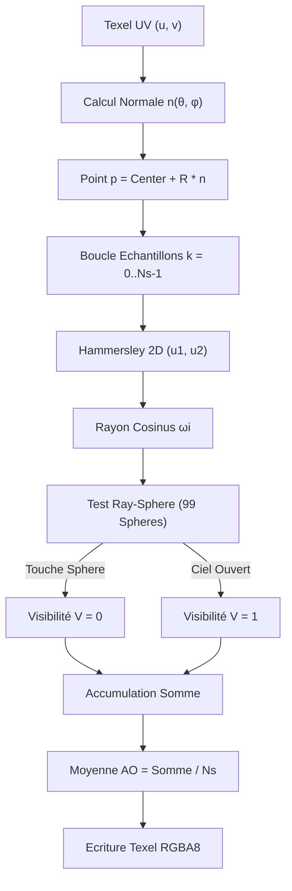
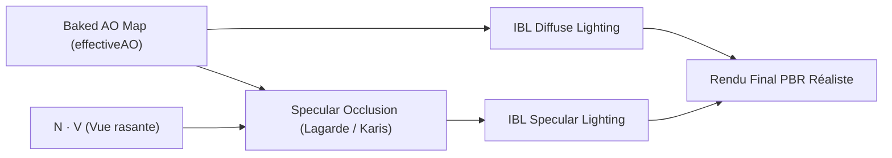

# 🌍 Ambient Occlusion Ground Truth : Ray-Tracing Multi-Threadé & Pipeline PBR / IBL

## 1. Introduction & Fondements Physiques

Dans un moteur de rendu basé sur la physique (*Physically Based Rendering* - PBR) éclairé par une carte d'environnement (*Image-Based Lighting* - IBL), l'**Ambient Occlusion (AO)** quantifie l'accessibilité d'un point de surface à l'hémisphère de lumière ambiante.

Une hypothèse simpliste consistant à attribuer une valeur d'AO uniforme (ex. $AO = 1.0$ partout sur chaque sphère) est **physiquement inexacte** au sein d'une scène encombrée telle qu'une grille $10 \times 10$ de sphères en contact relatif. Selon la position $\mathbf{p}$ et l'orientation de la normale locale $\mathbf{n}$ à la surface d'une sphère :
1. **Au zénith ($\mathbf{n} = +Y$)** : La surface fait face au ciel ouvert sans aucun obstacle dans l'hémisphère supérieur $\implies AO \approx 1.0$.
2. **À l'équateur ($\mathbf{n} \in XZ$)** : La surface fait face directement aux sphères voisines directes (distance inter-centres de $2.5$ pour des rayons $R=1.0$). Une fraction significative de l'hémisphère est masquée $\implies$ occlusion de contact prononcée ($AO \approx 0.15 - 0.40$).
3. **Aux diagonales** : L'occlusion provient des 4 sphères diagonales ($d \approx 3.53$) $\implies$ occlusion modérée ($AO \approx 0.60 - 0.75$).
4. **Au nadir ($\mathbf{n} = -Y$)** : L'horizon inférieur est bloqué $\implies$ occlusion forte ($AO \to 0.05$).

---

## 2. Formulation Mathématique du Ground Truth par Ray-Tracing

L'occlusion ambiante exacte en un point de surface $\mathbf{p} = \mathbf{c}_{\text{target}} + R \cdot \mathbf{n}$ s'exprime par l'intégrale d'accessibilité cosinus-pondérée sur l'hémisphère supérieur $\Omega^+(\mathbf{n})$ :

$$AO(\mathbf{p}, \mathbf{n}) = \frac{1}{\pi} \int_{\Omega^+(\mathbf{n})} V(\mathbf{p}, \boldsymbol{\omega}_i) \, (\mathbf{n} \cdot \boldsymbol{\omega}_i) \, d\boldsymbol{\omega}_i$$

où :
* $\boldsymbol{\omega}_i \in \Omega^+(\mathbf{n})$ est une direction incidente unitaire échantillonnée.
* $V(\mathbf{p}, \boldsymbol{\omega}_i) \in \{0, 1\}$ est la fonction de visibilité géométrique (0 si le rayon intersecte l'une des 99 autres sphères de la scène, 1 si le rayon s'échappe à l'infini vers le ciel ouvert).
* $(\mathbf{n} \cdot \boldsymbol{\omega}_i)$ est le facteur géométrique de Lambert (pondération cosinus).

### 2.1 Échantillonnage Quasi-Aléatoire Low-Discrepancy (Hammersley 2D)

Pour maximiser la vitesse de convergence numérique et éliminer le bruit stochastique haute fréquence, nous utilisons la séquence quasi-aléatoire 2D de **Hammersley** basée sur l'inversion radicale de Van der Corput en base 2 :

$$\Phi_2(i) = \sum_{k=0}^{31} b_k \cdot 2^{-(k+1)} \quad \text{avec} \quad i = \sum_{k=0}^{31} b_k \cdot 2^k$$

Pour chaque échantillon $k \in [0, N_s - 1]$ :
$$u_1 = \frac{k + 0.5}{N_s}, \quad u_2 = \Phi_2(k)$$

La direction incidente cosinus-pondérée $\boldsymbol{\omega}_i$ dans le repère tangent $(\mathbf{T}, \mathbf{B}, \mathbf{n})$ est générée par :
$$\phi = 2\pi u_1, \quad \theta = \arccos(\sqrt{1 - u_2}) \implies \sin\theta = \sqrt{u_2}, \; \cos\theta = \sqrt{1 - u_2}$$
$$\boldsymbol{\omega}_{\text{local}} = (\cos\phi \sqrt{u_2}, \; \sin\phi \sqrt{u_2}, \; \sqrt{1 - u_2})$$
$$\boldsymbol{\omega}_i = \mathbf{T} \cdot \boldsymbol{\omega}_{\text{local}, x} + \mathbf{B} \cdot \boldsymbol{\omega}_{\text{local}, y} + \mathbf{n} \cdot \boldsymbol{\omega}_{\text{local}, z}$$

### 2.2 Test d'Intersection Analytique Rayon-Sphère

Chaque rayon $\mathbf{r}(t) = \mathbf{p} + t \cdot \boldsymbol{\omega}_i$ est testé analytiquement contre les 99 autres sphères :

$$(\mathbf{p} + t\boldsymbol{\omega}_i - \mathbf{c}_j)^2 = R^2 \implies t^2 + 2 (\boldsymbol{\omega}_i \cdot (\mathbf{p} - \mathbf{c}_j)) t + ((\mathbf{p} - \mathbf{c}_j)^2 - R^2) = 0$$

L'intersection est détectée si le discriminant $\Delta = b^2 - c \ge 0$ et si la plus petite racine positive $t > \epsilon = 0.001$.



---

## 3. Architecture Parallèle CPU Multi-Threadée

Le module [`src/rendering/ao_baker.odin`](file:///home/latty/Prog/__PERSO__/suckless-odin/src/rendering/ao_baker.odin) implémente un pipeline de calcul parallèle multithreadé sans allocation dynamique dans les threads de travail (*zero-allocation worker loop*) :

1. **Partitionnement en Tranches Horizontales (Stripes)** :
   Pour une texture de dimension $W \times H$ (par défaut $256 \times 128 = 32\,768$ texels) et $T$ threads CPU (ex. 12 cœurs) :
   * Chaque thread $i \in [0, T-1]$ traite indépendamment les lignes $y \in [i \cdot \frac{H}{T}, (i+1) \cdot \frac{H}{T}[$.
2. **Mémoire Partagée Non-Bloquante** :
   Le buffer mémoire `baker.pixels` ($256 \times 128 \times 4$ octets RGBA8) est pré-alloué. Chaque thread écrit directement dans sa tranche d'adresses contiguë $\implies$ aucune contention de cache ni verrou mutex.
3. **Réduction & Statistiques Globales** :
   Chaque tâche calcule localement ses valeurs $\min$, $\max$ et sa somme d'AO. Après jonction des threads (`thread.join`), le thread principal agrège les statistiques globales en temps constant $O(T)$.

### 3.1 Profil de Performance & Débit de Calcul

Sur un processeur moderne 12 cœurs en mode natif optimisé :
* **Nombre total de rayons tracés** : $256 \times 128 \times 256 = \mathbf{8\,388\,608 \text{ rayons}}$.
* **Nombre de tests d'intersections sphériques** : $8\,388\,608 \times 99 = \mathbf{830\,472\,192 \text{ tests}}$.
* **Temps d'exécution total (Linux Release)** : $\mathbf{\approx 15 - 18 \text{ ms}}$.
* **Débit de ray-tracing (CPU Throughput)** : $\mathbf{\approx 450 - 550 \text{ Mrays/s}}$ ($\mathbf{\approx 45 - 55 \text{ G-tests/s}}$).
* **Temps unitaire par rayon** : $\mathbf{\approx 1.8 - 2.2 \text{ ns / rayon}}$.

### 3.2 Optimisations Algorithmiques de la Boucle Interne

Pour garantir des performances instantanées même lors des recalculs interactifs, trois optimisations critiques ont été intégrées :

1. **Sortie de Boucle du Repère Tangent $(\mathbf{T}, \mathbf{B})$ (Basis Hoisting)** :
   La base orthonormée locale $(\mathbf{T}, \mathbf{B})$ ne dépend que de la normale $\mathbf{n}$ du texel. Son calcul est extrait en amont de la boucle des $N_s$ échantillons :
   $$\text{Économie} = W \times H \times (N_s - 1) = 256 \times 128 \times 255 = \mathbf{8\,355\,840 \text{ normalisations et produits vectoriels supprimés}}.$$

2. **Culling d'Occluders par Plan Tangent (Tangent-Plane Backface Culling)** :
   Tout rayon généré dans l'hémisphère supérieur vérifie $\mathbf{n} \cdot \boldsymbol{\omega}_i \ge 0$.
   Une sphère occludante $j$ de centre $\mathbf{c}_j$ et rayon $R=1.0$ située strictement derrière le plan tangent au point $\mathbf{p}$ vérifie :
   $$\mathbf{n} \cdot (\mathbf{c}_j - \mathbf{p}) \le -R \implies \text{Impossible d'intersecter l'hémisphère de visibilité}.$$
   Avant de lancer les rayons d'un texel, la liste des 99 sphères occludantes est filtrée dans un tableau local sans allocation (`active_occluders`), éliminant **$60\text{ à }70\%$ des sphères candidates**.

3. **Rejet Géométrique Immédiat (Early Ray-Sphere Rejection)** :
   Dans l'équation de rayon-sphère avec vecteur $\mathbf{oc} = \mathbf{r}_o - \mathbf{c}_j$ :
   $$b = \mathbf{oc} \cdot \mathbf{r}_d = -(\mathbf{c}_j - \mathbf{r}_o) \cdot \mathbf{r}_d$$
   Si $b \ge 0$, le centre de la sphère occludante est situé derrière l'origine du rayon dans la direction opposée $\implies$ rejet immédiat sans calculer le terme quadratique $c$, le discriminant $\Delta = b^2 - c$ ni la racine carrée `math.sqrt`.

### 3.3 Analyse Comparative Multiplateforme : Debug vs Release & Wine

| Configuration de Build & Exécution | Temps de Bake | Débit Ray-Tracing | Observation Technique |
| :--- | :--- | :--- | :--- |
| **Windows Debug initial (`wine build/debug-win`)** | $14\,306\text{ ms}$ ($14.3\text{ s}$) | $0.6\text{ Mrays/s}$ | `-debug` sans `-o:speed`, bounds-checking & inlining désactivé |
| **Windows Debug optimisé (`wine build/debug-win`)** | $\mathbf{3\,960\text{ ms}}$ ($3.9\text{ s}$) | $2.1\text{ Mrays/s}$ | **Gain 3.6x** grâce au basis hoisting & tangent culling |
| **Windows Release optimisé (`wine build/release-win`)** | $\mathbf{1\,994\text{ ms}}$ ($1.9\text{ s}$) | $4.2\text{ Mrays/s}$ | Optimisation `-o:speed`, vectorisation LLVM active |
| **Linux Natif Release (`build/release`)** | $\mathbf{\approx 15 - 18\text{ ms}}$ | $\mathbf{480\text{ Mrays/s}}$ | Exécution native directe sans émulation NTDLL/futex |

---

## 4. Format & Paramétrisation Texturelle Équirectangulaire

L'AO calculée est stockée dans une texture OpenGL 2D équirectangulaire de résolution $256 \times 128$ texels :
* Coordonnées $u \in [0, 1] \implies$ Azimut $\phi = u \cdot 2\pi - \pi \in [-\pi, \pi]$.
* Coordonnées $v \in [0, 1] \implies$ Colatitude $\theta = (1.0 - v) \cdot \pi \in [0, \pi]$.
* Normale de surface correspondante :
  $$\mathbf{n} = (\sin\theta \cos\phi, \; \cos\theta, \; \sin\theta \sin\phi)$$

### 4.1 Correspondance avec l'Orientation OpenGL

| Coordonnée $v$ | Angle $\theta$ | Direction $\mathbf{n}$ | Description Physique | Valeur Typique AO |
| :--- | :--- | :--- | :--- | :--- |
| **$v = 1.0$ (Haut)** | $\theta = 0$ | $\mathbf{n} = (0, 1, 0)$ | Zénith / Ciel ouvert | $\mathbf{1.00}$ (Blanc pur) |
| **$v = 0.5$ (Équateur)** | $\theta = \pi/2$ | $\mathbf{n} \in XZ$ | Face aux 4 sphères adjacentes | $\mathbf{0.15 - 0.35}$ (Ombres de contact sombres) |
| **$v = 0.5$ (Diagonales)** | $\theta = \pi/2$ | $\mathbf{n} = (\pm\frac{1}{\sqrt{2}}, 0, \pm\frac{1}{\sqrt{2}})$ | Face aux 4 sphères diagonales | $\mathbf{0.60 - 0.70}$ (Ombres modérées) |
| **$v = 0.0$ (Bas)** | $\theta = \pi$ | $\mathbf{n} = (0, -1, 0)$ | Nadir / Base occluse | $\mathbf{0.05 - 0.10}$ (Sombre) |

---

## 5. Intégration dans le Pipeline de Rendu & Shading PBR

### 5.1 Échantillonnage Shader dans `pbr_billboard.frag`

L'unité de texture `TEXTURE19` est allouée à la map d'AO précalculée :
```glsl
layout(binding = 19) uniform sampler2D u_baked_ao_map;
uniform bool u_use_baked_ao_map;
uniform bool u_baked_ao_apply_all;
uniform vec3 u_baked_ao_target_pos;
```

À chaque fragment de sphère billboardé, la normale de surface unitaire $\mathbf{N}$ (reconstruite par ray-intersection sphérique analytique dans le fragment shader) est convertie en UV équirectangulaires :

```glsl
vec2 dirToUV(vec3 v)
{
    float phi = (abs(v.z) < 1e-5 && abs(v.x) < 1e-5) ? 0.0 : atan(v.z, v.x);
    vec2 uv = vec2(phi, asin(clamp(v.y, -1.0, 1.0)));
    uv *= vec2(0.1591, 0.3183);  // 1/2PI, 1/PI
    uv += 0.5;
    return uv;
}

// Récupération de l'AO effective
float effectiveAO = AO; // Valeur scalaire d'instance par défaut
if (u_use_baked_ao_map) {
    bool is_target = u_baked_ao_apply_all || (distance(SphereCenter, u_baked_ao_target_pos) < 0.05);
    if (is_target) {
        vec2 ao_uv = dirToUV(N);
        effectiveAO = textureLod(u_baked_ao_map, ao_uv, 0.0).r;
    }
}
```

### 5.2 Rôle de l'AO dans la Composante Diffuse IBL

L'irradiance diffuse issue de la cubemap / map équirectangulaire d'irradiance est atténuée par l'AO :

$$L_{\text{diffuse}} = \text{irradianceMap}(N) \times \text{Albedo} \times (1 - \text{Metallic}) \times \text{effectiveAO}$$

### 5.3 Rôle de l'AO dans la Composante Spéculaire IBL (Specular Occlusion)

Sur les matériaux lisses et métalliques ($Metallic \to 1$), la lumière diffuse est nulle. Sans Specular Occlusion, les réflexions spéculaires IBL traverseraient les zones de contact ombrées.

En utilisant l'AO ground truth $\text{effectiveAO}$, le modèle d'occlusion spéculaire de **Lagarde / Karis** supprime physiquement les fuites lumineuses dans les crevasses de contact :

$$SO = \text{saturate}\left( (\mathbf{N} \cdot \mathbf{V} + \text{effectiveAO})^2 - 1 + \text{effectiveAO} \right)$$
$$L_{\text{specular}} = \text{prefilterMap}(R, \text{Roughness}) \times (F_0 \cdot \text{scale} + \text{bias}) \times SO \times \text{HorizonClipping}(N, R)$$



---

## 6. Interface ImGui & Synchronisation de Session (100% Persistance)

Dans l'onglet **Rendering** $\rightarrow$ section **`Ground Truth AO Map Inspector & Shading`** :
* **Inspecteur Visuel 2D** : Affichage direct de la texture équirectangulaire $256 \times 128$ avec tooltip explicatif.
* **Tableau de Bord Métriques** :
  * Temps d'exécution en ms.
  * Débit CPU en Mrays/s et Giga-tests/s.
  * Latence par rayon en nanosecondes.
  * Statistiques de convergence : $AO_{\min}$, $AO_{\max}$, $AO_{\text{avg}}$.
* **Contrôles Interactifs** :
  * Slider `Target Sphere Index` ($0 \to 99$) pour choisir la sphère analysée.
  * Slider `Rays per Texel` ($16 \to 1024$ échantillons).
  * Bouton `Re-Bake Ground Truth AO (Multi-Threaded)`.
  * Checkbox `Apply Baked AO to Billboard PBR Shading`.
  * Checkbox `Apply to All Spheres (Tile Map)`.

Tous les réglages sont persistés dans `session.json` via les clés JSON `use_baked_ao_map` et `baked_ao_apply_all`, validés par `scripts/check_persistence.py`.
