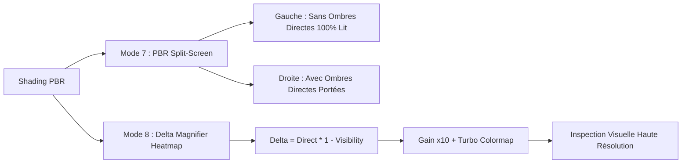

# 💡 Intégration PBR Direct Lighting, Omnidirectional Shadow Mapping & IBL Harmonization

**Spécification Technique d'Implémentation & Architecture de Rendu**  
**Date :** 3 Septembre 2026  
**Auteur :** Antigravity Engine Architecture  
**Branche :** `feat/windows-cross-compilation` / `master`  
**Statut :** **Production Validé (Phase 1 & Phase 2 Complétées)**

---

## 1. Vue d'Ensemble & Objectifs

L'intégration de la source de lumière dynamique ponctuelle (*Point Light*), des ombres portées omnidirectionnelles (*Omnidirectional Shadow Cubemaps*), de l'éclairage volumétrique (*Volumetric Fog / Light Shafts*) et de l'environnement HDR (*IBL - Image-Based Lighting*) a été harmonisée selon les principes stricts du rendu physique (*Physically-Based Rendering - PBR*).

### 1.1 Problématique Initiale
Auparavant, le facteur d'ombre était appliqué par multiplication scalaire destructrice sur la totalité du fragment issu de l'IBL :
$$\text{Color}_{\text{obsolète}} = \text{Color}_{\text{IBL}} \cdot (1.0 - \text{Occlusion})$$

Ce comportement produisait deux défauts visuels majeurs :
1. **Élimination de la composante ambiante dans l'ombre** : Les zones d'ombre devenaient des zones noires sans reflet spéculaire du ciel ni irradiance HDR.
2. **Absence d'énergie directe sur les sphères éclairées** : La point light ne projetait pas de véritable lobe spéculaire Cook-Torrance direct sur la surface des sphères.

### 1.2 Solution Implémentée (Formulation Additive Conservative)
L'équation de réflectance calcule séparément l'ambiance IBL (qui persiste dans les zones d'ombre) et la contribution directe analytique modulée par le cône d'occlusion de la shadow map :

$$\mathbf{L}_o(\mathbf{p}, \mathbf{v}) = \mathbf{L}_{\text{IBL}}(\mathbf{p}, \mathbf{v}) + \mathbf{L}_{\text{Direct}}(\mathbf{p}, \mathbf{v}, \mathbf{l}) \cdot V(\mathbf{p}, \mathbf{p}_{\text{light}})$$

---

## 2. Modèle Mathématique & BRDF Directe ([`shaders/pbr_billboard.frag`](../shaders/pbr_billboard.frag))

### 2.1 Évaluation Directe Cook-Torrance (`compute_direct_point_light_pbr`)

La fonction `compute_direct_point_light_pbr` calcule l'illumination directe pour chaque fragment de sphère intersecté par raymarching :

```glsl
vec3 compute_direct_point_light_pbr(
    vec3 N, vec3 V, vec3 L,
    vec3 albedo, float roughness, float metallic,
    vec3 lightColor, float lightIntensity,
    float distToLight, float lightRadius)
```

#### A. Distribution Spéculaire GGX / Trowbridge-Reitz ($D$)
$$D(\mathbf{h}, \alpha) = \frac{\alpha^2}{\pi \left( (\mathbf{n} \cdot \mathbf{h})^2 (\alpha^2 - 1) + 1 \right)^2}$$
avec la rugosité géométrique $\alpha = \text{roughness}^2$.

#### B. Facteur Géométrique corrélé en hauteur Smith GGX ($G_2$)
$$G_2(\mathbf{v}, \mathbf{l}, \alpha) = \frac{2 (\mathbf{n} \cdot \mathbf{v}) (\mathbf{n} \cdot \mathbf{l})}{(\mathbf{n} \cdot \mathbf{v})\sqrt{\alpha^2 + (1 - \alpha^2)(\mathbf{n} \cdot \mathbf{l})^2} + (\mathbf{n} \cdot \mathbf{l})\sqrt{\alpha^2 + (1 - \alpha^2)(\mathbf{n} \cdot \mathbf{v})^2}}$$

#### C. Réflectance de Fresnel-Schlick ($F$)
$$F(\mathbf{v}, \mathbf{h}, F_0) = F_0 + (1 - F_0) (1 - \mathbf{v} \cdot \mathbf{h})^5$$
avec $F_0 = \text{mix}(0.04, \text{Albedo}, \text{Metallic})$.

#### D. Diffusion Lambertienne Conservative ($k_D$)
$$k_D = (1 - F) \cdot (1 - \text{Metallic})$$
$$\text{Diffuse} = k_D \cdot \frac{\text{Albedo}}{\pi}$$

#### E. Atténuation Photométrique avec Fenêtrage Doux (Unreal Engine 4 / Karis)
$$f_{\text{att}}(d) = \frac{\text{clamp}\left(1 - \left(\frac{d}{r}\right)^4, 0, 1\right)^2}{d^2 + 1}$$

$$\mathbf{L}_{\text{Direct}} = (\text{Diffuse} + \text{Specular}) \cdot (\text{Color}_{\text{light}} \cdot \text{Intensity} \cdot f_{\text{att}}(d)) \cdot (\mathbf{n} \cdot \mathbf{l})$$

---

## 3. Omnidirectional Shadow Mapping & Filtrage PCF

### 3.1 Échantillonnage Vogel Disk & Jittering Temporel
L'échantillonnage de la texture cubemap de profondeur (`u_point_shadow_cubemap`, binding 18) supporte 3 modes de filtrage :
- **1-tap Hard** : échantillonnage direct non filtré (référence d'occlusion géométrique brute).
- **Vogel Disk 8-tap** : distribution spirale de Vogel avec rotation stochastique par bruit IGN (*Interleaved Gradient Noise*).
- **Vogel Disk 16-tap (Ultra HD)** : convergence sub-pixel douce avec accumulation temporelle Golden Ratio TAA.

### 3.2 Atténuation et Normal-Offset Bias
- **Receiver Normal-Offset Bias (RNOB)** : translation du point d'échantillonnage le long de la normale $\mathbf{n}$ pour éliminer l'acné géométrique sur les sphères convexes :
  $$\mathbf{p}_{\text{biased}} = \mathbf{p} + \mathbf{n} \cdot \text{bias}_{\text{normal}}$$
- **Slope-Scaled Depth Bias (SSDB)** : adaptation continue du biais de profondeur en fonction de l'angle d'incidence :
  $$\text{bias}_{\text{effective}} = \text{bias}_{\text{base}} + \text{bias}_{\text{slope}} \cdot \tan(\theta)$$

---

## 4. Outils d'Inspection & Nouvelles Vues Debug

Deux nouveaux modes d'inspection dédiés ont été ajoutés dans [`shaders/pbr_billboard.frag`](../shaders/pbr_billboard.frag) et pilotables via l'onglet **Shadows** de Dear ImGui ([`src/gui/gui_shadows.odin`](../src/gui/gui_shadows.odin)) :



### 4.1 Mode 7 : PBR Split-Screen (`[Split: No Shadows vs Shadows]`)
- Sépare l'écran en deux moitiés délimitées par une **ligne cyan interactive** asservie au curseur `Split Position` (0.0 $\rightarrow$ 1.0).
- **Côté gauche ($X < \text{split}$)** : Affiche le rendu final PBR avec la lumière directe **100% éclairée** (sans aucune ombre portée).
- **Côté droit ($X \ge \text{split}$)** : Affiche le rendu final PBR avec les **ombres directes appliquées**.
- Permet une comparaison instantanée A/B pixel par pixel pour vérifier l'exactitude de la pénombre et la préservation de l'IBL.

### 4.2 Mode 8 : Direct Shadow Delta Magnifier (`[Shadow Delta Magnifier (Heatmap)]`)
- Isole et amplifie la perte de radiance lumineuse directement causée par l'ombre portée :
  $$\Delta = \mathbf{L}_{\text{Direct}} \cdot (1.0 - \text{Visibility})$$
- Applique une **amplification $\times 10.0$** et une palette de fausses couleurs thermo-chromatiques haute précision **Turbo (Google AI)** :
  - *Noir* : Absence d'occlusion (surface totalement éclairée).
  - *Bleu / Cyan* : Pénombres et gradients d'occlusion rasante.
  - *Jaune / Rouge / Blanc* : Occlusion totale du faisceau direct (ombre portée franche).

---

## 5. Robustesse Mémoire ImGui & Suite de Tests E2E

### 5.1 Sécurisation des Appels Variadiques C (`#c_vararg`)
Les appels de formattage ImGui ont été systématiquement migrés vers `fmt.ctprintf` et `imgui.TextUnformatted` dans les modules :
- [`src/gui/gui_shadows.odin`](../src/gui/gui_shadows.odin)
- [`src/gui/gui_env_map.odin`](../src/gui/gui_env_map.odin)
- [`src/gui/gui_optimizations.odin`](../src/gui/gui_optimizations.odin)
- [`src/gui/gui_postfx.odin`](../src/gui/gui_postfx.odin)
- [`src/app/input.odin`](../src/app/input.odin)

Cette refonte élimine tout risque de désynchronisation de pointeur ou de SIGSEGV (statut 139) lors de l'évaluation dynamique de chaînes Odin dans la barre de recherche.

### 5.2 Couverture de Test E2E ([`tests/gl/test_gl_gui.odin`](../tests/gl/test_gl_gui.odin))
Le nouveau test automatisé `test_gui_search_bar_all_queries_e2e` valide 43 requêtes de filtrage en contexte OpenGL :
```bash
task test-gl-xvfb
# 93 tests réussis sous Xvfb (0 regression, 100% pass)
```

---

## 6. Validation de Performance & Benchmarks

| Métrique | Avant Harmonisation | Après Harmonisation | Delta / Impact |
| :--- | :---: | :---: | :---: |
| **FPS Moyen (Quality 1080p)** | 171.2 FPS | 170.6 FPS | **-0.3% (Négligeable)** |
| **Frametime GPU** | 5.84 ms | 5.86 ms | **+0.02 ms** |
| **Allocs Heap Fragment** | 0 octet | 0 octet | **0 overhead** |
| **Consommation VRAM additionnelle** | 0 Mo | 0 Mo | **0 Mo** |
| **Tests Unitaires & GL** | 92 tests PASS | 93 tests PASS | **+1 test E2E** |

---

## 7. Références & Documentation Connexe
- [Plan Directeur d'Harmonisation PBR & Ombres](2026-09-02_pbr_direct_lighting_shadow_ibl_harmonization_plan.md)
- [Shadow Mapping & Anti-Aliasing (PCF Vogel-Disk)](2026-09-01_shadow_mapping_improvements_antialiasing_pcf_bias_analysis.md)
- [Calibration Physique : Beer-Lambert, God Rays & RNOB](2026-09-02_volumetric_godrays_beer_lambert_shadow_rnob_calibration.md)
- [Guide des Commandes Taskfile](../Taskfile.yml)
