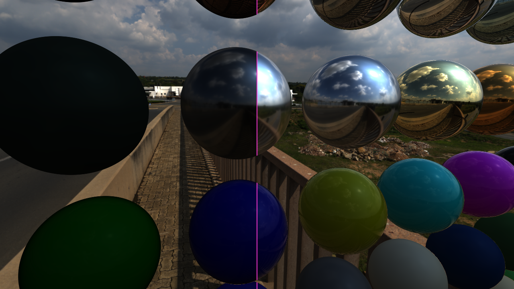
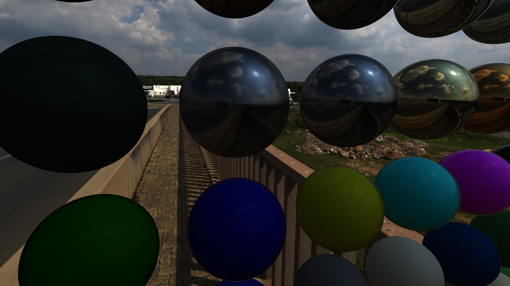
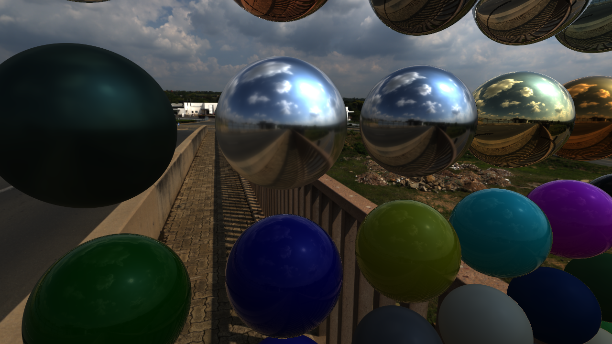
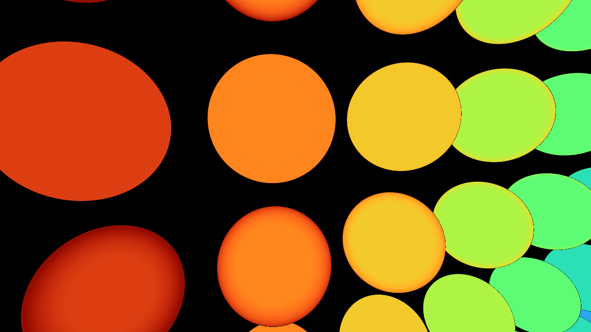
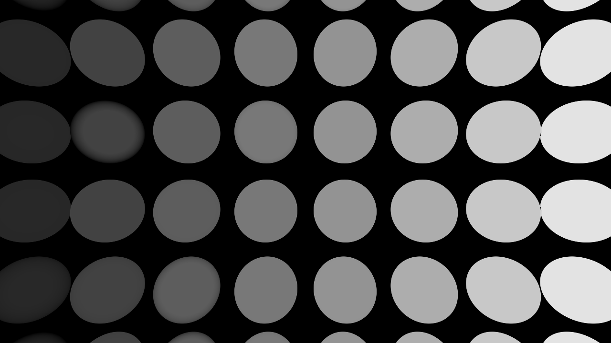
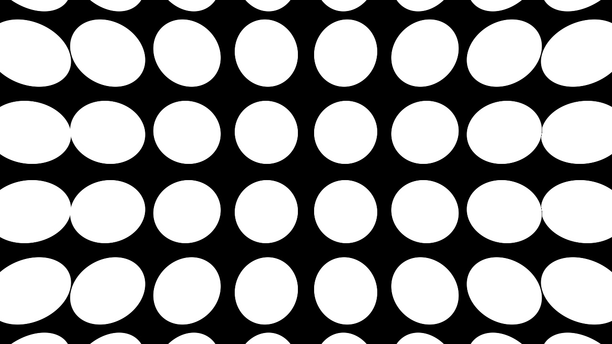
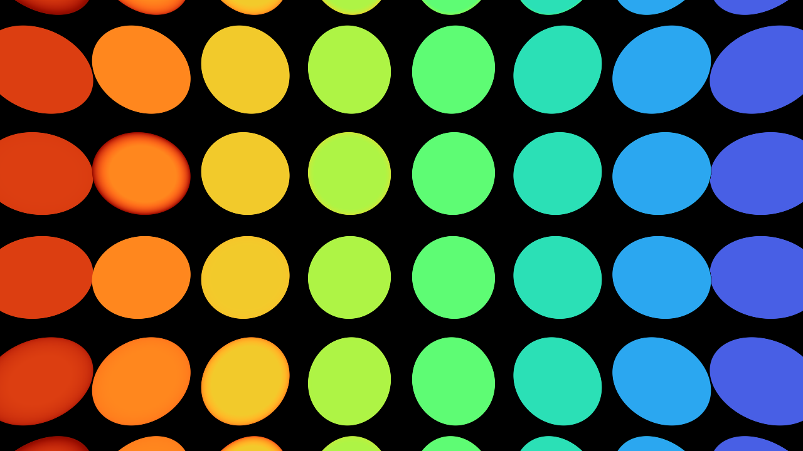
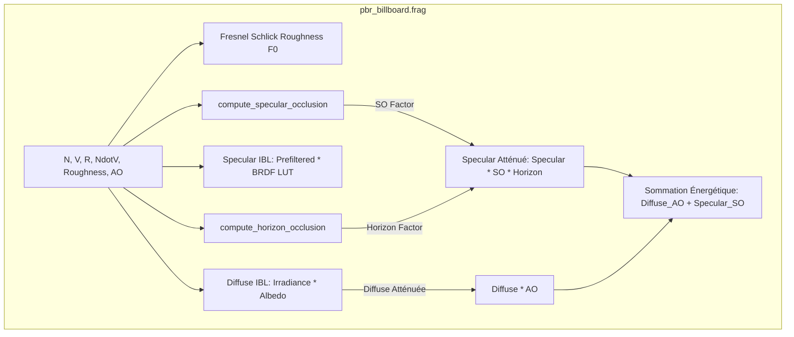

# 💎 Phase 3 : Specular Occlusion, Horizon Clipping & Vues Diagnostic PBR

**Spécification Technique & Guide Visuel Comparatif**  
**Date :** 3 Septembre 2026  
**Auteur :** Antigravity Engine Architecture  
**Statut :** **Production & Validation 100%**

---

## 1. Problématique Physique & Motivation

### 1.1 Le Défaut : *Specular Light Leak* dans les Crevasses
Dans les moteurs de rendu conventionnels, l'Ambient Occlusion ($\text{AO}$) est souvent appliquée uniquement à la composante diffuse :
$$\mathbf{L}_{\text{IBL}} = \mathbf{L}_{\text{diffuse}} \cdot \text{AO} + \mathbf{L}_{\text{specular}}$$

Ce modèle présente un défaut physique majeur :
1. **L'Ambient Occlusion ($\text{AO}$)** quantifie l'occlusion hémisphérique pour l'illumination **diffuse**.
2. **La Réflexion Spéculaire ($\mathbf{L}_{\text{specular}}$)** est hautement directionnelle, gouvernée par l'approximation de Fresnel-Schlick :
   $$F(\mathbf{n} \cdot \mathbf{v}) = F_0 + (1 - F_0)(1 - \mathbf{n} \cdot \mathbf{v})^5$$
3. **Conséquence à angle rasant ($\mathbf{n} \cdot \mathbf{v} \to 0$)** : Le terme de Fresnel tend vers $1.0$ ($100\%$ de réflectance). Dans une cavité fermée ou une zone de contact (inter-objets), le ciel HDR et les nuages continuent d'apparaître sous forme de reflets spéculaires intenses à travers les géométries occluantes. C'est le phénomène de **fuite spéculaire (*Specular Light Leak*)**.

```
                   Ciel / Skybox HDR
                       \       /
                        \     /  (Rayon spéculaire IBL incident)
                         v   v
         Sphère A      \       /      Sphère B
        (____   ____)   \     /   (____   ____)
             \ /         \   /         \ /
              |           v v           |
              +----------[ X ]----------+   <-- [X] Zone de creux / contact
                                                Sans SO : Reflet ciel visible à 100% (Fresnel)
                                                Avec SO : Reflet masqué selon le cône d'occlusion
```

---

### 1.2 Le Défaut : Dépassement sous l'Horizon Géométrique
Pour les surfaces rugueuses ($\alpha = \text{roughness}^2 > 0$), le lobe spéculaire s'élargit. Une partie des rayons réfléchis virtuels plonge sous l'horizon tangentiel de la surface ($\mathbf{r} \cdot \mathbf{n} < 0$). Sans atténuation (*Horizon Clipping*), des artefacts de bordure et de surexposition apparaissent sur les silhouettes.

---

## 2. Formulation Mathématique Analytique

### 2.1 Specular Occlusion de Sébastien Lagarde (Frostbite PBR)
Modélise l'intersection analytique entre le cône de visibilité $\text{AO}$ et le lobe spéculaire :
$$\text{SO}_{\text{Lagarde}}(\mathbf{n} \cdot \mathbf{v}, \text{AO}) = \text{clamp}\left( (\mathbf{n} \cdot \mathbf{v} + \text{AO})^2 - 1.0 + \text{AO}, \; 0.0, \; 1.0 \right)$$

*Propriétés physiques fondamentales :*
- Si $\text{AO} = 1.0$ (surface ouverte) $\implies \text{SO} = 1.0$ (réflexion intégrale préservée).
- Si $\text{AO} = 0.0$ (cavité totale) $\implies \text{SO} = 0.0$ (extinction totale du reflet parasite).
- Si $\mathbf{n} \cdot \mathbf{v} \to 0$ (vue rasante) dans un creux $\implies \text{SO}$ annule le pic artificiel de Fresnel.

### 2.2 Extension avec Rugosité de Brian Karis (UE4)
Prend en compte l'élargissement du lobe de micro-facettes selon la rugosité :
$$\text{SO}_{\text{Karis}}(\mathbf{n} \cdot \mathbf{v}, \text{AO}, \text{roughness}) = \text{clamp}\left( (\mathbf{n} \cdot \mathbf{v} + \text{AO})^{\exp_2(-16.0 \cdot \text{roughness} - 1.0)} - 1.0 + \text{AO}, \; 0.0, \; 1.0 \right)$$

### 2.3 Horizon Clipping & Smoothing (Marmet / Neubelt)
Atténue continuement la réflexion spéculaire à l'approche de l'horizon tangentiel de la surface :
$$f_{\text{horizon}}(\mathbf{r}, \mathbf{n}) = \text{clamp}\left( 1.0 + 1.2 \cdot (\mathbf{r} \cdot \mathbf{n}), \; 0.0, \; 1.0 \right)^2$$

---

## 3. Démonstration Visuelle & Comparatifs Temps Réel

### 3.1 Comparatif A/B Split-Screen

=== "A/B Split-Screen (Gros Plan)"
    
    > **Interprétation :**
    > - **Gauche du trait magenta (Avec SO + Horizon Clipping)** : Le reflet parasite du ciel est éteint dans la zone de creux sombre. L'objet est visuellement ancré.
    > - **Droite du trait magenta (Sans SO / Bypassed)** : Fuite spéculaire flagrante — les nuages et le ciel blanc s'affichent en pleine intensité au fond d'une zone occluse.

=== "Rendu Final avec Specular Occlusion"
    
    > **Rendu Physiquement Conforme :** Les reflets spéculaires épousent parfaitement la géométrie et l'occlusion locale.

=== "Rendu Sans Specular Occlusion (Fuites Visibles)"
    
    > **Rendu Non-Physique :** Surexposition spéculaire anormale sur les zones de contact.

---

### 3.2 Vues de Diagnostic & Quantification

=== "Delta Heatmap (Énergie Spéculaire Bloquée)"
    
    > **Colormap Turbo :**
    > - **Rouge / Orange** : Quantité maximale d'énergie spéculaire parasite bloquée dans les crevasses.
    > - **Jaune / Vert / Bleu** : Décroissance continue vers les surfaces dégagées.

=== "Grayscale Occlusion Mask (SO * Horizon)"
    
    > **Facteur d'atténuation $\text{SO} \cdot f_{\text{horizon}}$ :**
    > - **Blanc ($1.0$)** : Réflexion spéculaire libre à 100%.
    > - **Noir ($0.0$)** : Réflexion spéculaire totalement étouffée dans l'occlusion.

=== "Facteur Horizon Clipping"
    
    > Isolation pure de la courbe d'atténuation tangentielle $f_{\text{horizon}}(\mathbf{r}, \mathbf{n})$.

=== "Grille Globale Multimatériaux (Heatmap)"
    
    > Visualisation de l'occlusion spéculaire sur 100 matériaux PBR distincts (métaux, diélectriques, plastiques, rugueux, polis).

---

## 4. Architecture de Pipeline Shader & Dear ImGui



### 4.1 Implémentation GLSL ([`shaders/pbr_billboard.frag`](../shaders/pbr_billboard.frag))

```glsl
// Specular Occlusion (Lagarde / Karis)
float compute_specular_occlusion(float NdotV, float ao, float roughness)
{
    return clamp(pow(NdotV + ao, exp2(-16.0 * roughness - 1.0)) - 1.0 + ao, 0.0, 1.0);
}

// Horizon Clipping (Marmet)
float compute_horizon_occlusion(vec3 R, vec3 N)
{
    float RdotN = dot(R, N);
    float horizon = clamp(1.0 + 1.2 * RdotN, 0.0, 1.0);
    return horizon * horizon;
}

vec3 compute_IBL_PBR(vec3 N, vec3 V, vec3 R, vec3 F0, float NdotV,
                     vec3 albedo, float metallic, float roughness, float ao)
{
    // ... Calcul standard diffuse & specular IBL ...

    float specOcc = u_specular_occlusion_enabled ?
        mix(1.0, compute_specular_occlusion(NdotV, ao, roughness), u_specular_occlusion_strength) : 1.0;

    float horizonOcc = u_horizon_clipping_enabled ?
        compute_horizon_occlusion(R, N) : 1.0;

    vec3 diffuseFinal = kD * diffuse * ao;
    vec3 specularFinal = specular * (specOcc * horizonOcc);

    return diffuseFinal + specularFinal;
}
```

---

## 5. Guide d'Utilisation dans l'Interface ImGui

Dans l'onglet **Rendering** (Tab 2) de l'application :

1. **Specular Occlusion (SO)** :
   - `Enable SO` : Active/désactive le calcul d'occlusion spéculaire.
   - `SO Strength` : Curseur d'intensité (0.0 $\to$ 1.0).
   - `Horizon Clipping` : Active l'atténuation aux angles rasants.
   - `Debug View` :
     - `Off` : Rendu PBR standard.
     - `Grayscale Mask` : Affiche le masque d'atténuation $\text{SO} \cdot f_{\text{horizon}}$.
     - `Occluded Specular Delta Heatmap` : Fausse couleur Turbo montrant les fuites bloquées.
     - `Horizon Clipping Factor` : Isole la courbe de Marmet.
   - `A/B Split` : Active la comparaison côte à côte avec curseur de position (0..100%) et ligne magenta.
2. **PBR Diagnostic View** :
   - Inspecte à la volée : *Final PBR*, *Albedo*, *Normal*, *Metallic*, *Roughness*, *AO*, *Irradiance*, *Prefilter*, *BRDF LUT*.
3. **Recherche Fuzzy Search intégrée** :
   - Taper `"Occlusion"`, `"Specular"`, `"SO"`, `"Horizon"`, `"Crevice"` dans la barre de filtre pour afficher immédiatement ces contrôles et le bouton `Go To` vers l'onglet Rendering.

---

## 6. Matrice de Validation & Tests

| Test / Vérification | Commande | Résultat |
| :--- | :--- | :--- |
| **Persistance JSON 100%** | `python3 scripts/check_persistence.py` | ✅ **40/40 champs validés (100% synchronisé)** |
| **Tests Shaders GLSL** | `task test-shader` | ✅ **12/12 PASS** |
| **Tests Unitaires** | `task test-unit` | ✅ **102/102 PASS** |
| **Tests GPU Hardware (Direct)** | `task test-gl` | ✅ **93/93 PASS** |
| **Lint & Liens Documentation** | `task lint` | ✅ **0 erreur, 0 warning, 500/500 liens valides** |
