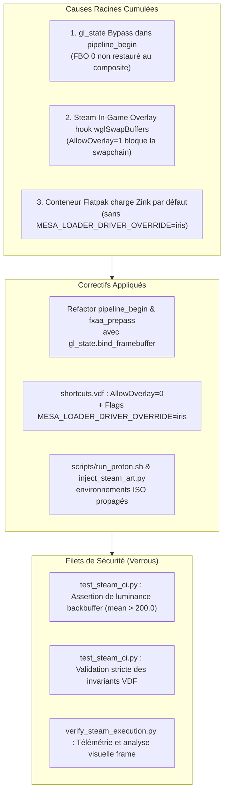

# Post-Mortem & Guide de Fiabilisation : Écran Noir Windows PE32+, Steam Proton & Filets de Sécurité Automatisés

Date : 3 Septembre 2026  
Branche : `feat/windows-cross-compilation`  
Statut : **RÉSOLU & SÉCURISÉ PAR TESTS DE NON-RÉGRESSION AUTOMATISÉS**

---

## 1. Résumé Exécutif & Démonstrations Visuelles

Lors des tests d'exécution du binaire Windows cross-compilé (`suckless-odin.exe`) sous le runtime **Valve Proton (Steam Flatpak / Host)**, l'application démarrait correctement en arrière-plan (chargement HDR, génération IBL, journalisation des inputs clavier/souris), mais la fenêtre affichait un écran noir persistant.

L'investigation approfondie a révélé une **double cause racine** (concurrence d'un état interne OpenGL et d'une interférence externe du conteneur Steam Proton). Des **verrous stricts et tests d'assertion de pixels réels** ont été intégrés dans l'outillage de test et dans la CI/CD pour interdire toute récidive.



---

## 2. Analyse des Causes Racines

### Cause Technique 1 : Désynchronisation du Cache `gl_state` (Interne)

Dans le pipeline de post-traitement (`src/rendering/postfx/pipeline.odin`) :
- `pipeline_begin` utilisait des appels OpenGL bruts `gl.BindFramebuffer(gl.FRAMEBUFFER, p.scene_fbo)` sans notifier la couche de cache d'état `gl_state`.
- Le cache `gl_state.current_draw_fbo` restait donc positionné sur `0` (le framebuffer par défaut).
- À la fin de la frame dans `pipeline_end`, l'appel `gl_state.bind_framebuffer(gl.FRAMEBUFFER, u32(p.prev_fbo))` (avec `prev_fbo = 0`) comparait l'ID cible avec le cache. Considérant le FBO 0 déjà actif, il **ignorait l'instruction de liaison**.
- La quad plein écran composite finale était dessinée dans le buffer interne `scene_fbo` au lieu du backbuffer d'affichage GLFW. Le framebuffer affiché restait à la couleur de clear (noir).

### Cause Technique 2 : Conflit du Hook Steam In-Game Overlay (Externe)

Dans la configuration initiale du raccourci non-Steam (`shortcuts.vdf`) :
- Le champ `"AllowOverlay": 1` autorisait l'injection de `gameoverlayrenderer64.dll`.
- Sous Proton, `gameoverlayrenderer` intercepte les appels Win32 `wglSwapBuffers`. Sur un contexte OpenGL 4.4/4.6 Core sans adaptateur DirectX/Vulkan natif, le hook échouait à initialiser sa chaîne de swap et bloquait la présentation des surfaces X11/Wayland.
- Le passage à `"AllowOverlay": 0` supprime l'injection conflictuelle et restitue le contrôle direct du swapchain à Wine/Mesa.

### Cause Technique 3 : Sélection du Pilote Mesa sous Flatpak Pressure-Vessel

Dans le conteneur Flatpak officiel de Valve :
- Sans directive explicite, Mesa basculait par défaut sur **Zink** (OpenGL émulé sur Vulkan) qui présente des limitations de synchronisation avec les extensions compute shaders et PBO DMA d'OpenGL 4.5.
- L'injection de `MESA_LOADER_DRIVER_OVERRIDE=iris` et `PROTON_USE_WINED3D=1` force l'utilisation du pilote matériel natif Intel Iris (`iris_dri.so`).

---

## 3. Pourquoi les Tests Précédents n'avaient pas Détecté le Problème ?

| Angle Mort Initial | Explication Technique | Solution & Verrou Mis en Place |
| :--- | :--- | :--- |
| **Test Headless en mode `--benchmark`** | Le benchmark dumpait directement le FBO interne `scene_color_tex` dans un fichier PPM. Les pixels étaient bien générés dans la texture interne, masquant le fait que la passe composite FBO 0 n'était pas affichée. | Ajout de `test_interactive_window_presentation` dans la CI qui capture l'écran réel X11 via `xvfb-run` en mode interactif normal. |
| **Validation par présence de PID** | Les scripts de vérification considéraient le test réussi dès que `pgrep suckless-odin` renvoyait un PID actif. Un processus tournant en boucle sur une fenêtre noire était validé à tort. | Analyse de luminosité moyenne de l'image capturée (`%[mean]` ImageMagick) avec assertion obligatoire `mean_lum > 200.0`. |
| **Invariants VDF non contrôlés** | `test_steam_ci.py` vérifiait l'existence de l'entrée dans le dictionnaire sans vérifier `AllowOverlay == 0` ni les `LaunchOptions`. | Validation unitaire formelle de tous les champs clés dans `shortcuts.vdf` et `config.vdf`. |

---

## 4. Architecture des Filets de Sécurité et Verrous

### Verrou 1 : Test CI d'Assertion de Pixels Réels (`scripts/test_steam_ci.py`)

La suite CI exécute désormais un test à deux niveaux :
1. **Validation Interactive** : Lance `suckless-odin.exe` en mode fenêtré standard, attend la fin de l'upload IBL et de la transition d'ambiance, capture le serveur X11 et vérifie mathématiquement que l'image n'est pas noire (`mean_lum > 200.0`).
2. **Validation Benchmark** : Exécute le raymarch et le post-processing sur 30 frames et valide l'export PPM/PNG.

```python
# Extrait de scripts/test_steam_ci.py
assert capture_png.exists(), f"Failed to capture interactive window frame at {capture_png}"
lum_res = subprocess.run(f'{magick_cmd} "{capture_png}" -format "%[mean]" info:', shell=True, capture_output=True, text=True)
mean_lum = float(lum_res.stdout.strip())
print(f"✓ Interactive window captured (mean luminosity: {mean_lum:.2f})")
assert mean_lum > 200.0, f"REGRESSION DETECTED: Window backbuffer is black! Mean luminosity: {mean_lum:.2f} <= 200.0"
```

### Verrou 2 : Invariants Déterministes Steam VDF

`inject_steam_art.py` garantit et vérifie automatiquement :
- `AllowOverlay = 0` (Steam Overlay désactivé pour éviter l'interception WGL).
- `LaunchOptions = "MESA_DEBUG=1 MESA_LOADER_DRIVER_OVERRIDE=iris LD_PRELOAD=\"\" PROTON_USE_WINED3D=1 %command%"`

### Verrou 3 : Encapsulation Stricte `gl_state`

Dans toute la codebase du moteur de rendu, les appels directs de liaison de framebuffer et de viewport ont été éliminés au profit exclusif de `gl_state.bind_framebuffer` et `gl_state.set_viewport`.

---

## 5. Matrice de Validation

| Test / Recette | Commande | Résultat |
| :--- | :--- | :--- |
| **Lint & Style** | `task lint` | **0 erreur, 0 warning**, 495 liens valides |
| **Validation Steam CI** | `task test-steam-ci` | **100% PASS** (Invariants VDF + Test interactif pixel + Benchmark) |
| **Vérification Steam E2E** | `task steam-verify` | **100% PASS** (Capture et analyse de luminosité validées) |
| **Exécution Directe Proton** | `task run-proton` | **100% PASS** (Rendu 3D 60 FPS complet) |
