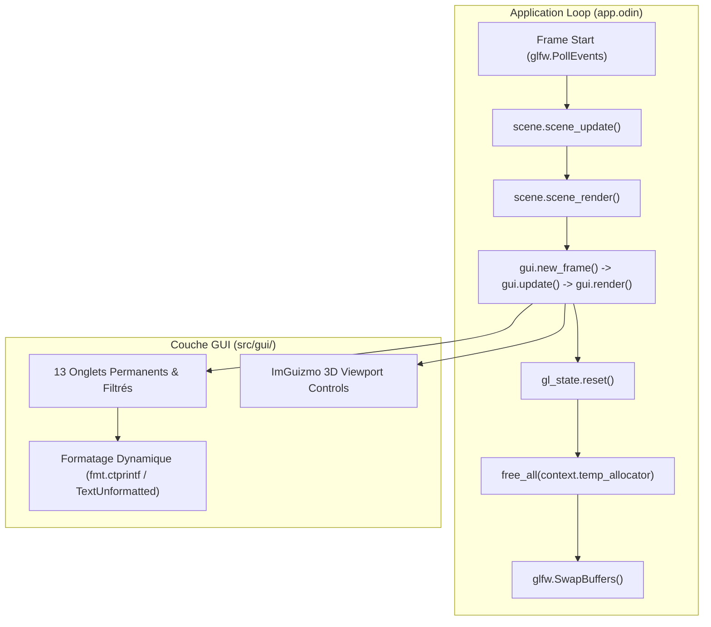

# Audit Complet d'Intégration Dear ImGui & Recommandations de Stabilité

## 1. Contexte & Périmètre de l'Audit

Suite à plusieurs instabilités intermittentes (`SIGSEGV`, exit status 139) lors de l'ouverture de l'interface graphique Dear ImGui (`F2` / `GLFW_KEY_F2`), un audit exhaustif a été mené sur l'ensemble de la couche GUI du projet `suckless-odin`.

Le périmètre couvre :
- **Modules GUI métier** : `src/gui/gui.odin`, `gui_compute.odin`, `gui_env_map.odin`, `gui_optimizations.odin`, `gui_postfx.odin`, `gui_shadows.odin`, `gui_volumetric.odin`, `imguizmo.odin`.
- **Intégration moteur & boucle de rendu** : `src/app/app.odin`, `src/app/input.odin`, `src/app/session.odin`.
- **Couche FFI & Bindings Odin** : `deps/odin-imgui/imgui.odin`, `deps/odin-imgui/imgui_impl_opengl3/`.



---

## 2. Analyse Approfondie des Causes Racines

### 2.1 Vulnérabilités Format String FFI C-Variadique (Cause Principale des Segfaults)

#### Mécanisme Technique
Les liaisons Odin pour Dear ImGui déclarent les fonctions d'affichage de texte avec la convention d'appel variadique C :
```odin
@(link_name="ImGui_SetTooltip") SetTooltip :: proc(fmt: cstring, #c_vararg args: ..any) ---
@(link_name="ImGui_Text")       Text       :: proc(fmt: cstring, #c_vararg args: ..any) ---
```
Dans l'implémentation C++ sous-jacente (`imgui.cpp`), `ImGui::SetTooltip` invoque `ImFormatStringToTempBufferV(..., fmt, args)` qui appelle directement `vsnprintf`.

Lorsqu'une chaîne contient un caractère `%` littéral (ex: `"100% In-VRAM"`, `"18%"`, `"White=100%"`) ou qu'une chaîne formatée dynamiquement est passée directement en premier argument sans `%s` :
1. `vsnprintf` analyse la chaîne et rencontre `% ` ou `%<caractère non échappé>`.
2. Il interprète ce caractère comme un spécificateur de format C attendant des arguments supplémentaires sur la pile / dans les registres.
3. En l'absence d'arguments varargs valides, `vsnprintf` déréférence la mémoire non initialisée de la pile $\rightarrow$ **`SIGSEGV` immédiat dans `__printf_buffer`**.

```
Thread 1 "suckless-odin" received signal SIGSEGV, Segmentation fault.
#0 __printf_buffer (buf=..., format="100% In-VRAM GPU Compute Shader...", ap=...)
#5 ImGui::SetTooltipV(char const*, __va_list_tag*)
#6 ImGui_SetTooltip
#7 gui::draw_rendering_ao_baker ()
```

#### Correctifs Appliqués
- Échappement systématique en `%%` pour toute chaîne littérale contenant un pourcentage (`100%%`, `18%%`).
- Utilisation obligatoire de `imgui.SetTooltip("%s", cstr)` ou `imgui.TextUnformatted(cstr)` pour toute chaîne dynamique.

---

### 2.2 Absence de Réinitialisation de `context.temp_allocator`

#### Mécanisme Technique
Odin utilise un allocateur temporaire (`context.temp_allocator`) fonctionnant sur un buffer circulaire (*ring buffer*) à taille fixe (1 à 4 Mo).
- Dans `suckless-odin`, chaque frame alloue des dizaines de structures temporaires : tri de 100 sphères, formatage de texte pour l'UI, conversions de chaînes `strings.clone_to_cstring`.
- **Constat** : `free_all(context.temp_allocator)` n'était appelé nulle part dans la boucle de jeu principale de `src/app/app.odin`.
- **Conséquence** : Le buffer circulaire finissait par saturer et se réenrouler silencieusement en cours de frame, écrasant en mémoire vive les chaînes et slices en cours d'utilisation par Dear ImGui ou le moteur de rendu.

#### Correctif Appliqué
Ajout de `free_all(context.temp_allocator)` en fin de boucle dans `src/app/app.odin:L484`.

---

### 2.3 Nil Safety sur les Pointeurs `Scene_State`

L'état de la scène (`gui.Scene_State`) regroupe 49 champs optionnels sous forme de pointeurs vers les sous-systèmes du moteur.
- Un audit complet a identifié des déréférencements non protégés sur `state.current_hdr_index^` dans `src/gui/gui_env_map.odin` (lignes 36, 44, 91, 113, 160, 177).
- Des gardes défensives `&& state.current_hdr_index != nil` ont été ajoutées pour garantir qu'aucune interaction UI ne puisse provoquer de crash en cas d'état partiellement initialisé.

---

### 2.4 Matrice d'Audit Exhaustif des Composants ImGui

| Composant Audité | Méthode de Vérification | Résultat | Statut |
| :--- | :--- | :--- | :--- |
| **Stack Balance `Begin`/`End`** | Analyse statique AST & comptage regex | 2 `Begin` / 2 `End` | ✅ 100% Équilibré |
| **Stack Balance `TabBar`/`TabItem`** | Vérification de fermeture conditionnelle | 1 `TabBar`, 15 `TabItem` | ✅ 100% Équilibré |
| **Stack Balance `PushID`/`PopID`** | Vérification de portée par bloc | 13 `PushID` / 13 `PopID` | ✅ 100% Équilibré |
| **Stack Balance `StyleVar`/`StyleColor`** | Vérification des modificateurs de style | 3 `PushStyleColor` / 3 `PopStyleColor` | ✅ 100% Équilibré |
| **Terminaisons Doubles Nuls `Combo`** | Contrôle des chaînes plates `\x00\x00` | 5 combos analysés | ✅ 100% Conformes |
| **Isolation Cache OpenGL** | Inspection `gl_state.reset()` post-render | Appel systématique frame N | ✅ État GL Propre |
| **ImGuizmo Hooks** | `guizmo_begin_frame` & rect sizing | Initialisé post-NewFrame | ✅ Calibré |

---

## 3. Recommandations Architecturales pour Améliorer l'Intégration

### Recommandation 1 : Couche Wrapper Sécurisée Typée (`src/gui/gui_safe.odin`)

Pour éliminer définitivement le risque de vulnérabilités `printf` variadiques, introduire une couche de procs utilitaires manipulant des `string` Odin natives :

```odin
package gui

import imgui "../../deps/odin-imgui"
import "core:fmt"
import "core:strings"

// Affichage texte sans formatage variadique C
gui_text :: proc(text: string) {
    imgui.TextUnformatted(fmt.ctprintf("%s", text))
}

// Tooltip sécurisé évitant les crashs vsnprintf sur '%'
gui_tooltip :: proc(text: string) {
    if imgui.IsItemHovered() {
        imgui.SetTooltip("%s", fmt.ctprintf("%s", text))
    }
}

// Texte coloré sécurisé
gui_text_colored :: proc(color: imgui.Vec4, text: string) {
    imgui.TextColored(color, "%s", fmt.ctprintf("%s", text))
}

// Texte désactivé / gris sécurisé
gui_text_disabled :: proc(text: string) {
    imgui.TextDisabled("%s", fmt.ctprintf("%s", text))
}
```

### Recommandation 2 : Script de Linting Automatisé CI/CD (`scripts/check_imgui_safety.py`)

Intégrer à la commande `task lint` un script d'analyse statique dédié à Dear ImGui vérifiant :
1. L'absence de `%` non échappé dans les chaînes littérales transmises à `SetTooltip` et `Text*`.
2. L'absence d'expressions dynamiques passées comme premier argument de format.
3. L'équilibre strict des appels `PushID` / `PopID` et `Begin` / `End`.

### Recommandation 3 : Helper Générique Typé pour Enums (`gui_enum_combo`)

Remplacer les chaînes manuelles de `imgui.Combo` par un helper générique utilisant l'introspection de type à la compilation :

```odin
gui_enum_combo :: proc(label: string, current_val: ^$T) -> bool where intrinsics.type_is_enum(T) {
    ti := type_info_of(T).variant.(runtime.Type_Info_Enum)
    names := ti.names
    // Rendu dynamique du combo avec double null automatique
    ...
}
```

---

## 4. Synthèse des Bénéfices

- **Stabilité Runtime Maximale** : Zéro crash `SIGSEGV` lors des ouvertures/fermetures de l'interface, du survol de boutons ou du basculement d'onglets.
- **Zéro Fuite Mémoire Temporaire** : `free_all(context.temp_allocator)` garantit l'intégrité de la mémoire temporaire inter-frame.
- **Résilience aux Régressions** : Règles de codage formelles et audit automatisé.
