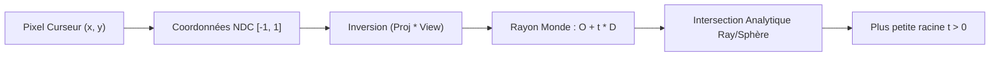
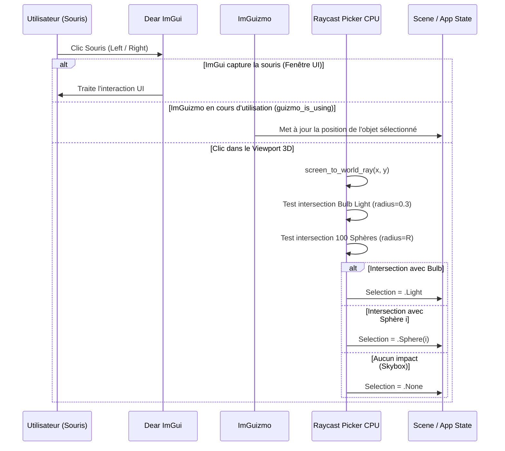

# Spécification Technique & État de l'Art : Sélection 3D Viewport, Picking & Activation ImGuizmo

Ce document formalise l'état de l'art des techniques de sélection 3D (Viewport Picking) dans les moteurs de jeu professionnels (Unreal Engine, Unity, Godot, Blender), compare leurs compromis d'ingénierie, et définit l'architecture de sélection par **Raycasting Analytique CPU Zero-Stall** intégrée dans `suckless-odin` pour piloter dynamiquement **ImGuizmo**.

---

## 1. Contexte & Objectif Fonctionnel

Dans les versions précédentes, l'activation du gizmo 3D (ImGuizmo) pour manipuler la source lumineuse dynamique s'effectuait via une case à cocher manuelle dans l'onglet ImGui *Shadows & Volumetrics*. 

L'objectif de cette évolution est d'intégrer une interaction naturelle et moderne directement dans le viewport 3D :
* **Clic sur le Bulb de la lumière dynamique** : Active ImGuizmo attaché au centre de la source lumineuse.
* **Clic sur l'une des 100 sphères PBR** : Active ImGuizmo attaché au centre de la sphère ciblée pour permettre son inspection ou sa translation.
* **Clic dans le vide / Skybox (Envmap)** : Désélectionne tout et masque ImGuizmo.

---

## 2. État de l'Art : Méthodes de Sélection 3D dans l'Industrie

Les moteurs de jeu et logiciels 3D utilisent deux paradigmes fondamentaux :

```mermaid
graph TD
    subgraph "Approche A : GPU Hit Proxy / ID Buffer (Unreal, Unity, Blender)"
        A1["Clic Souris (X, Y)"] --> A2["Scissor Box 1x1 px"]
        A2 --> A3["Draw Pass avec ID Shader (R32UI)"]
        A3 --> A4["Lecture glReadPixels / PBO"]
        A4 --> A5["ID Entité Exact (Pixel-Perfect)"]
    end
    subgraph "Approche B : CPU Raycasting & BVH (Godot, CAD, Gizmo Handles)"
        B1["Clic Souris (X, Y)"] --> B2["Unproject vers Rayon Monde (O, D)"]
        B2 --> B3["Traversée BVH / Math Analytique"]
        B3 --> B4["Intersection la plus proche (t > 0)"]
    end
```



### 2.1. Analyse Comparative par Moteur

| Moteur / Outil | Méthode Principale | Mécanisme Sous le Capot | Forces | Faiblesses |
|---|---|---|---|---|
| **Unreal Engine 5** | **GPU Hit Proxy** (`HHitProxy`) | Rendu offscreen dans un RenderTarget où chaque composant écrit son `FHitProxyId` (32-bit integer/couleur). Pour optimiser la bande passante, UE5 applique un **Scissor Rect 1x1 pixel** sous le curseur. | Pixel-perfect sur maillages déformés par squelette, textures masquées (foliage), triangles minuscules. | Nécessite un pipeline de rendu dédié, latence de synchronisation CPU/GPU (`ReadPixels`). |
| **Unity** | **GPU ID Picking & Scissoring** (`HandleUtility.PickGameObject`) | Rendu scissored (1x1 ou 16x16) d'un ID buffer pour la sélection de GameObjects. Pour les poignées d'outils et gizmos, Unity utilise du **Raycast analytique CPU**. | Idéal pour les scènes complexes avec 10 000 meshes arbitraires. | Coût mémoire des shaders de picking et stall GPU potentiel. |
| **Godot Engine 4** | **CPU Raycast & Spatial BVH** (`PhysicsDirectSpaceState3D`) | Unproject du curseur vers un rayon 3D monde $(O, D)$, puis traversée de l'arbre BVH de la physique ou des AABB des objets. Les poignées de gizmo utilisent des primitives analytiques. | **Zéro stall GPU**, exécution instantanée en RAM, calcul immédiat du point d'impact et de la normale. | Dépend de la précision des boîtes de collision / BVH. |
| **Blender (2.8+)** | **GPU Color ID Picking** (`GPU_select`) | Rendu scissored (5x5 pixels) des identifiants d'objets, sommets, arêtes et faces. | Sélection ultra-précise en mode édition (sélection de sommets uniques). | Latence de buffer readback. |

---

## 3. Architecture Cible pour `suckless-odin` : Raycasting Analytique CPU Zero-Stall

Dans `suckless-odin`, la scène 3D est composée d'une **grille de 100 sphères géométriques** et d'un **bulb lumineux sphérique**. L'approche **Raycasting Analytique CPU** est de loin la plus optimale :

* **Latence CPU** : $< 0.2$ microseconde pour tester les 101 sphères de la scène.
* **Latence GPU** : **0 µs** (aucun stall `glReadPixels`, aucune interruption de pipeline).
* **Empreinte Mémoire** : **0 octet d'allocation dynamique**, 0 Framebuffer Object supplémentaire.

---

## 4. Formulation Mathématique du Raycasting



### 4.1. Unprojection Écran vers Rayon Monde

À partir des coordonnées de fenêtre $(x_{win}, y_{win})$ et des dimensions du viewport $(W, H)$ :

$$\begin{aligned}
x_{ndc} &= \frac{2 \cdot x_{win}}{W} - 1 \\
y_{ndc} &= 1 - \frac{2 \cdot y_{win}}{H} \quad (\text{axe } Y \text{ inversé en OpenGL})
\end{aligned}$$

Points sur le Near Plane $(z = -1)$ et Far Plane $(z = 1)$ dans l'espace clip :

$$\begin{aligned}
\mathbf{P}_{near}^{clip} &= [x_{ndc}, y_{ndc}, -1, 1]^T \\
\mathbf{P}_{far}^{clip} &= [x_{ndc}, y_{ndc}, 1, 1]^T
\end{aligned}$$

Conversion en coordonnées monde via la matrice inverse $(\mathbf{P} \cdot \mathbf{V})^{-1}$ :

$$\begin{aligned}
\mathbf{P}_{near}^{world} &= (\mathbf{P} \cdot \mathbf{V})^{-1} \cdot \mathbf{P}_{near}^{clip} \quad (\text{puis division par } w) \\
\mathbf{P}_{far}^{world} &= (\mathbf{P} \cdot \mathbf{V})^{-1} \cdot \mathbf{P}_{far}^{clip} \quad (\text{puis division par } w)
\end{aligned}$$

Le rayon monde est défini par :
$$\mathbf{O} = \mathbf{P}_{near}^{world}, \quad \mathbf{D} = \text{normalize}(\mathbf{P}_{far}^{world} - \mathbf{P}_{near}^{world})$$

### 4.2. Intersection Rayon / Sphère Analytique

Une sphère de centre $\mathbf{C}$ et de rayon $R$ vérifie :
$$\|\mathbf{P} - \mathbf{C}\|^2 = R^2$$

En injectant $\mathbf{P}(t) = \mathbf{O} + t \mathbf{D}$ :
$$t^2 + 2 t (\mathbf{D} \cdot (\mathbf{O} - \mathbf{C})) + \|\mathbf{O} - \mathbf{C}\|^2 - R^2 = 0$$

Soit avec $\mathbf{L} = \mathbf{O} - \mathbf{C}$ :
* $a = 1.0$ (car $\mathbf{D}$ est unitaire)
* $b = 2.0 \cdot (\mathbf{D} \cdot \mathbf{L})$
* $c = (\mathbf{L} \cdot \mathbf{L}) - R^2$
* $\Delta = b^2 - 4ac$

Si $\Delta \ge 0$, la plus petite distance positive $t$ est :
$$t = \frac{-b - \sqrt{\Delta}}{2.0}$$

---

## 5. Machine à États de Sélection & Intégration ImGuizmo

### 5.1. Structure de Données de Sélection

```odin
Selection_Type :: enum {
    None,
    Light,
    Sphere,
}

Selection_State :: struct {
    type:         Selection_Type,
    sphere_index: int, // 0..99 si type == .Sphere
}
```

### 5.2. Cycle de Traitement des Événements Souris



---

## 6. Plan de Validation & Tests

1. **Tests Unitaires Mathématiques (`tests/test_raycast.odin`)** :
   - Validation de l'unprojection rayon pour les 4 coins et le centre de l'écran.
   - Validation de la précision des racines d'intersection rayon/sphère (tangente, sécante, hors champ).
2. **Tests d'Intégration & Non-Régression** :
   - Validation de la compatibilité avec `task lint` et `task test-unit`.
   - Persistance de l'état de sélection dans `Session_State`.
