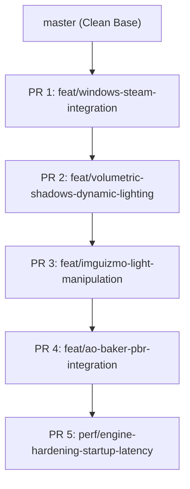
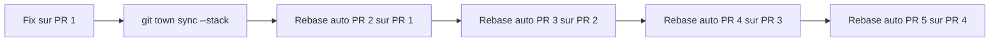
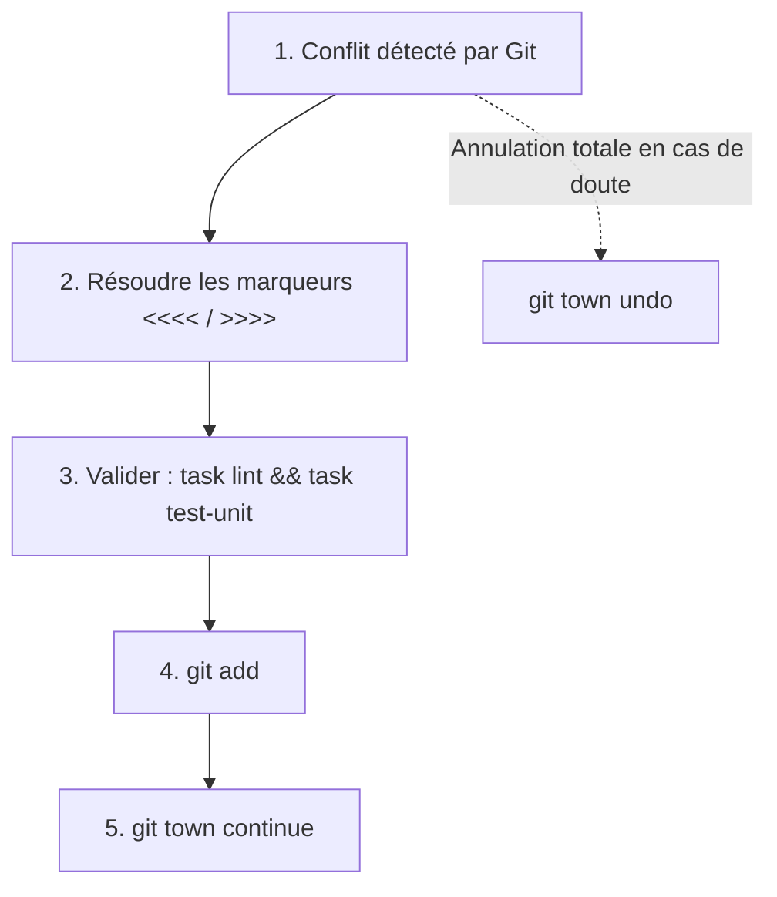
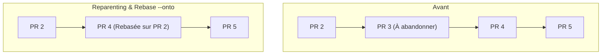
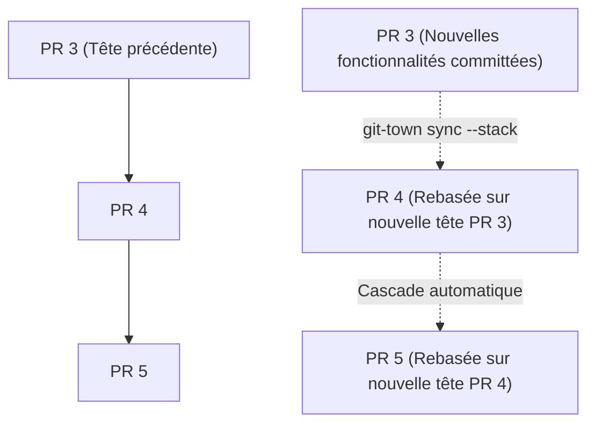
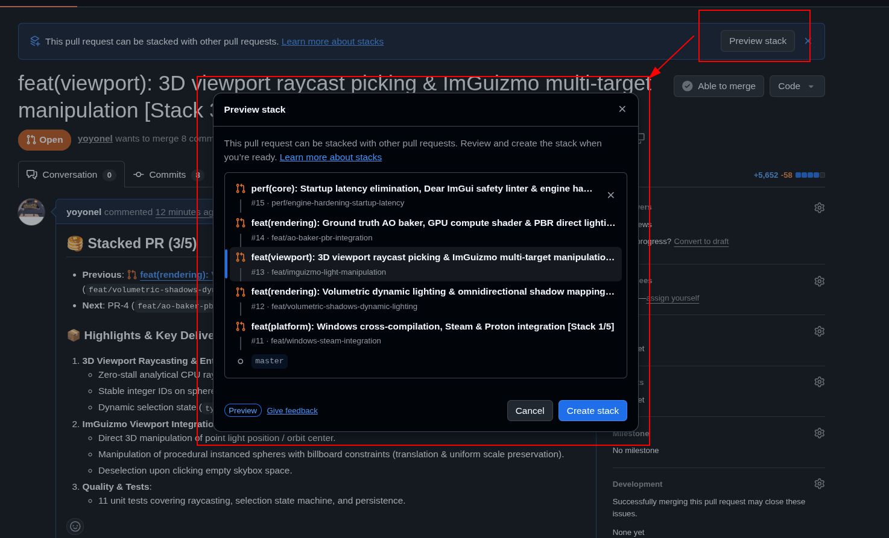

# Guide d'Ingénierie : Stacked PRs, Separation of Concerns & Git Town Workflow

Ce document formalise la stratégie de décomposition en **Stacked PRs** (branches empilées / dépendantes) pour le projet `suckless-odin`, le comparatif de l'outillage de l'écosystème, et le guide d'utilisation opérationnel sous forme de **FAQ interactive** pour maintenir, synchroniser et finaliser la cascade de branches en local avec **Git Town**.

---

## 1. Architecture des 5 Branches Empilées (Separation of Concerns)



### Cartographie des 5 Paliers de Stack

| Niveau | Branche | Base Target | Périmètre Fonctionnel |
|---|---|---|---|
| **1** | `feat/windows-steam-integration` | `master` | Abstractions Win32, toolchain Clang ThinLTO, Wine runner, injection Steam VDF & Steam Grid, support Gamepad USB. |
| **2** | `feat/volumetric-shadows-dynamic-lighting` | PR 1 | Modèle Cook-Torrance direct light, Cubemap shadows, PCF Vogel-Disk, Shadow TAA, Volumetric Raymarching & JBU. |
| **3** | `feat/imguizmo-light-manipulation` | PR 2 | Bindings et wrapper ImGuizmo C++, manipulation 3D de la lumière dans le viewport, synchronisation session. |
| **4** | `feat/ao-baker-pbr-integration` | PR 3 | Baker AO CPU multi-thread & GPU Compute Shader, Texture 2D Array, specular occlusion & horizon clipping PBR. |
| **5** | `perf/engine-hardening-startup-latency` | PR 4 | Linter statique ImGui C-variadic, lazy HDR thumbnails, compilation PostFX on-demand, early-exit benchmark. |

---

## 2. Foire Aux Questions (FAQ) & Guide Opérationnel

### Q1 : Pourquoi et comment découper une "Mega-PR" multi-sujets en chaîne de branches selon le principe de Separation of Concerns (SoC) ?

**Problématique** : Lors d'un cycle de développement intensif, plusieurs fonctionnalités volumineuses et orthogonales (ex: Windows/Steam, Volumetric Shadows, ImGuizmo, AO Baker, Optimisations de démarrage) se retrouvent accumulées sur une unique branche de travail (`feat/windows-cross-compilation`, 77+ commits, 5 000+ lignes de diff).

**Réponse & Solution** :
1. **Separation of Concerns (SoC)** : Isoler chaque sous-système dans une branche dédiée dont la responsabilité est unique et fermée.
2. **Revue de code granulaire** : Chaque PR présente un diff restreint (100 à 500 lignes ciblées), facilitant la relecture et la détection d'anomalies.
3. **Traçabilité & Bisection Git** : Si un bug ou une baisse de performance apparaît, `git bisect` cible immédiatement le sous-système fautif sans ambiguïté.
4. **Découpage en Stacked PRs** : Au lieu de branches parallèles (qui entreraient en conflit sur les fichiers partagés comme `gui.odin` ou `session.odin`), les branches sont chaînées hiérarchiquement : `PR 2` est basée sur `PR 1`, `PR 3` sur `PR 2`, etc.

---

### Q2 : Comment fonctionnent ensuite les modifications, corrections de bugs ou retours de review sur une branche amont de la chaîne ?

**Problématique** : Si un correctif ou un ajustement doit être appliqué sur une branche basse (ex: `PR 1`), comment le propager sur les branches descendantes (`PR 2`, `PR 3`, `PR 4`, `PR 5`) sans désynchroniser l'arbre Git ?



**Réponse & Procédure** :
1. **Se positionner sur la branche amont et appliquer le fix** :
   ```bash
   git checkout feat/windows-steam-integration
   # Modifier le code...
   git commit -m "fix(win): correct path separator handling"
   ```
2. **Lancer la cascade de rebase en 1 commande** :
   ```bash
   git town sync --stack
   ```
3. **Gestion automatique par Git Town** :
   - Rebase `feat/volumetric-shadows-dynamic-lighting` sur la nouvelle tête de `feat/windows-steam-integration`.
   - Rebase `feat/imguizmo-light-manipulation` sur la nouvelle tête de `feat/volumetric-shadows-dynamic-lighting`.
   - Rebase `feat/ao-baker-pbr-integration` sur `feat/imguizmo-light-manipulation`.
   - Rebase `perf/engine-hardening-startup-latency` sur `feat/ao-baker-pbr-integration`.

---

### Q3 : Quels sont les outils tiers existants pour gérer les Stacked PRs et lequel choisir en solo ?

**Problématique** : Existe-t-il des standards ou outils officiels dédiés à l'automatisation des piles de PRs (Stacked Diffs) ?

| Outil | Type | Fonctionnement Clé | Cas d'Usage Recommandé |
|---|---|---|---|
| **[Graphite](https://graphite.dev)** (`gt` CLI) | CLI + SaaS / GitHub App | Gère la pile en local et sur GitHub (retargeting automatique des bases, visualiseur web, `gt sync`). | Équipes moyennes/grandes avec forte collaboration web. |
| **[Git Town](https://www.git-town.com)** (`git-town` CLI) | CLI Open-Source autonome (Go) | Enregistre la hiérarchie parent-enfant dans `.git/config`. Synchronise et rebase toute la pile via `git-town sync`. | **Développeur solo / Projets Open Source sans dépendance SaaS**. |
| **[Aviator CLI](https://github.com/aviator-co/av)** (`av` CLI) | CLI Open-Source + GitHub | Stack tracker pour GitHub (`av stack sync`, `av pr create`). | Équipes souhaitant automatiser les merge queues et stacks GitHub. |
| **[Jujutsu](https://github.com/martinvonz/jj)** (`jj`) | VCS moderne (Rust) Git-compatible | Modèle de commits anonymes et rebase implicite en cascade sans branches nommées manuelles. | Développeurs cherchant une alternative native à Git. |
| **[gh-stack](https://github.com/timothyandrew/gh-stack)** | Extension GitHub CLI (`gh`) | Extension communautaire de `gh` pour gérer les stacks via labels GitHub. | Utilisateurs exclusifs de GitHub CLI sans outil externe. |

**Recommandation Solo** : **Git Town** car :
* 100% autonome et local (zéro compte, zéro clé API, zéro service cloud tiers).
* S'appuie nativement sur les primitives Git standards (`rebase`, `cherry-pick`, `config`).
* Réversible à 100% via `git-town undo` en cas d'erreur de manipulation.

---

### Q4 : Au moment de la finalisation, comment procède-t-on pour les différents merges dans `master` ou `develop`, dans quel ordre, et comment résout-on les rebases/diffs ?

**Problématique** : Dans quel ordre fusionner les branches sur GitHub / en local, comment basculer les branches parentes et résoudre d'éventuels conflits ?

#### Règle Absolue : Fusion Séquentielle "Bottom-Up" (Du bas vers le haut)
Ne jamais fusionner une branche haute (`PR 3`) avant ses branches mères (`PR 1` et `PR 2`). L'ordre de fusion est strictement :
1. `PR 1` (`feat/windows-steam-integration`)
2. `PR 2` (`feat/volumetric-shadows-dynamic-lighting`)
3. `PR 3` (`feat/imguizmo-light-manipulation`)
4. `PR 4` (`feat/ao-baker-pbr-integration`)
5. `PR 5` (`perf/engine-hardening-startup-latency`)

#### Méthode 1 : Fusion via Git Town CLI (1-clic)
```bash
# Shipper PR 1
git checkout feat/windows-steam-integration
git town ship
# Résultat : PR 1 est fusionnée dans master, PR 2 devient enfant direct de master, PR 3..5 sont automatiquement rebasées !

# Shipper PR 2
git checkout feat/volumetric-shadows-dynamic-lighting
git town ship
```

#### Méthode 2 : Fusion via l'Interface Web GitHub (PR par PR)
1. **Sur GitHub** : Cliquer sur **Merge** (ou *Rebase and Merge*) pour **PR 1**.
2. **Sur GitHub** : Modifier la base de **PR 2** (`feat/volumetric-shadows-dynamic-lighting`) pour pointer vers `master`.
3. **En local** : Mettre à jour `master` et reparenter :
   ```bash
   git checkout master
   git pull origin master
   git checkout feat/volumetric-shadows-dynamic-lighting
   git town set-parent master
   git town sync --stack
   ```
4. Répéter pour PR 3, PR 4, PR 5.

#### Résolution des Conflits de Rebase Pas-à-Pas
Si un conflit survient pendant `git town sync` ou `git town ship` :


---

### Q5 : Comment adapter ce workflow si le projet utilise une branche intermédiaire `develop` (Git Flow) ?

**Problématique** : Si `master` est réservé aux releases taguées et que le développement actif s'effectue sur `develop`.

**Procédure** :
1. Déclarer `develop` comme branche principale pour Git Town :
   ```bash
   git town config set-main-branch develop
   git checkout feat/windows-steam-integration
   git town set-parent develop
   ```
2. Fusionner séquentiellement les PRs dans `develop`.
3. Lors du tag de release, merger `develop` dans `master` :
   ```bash
   git checkout master
   git merge --ff-only develop
   git tag v1.0.0
   ```

---

### Q6 : Comment retirer ou abandonner une PR intermédiaire de la stack tout en conservant et reconnectant les PRs suivantes ?

**Problématique** : Si une fonctionnalité intermédiaire (ex: `PR 3: feat/imguizmo-light-manipulation`) est jugée non pertinente ou ajournée, comment l'extraire de la chaîne sans casser `PR 4` et `PR 5` ?



**Procédure en 3 étapes avec Git Town** :

1. **Reparenter la branche enfant (`PR 4`) sur la branche parente (`PR 2`)** :
   ```bash
   git checkout feat/ao-baker-pbr-integration
   git town set-parent feat/volumetric-shadows-dynamic-lighting
   ```

2. **Synchroniser la nouvelle cascade (Rebase automatique excluant PR 3)** :
   ```bash
   git town sync --stack
   ```
   *Sous le capot, Git Town exécute :*
   `git rebase --onto feat/volumetric-shadows-dynamic-lighting feat/imguizmo-light-manipulation feat/ao-baker-pbr-integration`
   (Tous les commits de PR 3 sont exclus ; PR 4 et PR 5 sont rejouées proprement sur PR 2).

2. **Archiver ou supprimer la branche abandonnée** :
   ```bash
   git branch -D feat/imguizmo-light-manipulation
   ```
   *(Sur GitHub : fermer la PR 3 correspondante).*

3. **Validation de non-régression** :
   ```bash
   task lint && task test-unit
   ```

---

### Q6 : Comment propager une nouvelle fonctionnalité ou refonte ajoutée sur une branche intermédiaire (ex: ajouts dans PR-3) vers toutes les branches descendantes ?

**Problématique** : Lors du travail sur une branche intermédiaire (`PR 3: feat/imguizmo-light-manipulation`), de nouveaux ajouts sont développés (ex: picking 3D par raycasting, tracking d'ID stable des sphères, tests unitaires et fonctionnels). Comment diffuser proprement et de manière déterministe ces nouveautés vers les branches filles en aval (`PR 4: feat/ao-baker-pbr-integration` et `PR 5: perf/engine-hardening-startup-latency`) ?



**Procédure Opérationnelle en 4 Étapes** :

#### Étape 1 : Valider et commiter sur la branche courante (`PR 3`)
S'assurer que la branche courante compile et passe tous les tests avant de propager :
```bash
# 1. Vérifier la propreté du code
task lint && task test-unit

# 2. Commiter les changements sur PR 3 (avec accord explicite)
git add src/ tests/ docs/
git commit -m "feat(picking): 3d viewport raycast picking and stable sphere id tracking"
```

#### Étape 2 : Diffuser la stack en cascade avec Git Town
Lancer la synchronisation descendante depuis la branche courante :
```bash
git-town sync --stack
```
**Ce que Git Town effectue automatiquement sous le capot** :
1. Détecte que `feat/imguizmo-light-manipulation` possède de nouveaux commits.
2. Identifie les branches descendantes enregistrées dans `.git/config` (`PR 4` puis `PR 5`).
3. Rebase `feat/ao-baker-pbr-integration` sur la nouvelle tête de `feat/imguizmo-light-manipulation`.
4. Rebase `perf/engine-hardening-startup-latency` sur la nouvelle tête de `feat/ao-baker-pbr-integration`.
5. Replace automatiquement le curseur Git (HEAD) sur la branche d'origine.

#### Étape 3 : Résolution d'éventuels conflits de propagation
Si une branche fille (comme `PR 4`) a déjà modifié des fichiers communs (ex: `types.odin` ou `gui.odin`), le rebase s'arrête en mode conflit :
```bash
# 1. Identifier les fichiers en conflit
git status

# 2. Ouvrir les fichiers, arbitrer et conserver le code souhaité
# 3. Marquer le conflit comme résolu
git add <fichier>

# 4. Continuer la cascade Git Town
git-town continue
```
> [!TIP]
> Si la propagation produit un état inattendu, `git-town undo` annule instantanément l'intégralité de la cascade et restaure toutes les branches à leur état exact avant la commande.

#### Étape 4 : Alternative manuelle Git (sans Git Town)
Si Git Town n'est pas utilisé, la commande Git pure équivalente est une cascade séquentielle de rebases :
```bash
# 1. Propager PR 3 vers PR 4
git checkout feat/ao-baker-pbr-integration
git rebase feat/imguizmo-light-manipulation

# 2. Propager PR 4 vers PR 5
git checkout perf/engine-hardening-startup-latency
git rebase feat/ao-baker-pbr-integration

# 3. Revenir sur PR 3
git checkout feat/imguizmo-light-manipulation
```

---

### Q7 : Pourquoi Git Town affiche-t-il plusieurs commandes lors d'un sync, et comment réconcilier une branche aval qui contient encore l'historique d'une ancienne branche monolithique (`git rebase --onto`) ?

**Problématique** :
1. En lançant `git-town sync --stack`, Git Town affiche une séquence de sous-commandes (`git checkout`, `git rebase`). Est-ce du travail manuel à reproduire ?
2. Si une branche fille (comme `PR 4: feat/ao-baker-pbr-integration`) a été historiquement branchée depuis une ancienne branche monolithique (`feat/windows-cross-compilation`) avant le découpage propre en SoC de `PR 1..PR 3`, `git rebase` standard tente de rejouer des dizaines d'anciens commits déjà réécrits en amont, provoquant des conflits fantômes. Comment aligner proprement cette branche ?

**Explications & Solution** :

#### 1. Règle UI : 1 Seule Commande Utilisateur vs Log Interne
* **Côté développeur** : Il n'y a **QU'UNE SEULE commande** : `git town sync --stack`.
* **Côté outil** : La liste affichée est le **journal de télémétrie interne** de ce que Git Town exécute en arrière-plan à votre place. Sans Git Town, le développeur devrait taper ces 8 commandes manuelles une par une et calculer les hashs.

#### 2. Cas de Transition Monolithique $\to$ Stacked PRs : Le Rebase Ciblé (`--onto`)
Quand les branches amont (`PR 1..3`) ont été découpées et nettoyées, les branches aval (`PR 4..5`) portent encore en amont les anciens commits bruts de la branche monolithique :
- `PR 4` ne contient en réalité que **10 commits spécifiques** (les fonctionnalités AO Baker : `6473852` à `c69e475`).
- Les 29 commits précédents sont des doublons obsolètes de PR 1..3.

Pour aligner l'historique une bonne fois pour toutes, on utilise l'opérateur `--onto` de Git :

```bash
# 1. Rebaser uniquement la tranche de commits spécifiques à PR 4 sur la nouvelle tête de PR 3 :
git rebase --onto feat/imguizmo-light-manipulation 6473852^ feat/ao-baker-pbr-integration

# 2. Résoudre les 2 conflits d'intégration dans les fichiers modifiés par les deux PRs :
#    - src/rendering/types/types.odin : conserver la sélection 3D (PR 3) ET les modes PBR/SO (PR 4)
#    - src/gui/gui_shadows.odin : conserver les combos et helpers de debug d'ombres
git add src/rendering/types/types.odin src/gui/gui_shadows.odin
git rebase --continue

# 3. Rebaser ensuite PR 5 (les 3 commits d'optimisation) sur la nouvelle PR 4 :
git rebase --onto feat/ao-baker-pbr-integration c69e475 perf/engine-hardening-startup-latency
```

Une fois cette réconciliation d'historique effectuée en une seule fois, toute la stack est parfaitement saine et alignée. **Toutes les futures propagations se feront automatiquement en 1 seule commande `git town sync --stack`**.

---

### Q8 : Qu'est-ce que le bouton "Preview stack" / "Create stack" proposé par l'interface web GitHub et comment s'articule-t-il avec Git Town ?

**Problématique** :
Lorsque plusieurs PRs sont ouvertes sur GitHub avec des branches chaînées (`base = branche parente`), GitHub affiche automatiquement un bandeau bleu en haut de la PR :
> *"This pull request can be stacked with other pull requests. [Preview stack]"*

En cliquant dessus, une boîte de dialogue modale s'ouvre, montrant l'arbre complet des PRs (`master ➔ #11 ➔ #12 ➔ #13 ➔ #14 ➔ #15`) et un bouton **"Create stack"**. Qu'est-ce que cette fonctionnalité et doit-on l'activer ?



#### 1. Nature de la fonctionnalité (GitHub Native Stacked PRs)
Il s'agit de la fonctionnalité native officielle de GitHub dédiée aux **Stacked Pull Requests**. GitHub analyse automatiquement l'arbre des branches cibles (`base`) et identifie que les PRs forment une chaîne séquentielle dépendante.

Cliquer sur **"Create stack"** transforme formellement ce groupe de PRs en un objet **Stack** de premier niveau dans l'interface web.

#### 2. Avantages pour la revue et la maintenance

1. **Widget de navigation persistant (1-clic)** :
   - Un sélecteur visuel horizontal et vertical apparaît sur chacune des PRs de la stack.
   - Les reviewers peuvent basculer instantanément d'une PR à l'autre sans devoir naviguer dans la liste générale des PRs du dépôt.
2. **Auto-retargeting natif lors du merge** :
   - Lorsque la PR de base (ex: `#11`) est fusionnée dans `master`, GitHub met à jour automatiquement la base de la PR suivante (`#12`) pour pointer directement vers `master`.
   - Cela élimine le besoin d'éditer manuellement la branche cible sur GitHub après chaque merge.
3. **Preuve d'alignement architectural** :
   - La détection automatique par GitHub confirme que la hiérarchie locale configurée via `git town` est 100% conforme, linéaire et sans rupture de dépendance.

#### 3. Synergie Git Town (Local) vs GitHub Stacks (Web)

Les deux outils ne se concurrencent pas mais se complètent parfaitement :

| Rôle | Outil | Responsabilité |
|---|---|---|
| **Plomberie locale** | **Git Town** (`git town sync --stack`) | Rebase en cascade, propagation locale des commits, gestion des branches git, résolution fine des conflits avant push. |
| **Expérience collaborative** | **GitHub Stacks** (Interface Web) | Affichage de la chaîne pour les reviewers, navigation fluide, synchronisation automatique des cibles de merge côté GitHub. |

> [!TIP]
> Il est vivement recommandé de cliquer sur **"Create stack"**. L'opération est sans risque (elle ne modifie aucun commit ni historique git) et améliore considérablement le confort de relecture.

---

### Q9 : Comment diagnostiquer et corriger les échecs de CI dans une Stack de PRs (Pattern "Waterfall Failure" vs "Leaf Flakiness") ?

**Problématique** :
Lors du déploiement simultané d'une stack de 5 PRs sur GitHub Actions, plusieurs workflows peuvent échouer en parallèle :
- PR #11, #12, #13 échouent toutes sur le même job `Windows Packaging & Sandbox`.
- PR #14 réussit à 100% (14/14 jobs verts).
- PR #15 échoue sur `Steam Deployment & Headless Runtime`.

Comment lire ces résultats, identifier la cause racine et appliquer la correction sans casser la stack ?

#### 1. Le Piège de l'Échec en Cascade ("Waterfall Failure")
Dans une architecture de PRs empilées, toute régression ou omission introduite dans une branche basse (ex: PR #11) est **mécaniquement héritée par toutes les branches filles** (PR #12, PR #13, etc.).

* **Symptôme** : Plusieurs PRs consécutives échouent exactement sur le même job et la même ligne de log (`Failed to initialize GLFW` dans `run_package_win.sh`).
* **Cause racine** : Sur les runners GitHub Actions dépourvus de carte graphique physique, Wine échoue à initialiser OpenGL si le rasterizer logiciel llvmpipe n'est pas explicitement forcé (`LIBGL_ALWAYS_SOFTWARE=1`, `GALLIUM_DRIVER=llvmpipe`, `MESA_GL_VERSION_OVERRIDE=4.5`).
* **L'anomalie de PR #14** : Pourquoi PR #14 était-elle verte ? Parce que ce correctif d'environnement avait été développé et fusionné plus haut dans la stack par erreur.
* **Règle d'Or Stacked PRs #1 (Fix at the Root)** :
  > [!IMPORTANT]
  > Tout fix d'infrastructure, de script CI ou de toolchain doit TOUJOURS être appliqué sur la PR la plus basse qui introduit le composant (ici PR #11), puis **propagé vers le haut** via `git town sync --stack`. Ne jamais appliquer un fix d'infrastructure au milieu de la stack.

#### 2. L'Instabilité de Feuille ("Leaf Flakiness")
À l'inverse, si seule la dernière PR de la stack (PR #15) échoue :
* **Symptôme** : `AssertionError: Captured screen image too small (233 bytes)` dans `test_steam_ci.py`.
* **Cause racine** : Sur les runners GitHub Actions mutualisés sous forte charge CPU, Wine met parfois 14 secondes à instancier la fenêtre X11 sous Xvfb. Une boucle de détection `xdotool` fixée à 12 secondes génère un faux négatif (timeout prématuré).
* **Règle d'Or Stacked PRs #2 (Isolate Leaf Fixes)** :
  > [!TIP]
  > Un échec spécifique à une feuille de la stack doit être corrigé directement sur cette feuille (augmentation du timeout à 25s), sans toucher aux branches amont.

#### 3. Pourquoi les Branches d'une Stack DOIVENT rester Linéaires (Interdiction des Merge Commits)
Git Town rebase les branches en cascade via `git rebase <parent>`.
Si une branche intermédiaire (comme PR #4) contient un **commit de merge** reliant l'amont à un vieil historique pré-existant (2 parents), `git rebase` standard tente de rejouer l'ensemble des commits ancêtres du second parent, réveillant des dizaines de conflits obsolètes.

* **Bonne pratique absolue** :
  - Conserver chaque branche de la stack sous forme de commits **linéaires rebasés** ou **squashés**.
  - Ne jamais faire de `git merge` d'une branche externe dans une branche de la stack sans la rebaser ou la squasher proprement.

---

## 3. Aide-Mémoire des Commandes Git Town

| Commande | Action Réalisée |
|---|---|
| `git-town branch` | Affiche la hiérarchie complète de la stack locale. |
| `git town sync --stack` | Rebase en cascade toute la stack depuis la racine jusqu'à la feuille. |
| `git town set-parent <parent>` | Modifie la branche parente de la branche courante. |
| `git-town continue` | Reprend la cascade de synchronisation après résolution d'un conflit. |
| `git-town undo` | Annule immédiatement la dernière opération Git Town et restaure l'arbre. |
| `git-town ship` | Fusionne la branche courante dans son parent, supprime la branche et rebase les enfants. |

---

## 4. Règles de Validation & Hygiène Locale

Avant chaque synchronisation ou proposition de merge, exécuter la suite de validation non-intrusive :

```bash
# 1. Validation de conformité statique et intégrité de style
task lint

# 2. Suite complète de tests unitaires et persistance
task test-unit

# 3. Validation de compilation et syntaxe des shaders
task test-shader
```
