# 🎛️ Plan de Suivi : Refactoring & Rationalisation de l'UI/UX ImGui

**Date** : 2026-09-07  
**Auteur** : Suckless-Odin Core Team  
**Statut** : En cours d'analyse & validation préliminaire  
**Branches concernées** : PR #12 (`feat/volumetric-shadows-dynamic-lighting`) $\rightarrow$ Stack (#13, #14, #15)  

---

## 1. Contexte & Problématique

L'interface utilisateur développée avec **Dear ImGui** au fil des phases de rendu PBR, IBL, ombres omnidirectionnelles et éclairage volumétrique souffre d'une surcharge cognitive majeure :

1. **Inflation horizontale du TabBar** :
   * PR #12 compte **11 onglets horizontaux** (`Camera`, `Scene`, `Rendering`, `Post-FX`, `MBlur`, `Profiling`, `Shaders`, `IBL Debug`, `Compute Tuning`, `Shadows`, `Volumetric`).
   * La suite de la stack (#14) en rajoute 2 de plus (`Env Map`, `Optimisations`), portant le total à **13 onglets**, provoquant l'apparition de flèches de défilement `<` `>` et masquant la moitié des paramètres à l'utilisateur.
2. **Placeholders fantômes (Dette technique)** :
   * L'onglet `Rendering` contient 14 contrôles grisés (`BeginDisabled`) avec des variables locales factices n'ayant aucun effet moteur (`Fog Debug`, `Exposure Histogram`, `GPU Timeline`, `Light Probes`, `N-Body Sim`, etc.).
3. **Redondances & Doublons structurels** :
   * L'effet **Motion Blur** est présent dans `Post-FX` tout en occupant un onglet dédié `MBlur` avec des échelles de réglage divergentes (intensité max à 2.0 dans Post-FX vs 3.0 dans MBlur).
   * Le **Sort Mode** des sphères est présent dans `Scene` et dupliqué dans `Rendering`.
   * L'**Exposition** est affichée grisée dans `Scene` alors que le vrai curseur actif se situe dans `Post-FX`.
4. **Éparpillement des outils de diagnostic** :
   * Les vues thermiques, masques de silhouette, splits A/B et analyseurs de texels sont dispersés à travers 5 onglets différents au lieu d'un centre d'inspection visuelle dédié.

---

## 2. Vérification Formelle Transversale de la Stack (#12 $\rightarrow$ #15)

Avant tout refactoring sur PR #12, un audit différentiel strict a été mené sur les modifications apportées à `src/gui/` par les PRs aval (#13, #14, #15) :

```text
PR #12 (2 commits - Base actuelle)
 │   └── 11 onglets, 85+ contrôles, shaders/volumetric/shadows GUI
 │
 ├── PR #13 (feat/imguizmo-light-manipulation)
 │    ├── +142 lignes dans gui.odin, +88 lignes dans imguizmo.odin, +70 lignes dans gui_shadows.odin
 │    ├── Ajout de draw_point_light_gizmo (intégration ImGuizmo 3D viewport, translation/rotation/scale)
 │    ├── Sélection d'ampoule et de sphères PBR par raycasting analytique viewport
 │    └── Nettoyage initial : suppression du slider d'exposition de Scene et du Sort Mode de Rendering
 │
 ├── PR #14 (feat/ao-baker-pbr-integration)
 │    ├── +777 lignes dans gui.odin, +209 lignes dans gui_env_map.odin, +198 lignes dans gui_optimizations.odin
 │    ├── Création de l'onglet 11 : "Env Map" (galerie de vignettes HDR, sélection visuelle interactive)
 │    ├── Création de l'onglet 12 : "Optimisations" (profils Quality, Balanced, Ultra-Performance)
 │    ├── Intégration du contrôleur AO Baker dans l'onglet Rendering (méthodes CPU/Compute, rebake 100 sphères)
 │    └── Refonte de la recherche fuzzy : "Search Results" devient un TabItem persistant
 │
 └── PR #15 (perf/engine-hardening-startup-latency)
      ├── +44 lignes dans gui_safe.odin (sécurisation des chaînes de format variadiques C ImGui)
      └── Linter statique check_imgui_safety.py pour éliminer les crashs format strings
```

### Constat Majeur sur les "Placeholders Fantômes"
L'audit formel confirme qu'**aucun des 14 widgets désactivés de `Rendering` n'a été réveillé ou câblé dans PR #13, #14 ou #15**.
* Quand PR #14 a eu besoin de sélectionner des environnements HDR, elle n'a pas câblé le placeholder `HDR Env Index` de `Rendering` ; elle a créé un onglet dédié complet `Env Map`.
* Quand PR #14 a eu besoin de profils de performance, elle n'a pas câblé le placeholder `Perf Mode` de `Rendering` ; elle a créé un onglet dédié `Optimisations`.
* **Conclusion** : Ces 14 widgets sont du pur code mort historique (vestiges du prototype initial) qui polluent visuellement l'application. Leur élimination ne cassera aucune PR aval de la stack.

---

## 3. Cartographie & Taux de Câblage Moteur

| Onglet | Nb Contrôles | Taux Câblage Réel | Persistance JSON | Diagnostic & Recommandation |
| :--- | :---: | :---: | :---: | :--- |
| **Camera** | 11 | **100%** | FOV, Position, Yaw, Pitch | **Conserver intact** : excellent comportement dynamique. |
| **Scene** | 9 | **85%** | 100% des options réelles | Retirer l'exposition grisée et le doublon de tri. |
| **Rendering** | 18 | **35%** | Partielle (Edge/Spec AA) | **Nettoyer d'urgence** : 14 placeholders morts à éradiquer. |
| **Post-FX** | 48 | **95%** | 100% des 15 passes | Structurer en 3 sous-groupes (Couleur, Optique, Netteté). |
| **MBlur** | 6 | **100%** | 100% (doublon Post-FX) | **Supprimer l'onglet** : intégrer l'injection dans Post-FX. |
| **Profiling** | 4 | **100%** | N/A (temps réel) | Fusionner avec les timers volumétriques. |
| **Shaders** | 4 | **100%** | N/A (runtime cache) | Regrouper dans le pôle performance. |
| **IBL Debug** | 6 | **100%** | N/A (inspection) | Déplacer vers le pôle Diagnostic Visuel. |
| **Compute Tuning**| 8 | **100%** | Profils JSON dédiés | Regrouper dans le pôle performance. |
| **Shadows** | 22 | **100%** | 100% persisté | Regrouper avec l'éclairage et l'atmosphère. |
| **Volumetric** | 32 | **100%** | 100% persisté | Alléger les modes de prévisualisation (10 radios). |

---

## 4. Architecture Cible : Les 5 Hubs Thématiques

Pour réduire drastiquement la largeur du TabBar et offrir une ergonomie fluide :

```mermaid
graph TD
    Inspector["Engine Controls (Dear ImGui)"]

    Inspector --> H1["1. View & World"]
    H1 --> H1_1["Camera (Sensibilité, Inertie, FOV, Vitesse)"]
    H1 --> H1_2["Scene & Skybox (Fond, Mipmaps, Billboard Wireframe, Tri)"]

    Inspector --> H2["2. Dynamic Lighting & Atmosphere"]
    H2 --> H2_1["Point Light & Ombres Omnidirectionnelles (PCF, TAA, Cubemap 3x2)"]
    H2 --> H2_2["Éclairage Volumétrique & God Rays (Raymarch, Presets, JBU)"]
    H2 --> H2_3["IBL / Image-Based Lighting (HDR, Irradiance, Prefilter, BRDF)"]

    Inspector --> H3["3. Post-Processing Pipeline"]
    H3 --> H3_1["Color & Exposure (Exposition, Tonemapping, Color Grading, LUT3D)"]
    H3 --> H3_2["Optics & Blur (Bloom, DoF Bokeh, Motion Blur + Injection, Fog)"]
    H3 --> H3_3["Anti-Aliasing & Lens (FXAA, Specular AA, Edge AA, Grain, Vignette)"]

    Inspector --> H4["4. Performance & Profiling"]
    H4 --> H4_1["GPU Frame Timers (Post-FX + Volumétrique unifiés avec ProgressBars)"]
    H4 --> H4_2["Compute Shader Tuning (Workgroups SPBRDF/IRMap/SPMap, Slicing)"]
    H4 --> H4_3["Shader Cache & Variants (LRU, Warmup, Evictions)"]
    H4 --> H4_4["GameMode & Boost Système (Priorité processus, nice, cgroups)"]

    Inspector --> H5["5. Visual Diagnostics"]
    H5 --> H5_1["Comparateurs A/B Split (Rideau interactif synchronisé)"]
    H5 --> H5_2["Heatmaps & Discontinuités (Pénombre, Deltas, TAA Acceptance)"]
    H5 --> H5_3["Inspecteur Pixel & Loupe Dynamique (Mesure EV directe)"]
```



---

## 5. Feuille de Route d'Implémentation (Par Étapes Non-Destructives)

### Étape 1 : Nettoyage de la Dette Morte sur PR #12
* Supprimer les blocs `draw_rendering_debug_views`, `draw_rendering_profiling`, `draw_rendering_scene_debug` et `draw_rendering_env` de `src/gui/gui.odin`.
* Supprimer le slider grisé `Exposure` dans `Scene`.
* Valider `task lint` et `task test`.

### Étape 2 : Élimination des Doublons
* Supprimer l'onglet `MBlur` redondant.
* Déplacer les contrôles spécifiques d'injection de vélocité dans la section Motion Blur de `src/gui/gui_postfx.odin`.

### Étape 3 : Consolidation des 5 Hubs
* Regrouper `Camera` et `Scene` dans le Hub 1.
* Regrouper `Shadows`, `Volumetric` et `IBL` dans le Hub 2.
* Catégoriser verticalement `Post-FX` dans le Hub 3.
* Réunir les profilers GPU et `Compute Tuning` dans le Hub 4.
* Centraliser les vues de debug dans le Hub 5.

### Étape 4 : Validation & Synchronisation
* Mettre à jour `scripts/check_persistence.py` et `tests/test_session.odin`.
* Mettre à jour `src/gui/test_gui.odin` pour vérifier que tous les nouveaux mots-clés de recherche fuzzy sont opérationnels.
* Valider la propagation sur les branches aval de la stack (#13, #14, #15) via `git rebase`.
