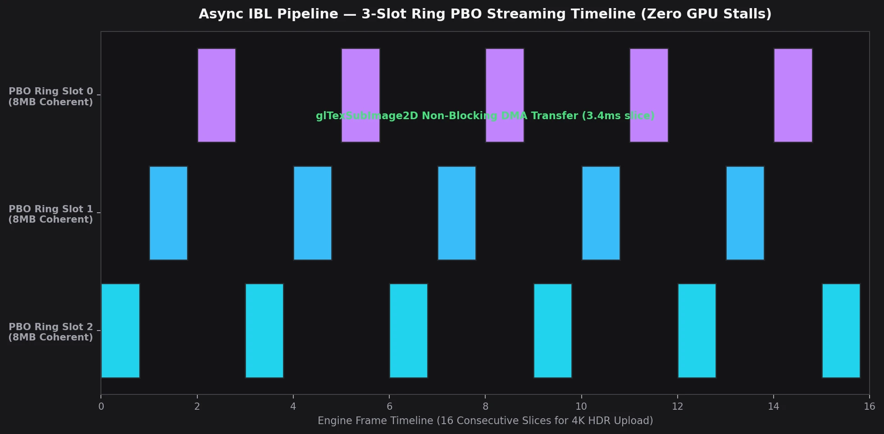

# Async IBL Pipeline — Fixes for ISO C11 Compliance

**Date**: 2026-05-26
**Branch**: `feat/env-manager-async`
**Status**: Fully async, ISO-compliant with legacy C11

## Context

The initial async env manager implementation (commit `1fc80e9`) established the
state machine but had several deviations from the C11 reference that caused
visual artifacts: blown-out hot spots, wave/banding patterns on irradiance,
and incorrect specular texture parameters.

## Key Fixes

### 1. Irradiance Texture: 64×64 Square (was 128×64)

**Problem**: C11 uses a **square** irradiance texture (`size × size`).
The Odin port used equirectangular 2:1 (`size*2 × size`). The `irmap.glsl`
shader's `imageSize()` returns different dimensions, so `uvToDir()` maps UV
differently on 64×64 vs 128×64, producing visible banding/wave artifacts.

**Fix**: `TexStorage2D(..., IRRADIANCE_SIZE, IRRADIANCE_SIZE)` — square, ISO C11.

### 2. Adaptive Luminance Threshold (ISO: IBL_STATE_LUMINANCE)

**Problem**: The specular/irradiance compute shaders have a `clampThreshold`
uniform that prevents firefly artifacts from HDR hot spots. C11 computes this
adaptively from mean luminance; the initial Odin port used a hard-coded 100.0.
Synchronous texture readback with a raw `gl.Finish()` blocked the main thread
for up to 80-100ms.

**Fix**: Added `Luminance` state between `Generate_Mipmaps` and `Specular_Init`.
To prevent CPU stalls, we bind an asynchronous **Pack PBO** (`gl.PIXEL_PACK_BUFFER`)
during the `Generate_Mipmaps` phase to schedule a non-blocking GPU-to-GPU copy
of the average luminance pixel. One frame later, in the `Luminance` phase, the
CPU maps the buffer (`gl.MapBuffer` with `gl.READ_ONLY`) and reads the color
instantly (**< 0.1ms**) without pipeline stalling. It then sets the adaptive threshold:
`threshold = mean * DEFAULT_CLAMP_MULTIPLIER (3.0)` with fallback to 5.0.

### 3. Specular WRAP_S = REPEAT (was CLAMP_TO_EDGE)

**Problem**: Equirectangular prefilter maps are continuous in the horizontal
axis (360° wrap-around). C11 uses `GL_REPEAT` for wrap S to avoid seams at
the ±180° boundary; the Odin port incorrectly used `GL_CLAMP_TO_EDGE`.

**Fix**: `gl.TexParameteri(gl.TEXTURE_2D, gl.TEXTURE_WRAP_S, gl.REPEAT)`

### 4. Progressive Y-Slicing & Seamless Downsampling Slicing

**Problem**: Dispatching all specular mips in a single frame or rendering all faces
of high-resolution seamless skybox cubemaps in a single frame causes massive driver
and GPU compute stalls (frame time spikes up to 140ms).

**Fix**: ISO C11 progressive slicing strategy and progressive seamless downsampling:
- Mip 0 (1024²): 24 Y-slices dispatched 1/frame
- Mip 1 (512²): 8 Y-slices dispatched 1/frame
- Mip 2 (256²): 4 Y-slices dispatched 1/frame (IBL_SPECULAR_MIP2_SLICES :: 4, avoiding compute shader stalls)
- Mips 3-10: all grouped in 1 frame (tiny textures, negligible cost)
- **Seamless Cubemap Downsampling**: Mip 1 and Mip 2 are rendered progressively face-by-face (1 face/frame) over 12 frames, while mips 3+ are processed in a single frame.

No barrier needed between slices of the same mip (disjoint Y-ranges).
`IMAGE_ACCESS` barrier between mip levels.

| Pipeline de Streaming Asynchrone Ring PBO (3 Slots Coordonnés) |
| :---: |
|  |
| *Découpage en 16 tranches consécutives de 8 Mo via PBO persistants sans aucun blocage du thread principal.* |

### 5. Proper Memory Barriers at Completion

**Problem**: The final barrier used only `SHADER_IMAGE_ACCESS_BARRIER_BIT`.
PBR shaders sample IBL via `textureLod()` (texture fetch), not `imageLoad()`.

**Fix**: `gl.MemoryBarrier(gl.TEXTURE_FETCH_BARRIER_BIT | gl.SHADER_IMAGE_ACCESS_BARRIER_BIT)`

### 6. Modern Immutable Storage & Progressive Sliced CPU→GPU Uploads

- **Modern Immutable Allocation**: Replaced sequential `gl.TexImage2D` calls with atomic `gl.TexStorage2D` for the full environment texture and cubemap mip chains. This avoids driver-side dynamic reallocation and texture resizing stalls during generation.
- **Progressive Sliced Upload**: The ~33.5MB FP16 environment map upload is sliced into horizontal chunks across multiple frames via `gl.TexSubImage2D(..., slice_data)`. This avoids GPU transfer stalls and keeps frame times smooth without unneeded PBO management overhead.
- **Precision**: `PREFILTER_MIP_LEVELS` changed from 5 to 11 (= `floor(log2(1024)) + 1`), matching C11's full mip chain. HDR data is now uploaded as `GL_HALF_FLOAT` (FP16 converted on worker thread via SIMD) instead of `GL_FLOAT`, halving upload bandwidth.

### 7. Synchronous Path Removed

`ibl_create` → `ibl_init`: only compiles compute programs and generates the
BRDF LUT (view-independent). Irradiance and prefilter are now exclusively
computed by the env_manager state machine. No double-load on startup.

## Architecture (Final State Machine)

```
Idle → Upload_Texture (Progressive Sliced) → Generate_Mipmaps (Pack PBO Readback) 
     → Luminance (Instant Map) → Specular_Init → Specular_Mips (Progressive Sliced) 
     → Irradiance → Done
```

- **Upload_Texture**: Progressively uploads async-loaded FP16 pixels to GPU via chunked `gl.TexSubImage2D` slices
- **Generate_Mipmaps**: `gl.GenerateMipmap` + schedules non-blocking luminance readback into Pack PBO
- **Luminance**: Map PBO instantly → compute adaptive threshold (NaN/Inf-safe, takes < 0.1ms)
- **Specular_Init**: Allocate prefilter texture (1024×1024, 11 mips full chain)
- **Specular_Mips**: Progressive Y-slicing across frames (ISO C11 ibl_coordinator):
  - Mip 0: 24 slices (1 slice/frame)
  - Mip 1: 8 slices (1 slice/frame)
  - Mip 2: 4 slices (1 slice/frame, sliced to prevent frame spikes)
  - Mips 3+: grouped in 1 frame (small enough)
- **Irradiance**: 12 Y-slices, one per frame, 64×64 square
- **Done**: `TEXTURE_FETCH | IMAGE_ACCESS` barrier + swap textures into live scene

## FP32→FP16 Conversion (Worker Thread)

The async loader now converts HDR data from FP32 to FP16 on the worker thread
using AVX2/F16C SIMD intrinsics (`deps/simd_utils.c`). This halves GPU upload
bandwidth and VRAM usage with negligible visual quality loss for IBL.

- **SIMD path**: `_mm256_cvtps_ph` (8 floats at a time) + scalar F16C tail
- **Fallback**: Software IEEE 754 conversion if F16C unavailable
- **Memory**: Worker allocates via `libc.malloc`, freed on main thread after upload

## Additional Features (same PR)

- **HDR cycling**: PAGE_UP/PAGE_DOWN scans `assets/textures/hdr/` and triggers transitions
- **IBL debug exposure**: EV slider in GUI (right-click to reset), session-persisted
- **Black screen guard**: app.odin clears to black after scene_render during first load
  (scene_render still runs for GL state coherency on Intel Mesa)
- **Skybox deferred init**: `skybox_create(0, 0, ...)` skips cubemap gen; done on first env load
- **Tracy instrumentation**: All IBL states have named zones + colored messages
- **GL debug labels**: `KHR_debug` object labels on all IBL textures
- **IBL placeholder textures**: 1×1 black during first-load (no GPU garbage sampling)
