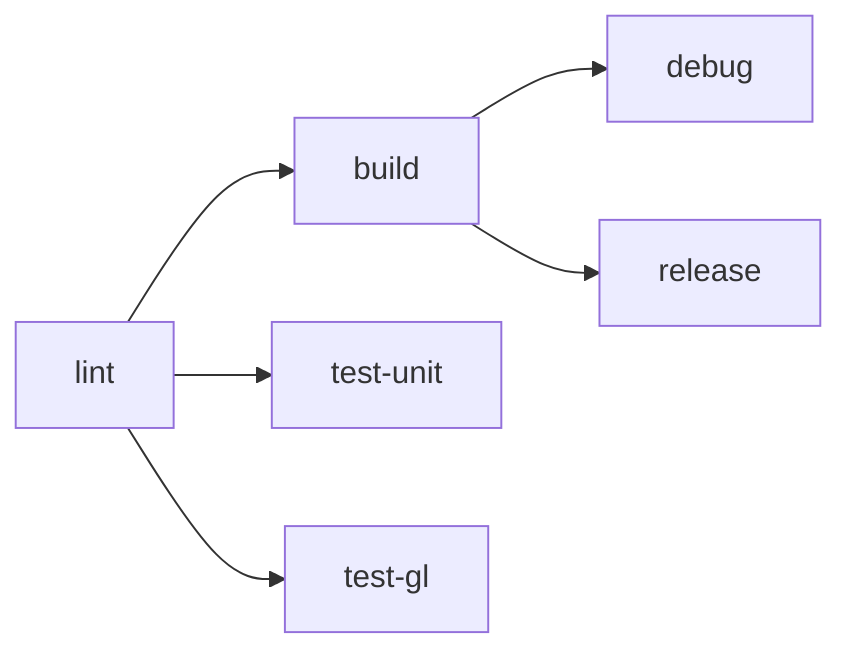

# CI/CD & Build System

## Build Configuration

The project uses separate output directories per build configuration to avoid overwrites:

```
build/
├── debug/suckless-odin       # Debug symbols, assertions enabled
├── release/suckless-odin     # Optimized (-o:speed), stripped
└── sanitize/suckless-odin    # AddressSanitizer instrumented
```

### Build Targets

| Recipe | Output | Odin Flags | Use Case |
|--------|--------|-----------|----------|
| `just build` | `build/debug/` | `-debug` | Development, debugging |
| `just build-release` | `build/release/` | `-o:speed` | Performance testing, distribution |
| `just build-strict` | `build/debug/` | `-debug -vet -strict-style -warnings-as-errors` | Pre-commit validation |
| `just build-sanitize` | `build/sanitize/` | `-debug -sanitize:address` | Memory error detection |

### Running

```bash
just run           # Run debug build
just run-release   # Run release build
just br            # Build debug + run
```

## CI/CD Pipeline (GitHub Actions)

The CI runs on every push to `master`/`main` and on pull requests.

### Pipeline Structure



### Jobs

| Job | Purpose | Dependencies |
|-----|---------|-------------|
| **lint** | `odin check -vet -strict-style -warnings-as-errors` | None |
| **build** | Compile debug + release (matrix) | lint |
| **test-unit** | Unit tests, CLI tests, shader CPU tests | lint |
| **test-gl** | GL shader tests + visual regression (xvfb + Mesa) | lint |

### GL Tests in CI

GL tests run headless using:
- **Mesa** (software OpenGL implementation)
- **xvfb** (virtual framebuffer for X11)

```bash
xvfb-run -a -s "-screen 0 1024x768x24" odin test tests/gl/ -define:ODIN_TEST_THREADS=1
```

### Visual Regression

The visual regression test renders the full PBR scene from 6 camera viewpoints and compares against reference images in `tests/references/`.

- **Threshold**: 5.0 RGB euclidean distance per pixel
- **Tolerance**: Max 2% of pixels may differ
- **On failure**: Diff artifacts are uploaded as GitHub Actions artifacts

To regenerate references locally:

```bash
just gen-refs        # With display
just gen-refs-xvfb   # Headless
```

### HDR Asset Dependency

The scene requires an HDR environment map from the sibling `suckless-ogl` repository. In CI, this is handled via sparse checkout:

```yaml
- uses: actions/checkout@v4
  with:
    repository: yoyonel/suckless-ogl
    path: ../suckless-ogl
    sparse-checkout: assets/textures/hdr/
```

Locally, the sibling repo must be checked out at `../suckless-ogl/`.

## Local CI

Run the full pipeline locally (mirrors GitHub Actions):

```bash
just ci              # lint + build + all tests (with xvfb)
just test-gl-xvfb   # GL tests only, headless
```

## Dependencies

### Dear ImGui (odin-imgui submodule)

| Aspect | Valeur |
|--------|--------|
| Upstream | [steinarb1234/odin-imgui](https://github.com/steinarb1234/odin-imgui) |
| Gestion | Git submodule at `deps/odin-imgui` |
| Binaire | `imgui_linux_x64.a` — construit localement, non versionné |
| Build requires | `python3`, `clang`, `ar`, `git` |

```bash
git submodule update --init    # After clone
just build-imgui               # Compile .a (~90s)
just update-imgui              # Pull latest + rebuild
```

### HDR Asset Dependency

The CI uses a pinned Odin nightly release, cached between runs:
- Version: `nightly+2026-05-03`
- Platform: `linux-amd64`
- Install path: `/opt/odin` (CI) or `/tmp/odin-linux-amd64-nightly+2026-05-03/` (local dev)
