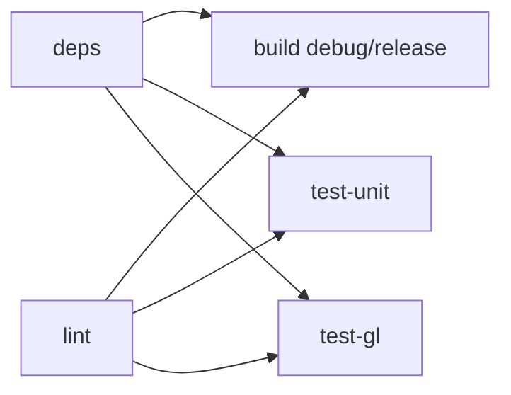

# CI/CD & Build System

## Build Configuration

The project uses separate output directories per build configuration to avoid overwrites:

```
build/
├── debug/suckless-odin       # Debug symbols, assertions enabled
├── release/suckless-odin     # Optimized (-o:speed), stripped
└── sanitize/suckless-odin    # AddressSanitizer instrumented
```

### Build Targets

| Recipe | Output | Odin Flags | Use Case |
|--------|--------|-----------|----------|
| `just build` | `build/debug/` | `-debug` | Development, debugging |
| `just build-release` | `build/release/` | `-o:speed` | Performance testing, distribution |
| `just build-strict` | `build/debug/` | `-debug -vet -strict-style -warnings-as-errors` | Pre-commit validation |
| `just build-sanitize` | `build/sanitize/` | `-debug -sanitize:address` | Memory error detection |

### Running

```bash
just run           # Run debug build
just run-release   # Run release build
just br            # Build debug + run
```

## CI/CD Pipeline (GitHub Actions)

The CI runs on every push to `master`/`main` and on pull requests.

### Pipeline Structure



### Jobs

| Job | Purpose | Dependencies | Cache |
|-----|---------|-------------|-------|
| **lint** | `odin check -vet -strict-style -warnings-as-errors` | None | Odin compiler |
| **deps** | Build GLFW 3.4 (shared) + ImGui .a, upload as artifacts | None | GLFW by version, ImGui by script hash |
| **build** | Compile debug + release (matrix) | lint, deps | Odin compiler |
| **test-unit** | Unit tests, CLI tests, shader CPU tests | lint, deps | Odin compiler |
| **test-gl** | GL shader tests + visual regression (xvfb + Mesa) | lint, deps | Odin compiler |

### Dependency Mutualization

GLFW and ImGui are built **once** in the `deps` job and shared via artifacts:

- **GLFW**: cached with key `glfw-3.4-shared-ubuntu-latest`, installed to `$GITHUB_WORKSPACE/glfw-install`
- **ImGui**: cached with key `imgui-${{ hashFiles('build.py', 'build_imgui_parallel.py') }}`
- Consumer jobs download artifacts and install GLFW to `/usr/local/lib/`

This eliminates redundant 60s+ builds in every job.

### GL Tests in CI

GL tests run headless using:
- **Mesa** (software OpenGL implementation)
- **xvfb** (virtual framebuffer for X11)

```bash
xvfb-run -a -s "-screen 0 1024x768x24" odin test tests/gl/ -define:ODIN_TEST_THREADS=1
```

### Visual Regression

The visual regression test renders the full PBR scene from 6 camera viewpoints and compares against reference images in `tests/references/`.

- **Threshold**: 5.0 RGB euclidean distance per pixel
- **Tolerance**: Max 2% of pixels may differ
- **On failure**: Diff artifacts are uploaded as GitHub Actions artifacts

To regenerate references locally:

```bash
just gen-refs        # With display
just gen-refs-xvfb   # Headless
```

### HDR Asset

The scene requires an HDR environment map (`assets/textures/hdr/cedar_bridge_2_4k.hdr`) which is tracked directly in this repository.

## Local CI

Run the full pipeline locally (mirrors GitHub Actions):

```bash
just ci              # lint + build + all tests (with xvfb)
just test-gl-xvfb   # GL tests only, headless
```

> **Note:** For executing the local build pipeline across isolated containers (e.g., `distrobox`) or offloading to NVIDIA GPUs via MangoHud natively, refer to [Distrobox Environment & Native GPU Offloading](distrobox-optimus-2026-05-24.md).

## Dependencies

### Dear ImGui (odin-imgui submodule)

| Aspect | Valeur |
|--------|--------|
| Upstream | [steinarb1234/odin-imgui](https://github.com/steinarb1234/odin-imgui) |
| Gestion | Git submodule at `deps/odin-imgui` |
| Binaire | `imgui_linux_x64.a` — construit localement, non versionné |
| Build requires | `python3`, `clang`, `ar`, `git` |

```bash
git submodule update --init    # After clone
just build-imgui               # Compile .a (~90s)
just update-imgui              # Pull latest + rebuild
```

### GLFW 3.4+ (built from source, shared)

odin-imgui requires GLFW 3.4+ (`glfwGetPlatform`), but Ubuntu's `libglfw3-dev` provides 3.3.x.
Odin's vendor GLFW on Linux expects a shared library (`system:glfw` → `-lglfw` → `libglfw.so`).

In CI, the `deps` job builds GLFW as a shared library from upstream:

```bash
git clone --depth 1 --branch 3.4 https://github.com/glfw/glfw.git /tmp/glfw-src
cmake -S /tmp/glfw-src -B /tmp/glfw-build \
  -DCMAKE_INSTALL_PREFIX=$GITHUB_WORKSPACE/glfw-install \
  -DBUILD_SHARED_LIBS=ON \
  -DGLFW_BUILD_EXAMPLES=OFF -DGLFW_BUILD_TESTS=OFF -DGLFW_BUILD_DOCS=OFF
cmake --build /tmp/glfw-build -j$(nproc)
cmake --install /tmp/glfw-build
```

Consumer jobs then install to system:
```bash
sudo cp -a glfw-install/lib/* /usr/local/lib/
sudo cp -a glfw-install/include/* /usr/local/include/
cd /usr/local/lib && sudo ln -sf libglfw.so.3 libglfw.so  # ensure symlink
sudo ldconfig
```

Locally, install GLFW 3.4+ via your package manager (e.g., `brew install glfw`).

### C++ Runtime (libc++)

ImGui's C++ code links against `libc++`. In CI:

```bash
apt-get install libc++-dev libc++abi-dev
```

Extra linker flags in CI: `-lX11` (imgui_impl_glfw calls X11 directly).

### Odin Compiler

The CI uses a pinned Odin nightly release, cached between runs:
- Version: `nightly+2026-05-03`
- Platform: `linux-amd64`
- Install path: `/opt/odin` (CI) or `/tmp/odin-linux-amd64-nightly+2026-05-03/` (local dev)

## Memory Safety (ASAN / LSAN)

All allocations must be matched with corresponding `delete`/`free`. Validate with:

```bash
just build-sanitize                           # Build with -sanitize:address
./build/sanitize/suckless-odin & APP_PID=$!
sleep 2 && xdotool key Escape                 # Clean shutdown (triggers LSAN)
wait $APP_PID                                 # Exit code 0 = no leaks
```

**Key patterns** (see `.github/instructions/odin-coding-style.instructions.md`):
- `os.read_entire_file` → `defer delete(data)`
- `strings.clone_to_cstring` → `defer delete(cstr)` or freed in `destroy`
- Struct-owned allocations → freed in the struct's `destroy` proc

## Pre-commit Hooks (official framework)

Uses [pre-commit.com](https://pre-commit.com/) framework. Config in `.pre-commit-config.yaml`.

### Install

```bash
just pre-commit-install    # Installs both pre-commit and pre-push hooks
```

### Hooks

| Stage | Hook | What it does |
|-------|------|-------------|
| pre-commit | `odin-lint` | `odin check src/ -vet -strict-style -warnings-as-errors` |
| pre-push | `odin-build` | `odin build src/ -out:/tmp/odin-build-check -debug` |
| pre-push | `odin-test-unit` | `odin test tests/ -out:/tmp/odin-test-unit` |
| pre-push | `odin-test-cli` | `odin test src/ -out:/tmp/odin-test-cli` |
| pre-push | `odin-test-shader` | `odin test src/rendering/shader/ -out:/tmp/odin-test-shader` |
| pre-push | `odin-test-gl` | `odin test tests/gl/ -out:/tmp/odin-test-gl` (headless xvfb) |

### Binary Pollution Prevention

All `odin test` commands use `-out:/tmp/odin-test-*` to avoid creating binaries
in the working directory. Without this, `odin test tests/` would try to create a
file named `tests` conflicting with the `tests/` directory.
