# CPU ↔ GPU Data Architecture

> **Date**: 2026-05-23
> **Branch**: feat/postfx-pipeline
> **OpenGL**: 4.6 Core (Mesa Intel Iris Xe)

Complete mapping of all CPU↔GPU resource flows in the suckless-odin renderer.

---

## Table of Contents

1. [Overview Diagram](#overview-diagram)
2. [Buffer Objects (UBO / SSBO)](#buffer-objects)
3. [Vertex Data (VAO / VBO)](#vertex-data)
4. [Textures](#textures)
5. [Framebuffers (FBO)](#framebuffers)
6. [Pixel Buffer Objects (PBO)](#pixel-buffer-objects)
7. [Compute Shader Resources](#compute-shader-resources)
8. [Shader Programs](#shader-programs)
9. [Binding Point Map](#binding-point-map)
10. [Data Flow Timing Diagram](#data-flow-timing-diagram)

---

## Overview Diagram

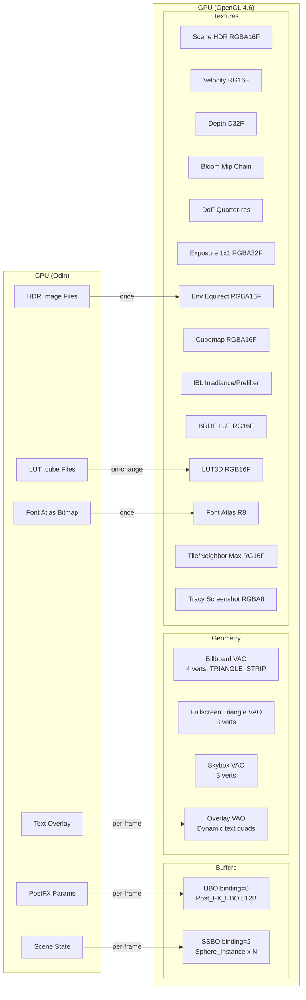

---

## Buffer Objects

### UBO — Post-Processing Settings (binding = 0)

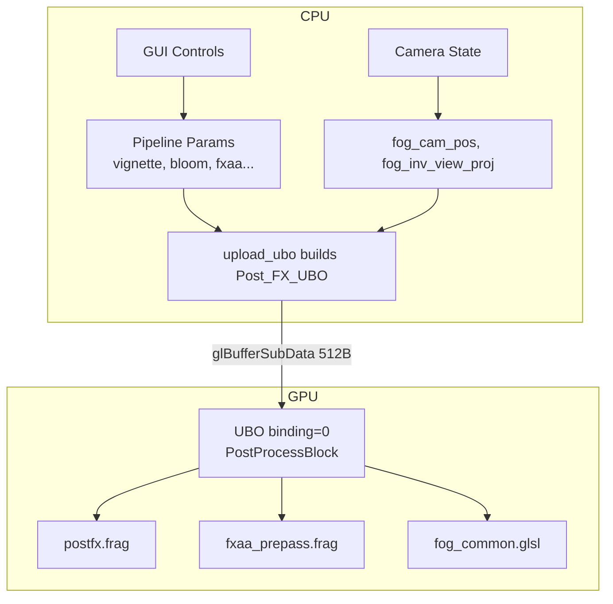

| Property | Value |
|----------|-------|
| **Source file** | `src/rendering/postfx/pipeline.odin` |
| **Struct** | `Post_FX_UBO` (`src/rendering/postfx/types.odin`) |
| **Size** | 512 bytes (#packed, std140-compatible) |
| **Binding** | `GL_UNIFORM_BUFFER` base 0 |
| **Direction** | CPU → GPU |
| **Frequency** | Per-frame (in `upload_ubo`, triggered by `pipeline_end`) |
| **Upload** | `glBufferSubData(GL_UNIFORM_BUFFER, 0, 512, &ubo)` |
| **GLSL** | `layout(std140, binding = 0) uniform PostProcessBlock { ... }` |

**Layout sections** (512 bytes total):

| Offset | Size | Section |
|--------|------|---------|
| 0 | 16B | Header (active_effects, time, texel_size) |
| 16 | 16B | Vignette |
| 32 | 32B | Film Grain |
| 64 | 16B | Exposure |
| 80 | 16B | Chromatic Aberration |
| 96 | 16B | White Balance |
| 112 | 32B | Color Grading |
| 144 | 32B | Tonemapping |
| 176 | 16B | Bloom |
| 192 | 16B | FXAA |
| 208 | 16B | Depth of Field |
| 224 | 16B | Camera planes |
| 240 | 16B | Motion Blur |
| 256 | 32B | Banding |
| 288 | 112B | Fog (density, color, cam_pos, inv_view_proj mat4) |
| 400 | 16B | LUT3D |
| 416 | 16B | Debug split mask |
| 432 | 80B | Split positions (20 floats) |

---

### SSBO — Sphere Instances (binding = 2)

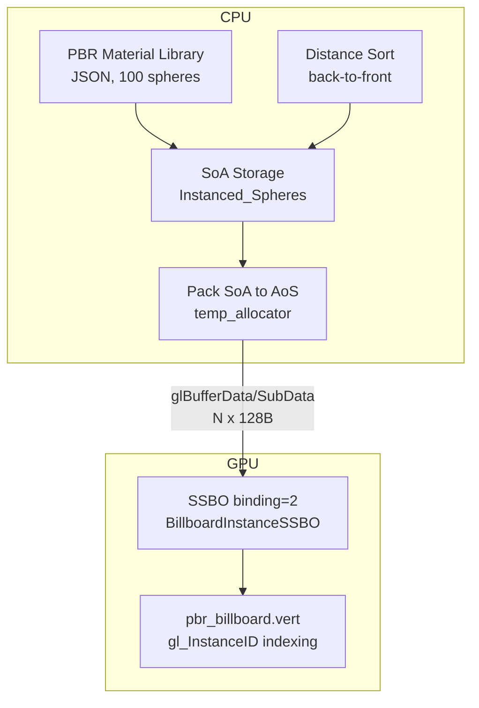

| Property | Value |
|----------|-------|
| **Source file** | `src/rendering/instanced.odin` |
| **CPU struct** | `Sphere_Instance` (`src/rendering/types/types.odin`) |
| **Per-instance** | 128 bytes (#align(64)) |
| **Total** | N × 128B (100 spheres = 12,800B) |
| **Binding** | `GL_SHADER_STORAGE_BUFFER` base 2 |
| **Direction** | CPU → GPU |
| **Frequency** | Per-frame (after sort in `scene_update`) |
| **Upload** | First frame: `glBufferData(DYNAMIC_DRAW)` / subsequent: `glBufferSubData` |
| **Draw** | `glDrawArraysInstanced(GL_TRIANGLE_STRIP, 0, 4, count)` |

**Struct layout (std430, 128 bytes)**:

| Offset | Size | Field | Type |
|--------|------|-------|------|
| 0 | 64B | `model` | mat4 |
| 64 | 12B | `albedo` | vec3 |
| 76 | 4B | `metallic` | float |
| 80 | 4B | `roughness` | float |
| 84 | 4B | `ao` | float |
| 88 | 4B | padding | — |
| 92 | 12B | `prev_center` | vec3 (motion blur) |
| 104 | 24B | padding to 128B | #align(64) |

**Compile-time assertions**:

```odin
#assert(size_of(Sphere_Instance) == 128)
#assert(offset_of(Sphere_Instance, albedo) == 64)
#assert(offset_of(Sphere_Instance, prev_center) == 92)
```

---

## Vertex Data

### Billboard Quad VAO

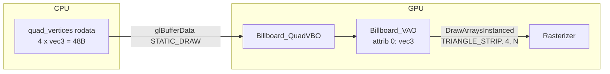

| Property | Value |
|----------|-------|
| **Source** | `src/rendering/billboard.odin` |
| **Vertices** | 4 (triangle strip = 2 triangles) |
| **Layout** | attrib 0: vec3 position |
| **Size** | 48 bytes (static) |
| **Upload** | Once at init |
| **Draw call** | `glDrawArraysInstanced(TRIANGLE_STRIP, 0, 4, instance_count)` |

---

### PostFX Fullscreen Triangle VAO

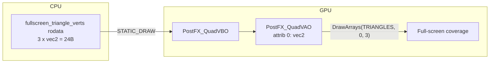

| Property | Value |
|----------|-------|
| **Source** | `src/rendering/postfx/quad.odin` |
| **Technique** | Single oversized triangle (no diagonal seam) |
| **Vertices** | 3 × vec2 = 24 bytes |
| **Used by** | All postfx passes (bloom, DoF, composite, FXAA) |
| **Upload** | Once at init |

---

### Skybox Fullscreen VAO

| Property | Value |
|----------|-------|
| **Source** | `src/rendering/skybox.odin` |
| **Vertices** | 3 × vec3 = 36 bytes (fullscreen triangle) |
| **Upload** | Once at init |
| **Used by** | Background cubemap render |

---

### Text Overlay Dynamic VAO

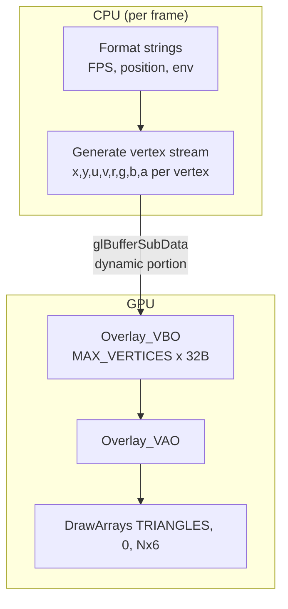

| Property | Value |
|----------|-------|
| **Source** | `src/rendering/overlay.odin` |
| **Stride** | 8 floats/vertex (32 bytes): x, y, u, v, r, g, b, a |
| **Attribs** | 0: vec2 pos, 1: vec2 uv, 2: vec4 color |
| **Buffer** | Pre-allocated at MAX_VERTICES, orphan + SubData each frame |
| **Direction** | CPU → GPU per frame |
| **Sync strategy** | Buffer orphaning (`BufferData(nil)` before `SubData`) |

---

## Textures

### Environment & IBL Pipeline

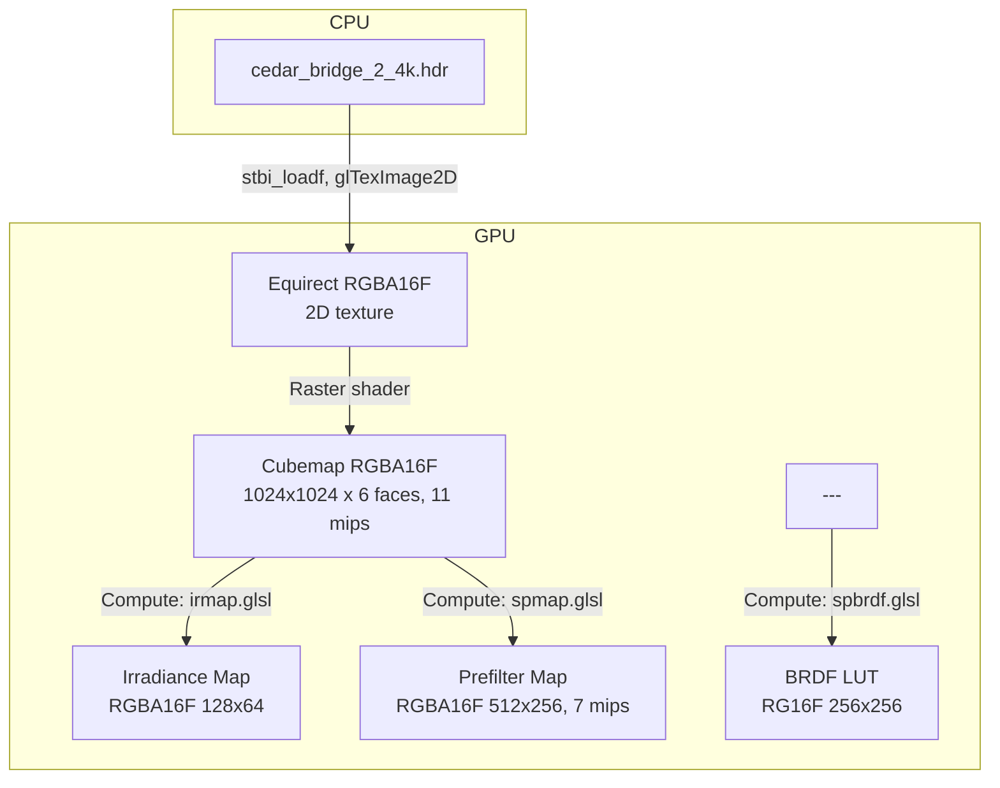

| Texture | Format | Size | Source | Direction | Frequency |
|---------|--------|------|--------|-----------|-----------|
| Environment (equirect) | RGBA16F | W×H (4K typical) | HDR file on disk | CPU→GPU | Once at startup |
| Cubemap | RGBA16F | 1024²×6, 11 mips | equirect→cubemap shader | GPU→GPU | Once at startup |
| Irradiance map | RGBA16F | 128×64 | Compute (irmap.glsl) | GPU→GPU | Once at startup |
| Prefilter map | RGBA16F | 512×256, 7 mips | Compute (spmap.glsl) | GPU→GPU | Once at startup |
| BRDF LUT | RG16F | 256×256 | Compute (spbrdf.glsl) | GPU→GPU | Once at startup |

---

### PostFX Texture Chain

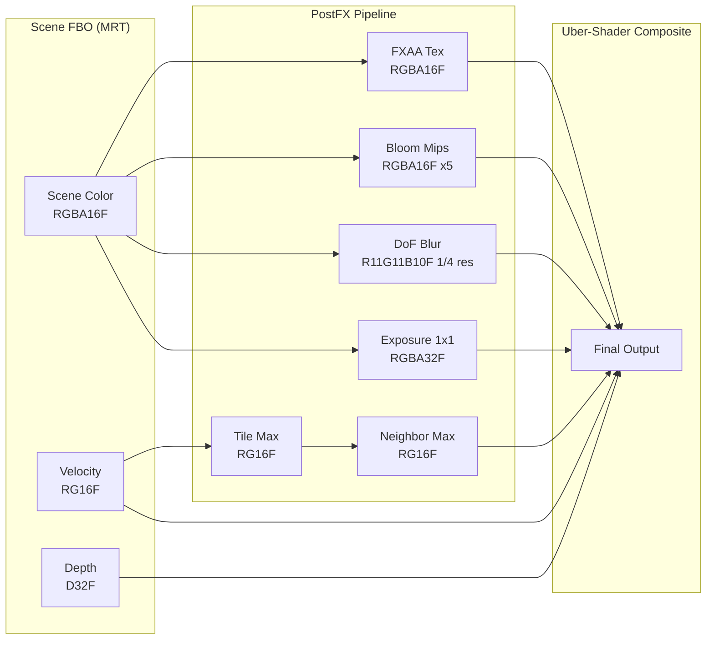

| Unit | Texture | Format | Resolution | Updated |
|------|---------|--------|------------|---------|
| 0 | Scene color | RGBA16F | Full | Per frame |
| 1 | Bloom result | RGBA16F | ½ chain (5 mips) | Per frame if enabled |
| 2 | Depth | D32F | Full | Per frame |
| 3 | Exposure | RGBA32F | 1×1 | Per frame (compute) |
| 4 | Velocity | RG16F | Full | Per frame (MRT) |
| 5 | DoF blur | R11F_G11F_B10F | ¼ res | Per frame if enabled |
| 6 | Neighbor max velocity | RG16F | Tile res | Per frame if MB |
| 7 | Tile max velocity | RG16F | Tile res | Per frame if MB |
| 8 | LUT 3D | RGB16F | N³ (3D) | On LUT change |

---

### Other Textures

| Texture | Format | Size | Source | Direction | Frequency |
|---------|--------|------|--------|-----------|-----------|
| Font atlas | R8 | 512×512 | stbtt bake (CPU bitmap) | CPU→GPU | Once |
| LUT 3D | RGB16F | N³ (e.g. 33³) | .cube file parse | CPU→GPU | On change |
| Tracy screenshot | RGBA8 | 320×180 | Blit from backbuffer | GPU→GPU→CPU | Per frame |

---

## Framebuffers

### Main Scene FBO

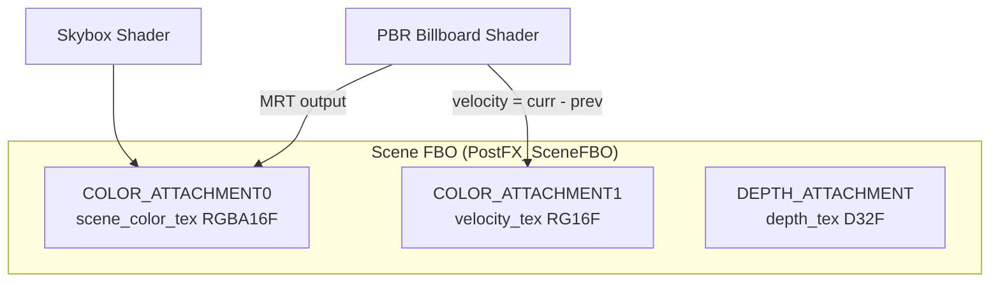

| Property | Value |
|----------|-------|
| **MRT** | 2 color attachments + depth |
| **Resize** | Recreated on window resize |
| **Drawn by** | PBR billboard shader, skybox shader |
| **Read by** | All postfx passes |

---

### FXAA Pre-Pass FBO

| Property | Value |
|----------|-------|
| **Attachment** | COLOR0: RGBA16F (same format as scene) |
| **Purpose** | Anti-alias scene BEFORE motion blur samples it |
| **Condition** | Active only when FXAA + MotionBlur both enabled |

---

### Bloom FBO (Shared, Re-attached)

| Property | Value |
|----------|-------|
| **Technique** | Single FBO, texture re-attached per mip level |
| **Mip levels** | 5 (each ½ previous) |
| **Passes** | Prefilter → Downsample ×4 → Upsample ×4 |
| **Format** | RGBA16F per mip |

---

### DoF FBO

| Property | Value |
|----------|-------|
| **Resolution** | ¼ scene (width/4 × height/4) |
| **Textures** | blur_tex + temp_tex (R11G11B10F) |
| **Passes** | Downsample → Upsample (ping-pong) |

---

### Tracy Screenshot FBO

| Property | Value |
|----------|-------|
| **Resolution** | 320×180 fixed |
| **Purpose** | Downscale backbuffer for Tracy frame image |
| **Flow** | Blit backbuffer → FBO → ReadPixels into PBO |

---

## Pixel Buffer Objects

### Tracy Frame Image PBO Ring

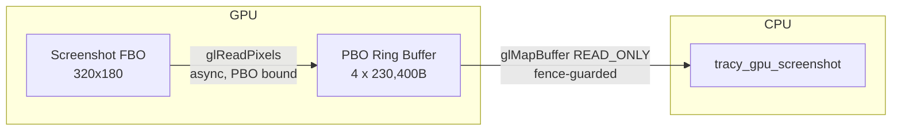

| Property | Value |
|----------|-------|
| **Source** | `src/core/tracy/frame_image.odin` |
| **Count** | 4 PBOs (ring buffer) |
| **Size each** | 320 × 180 × 4 = 230,400 bytes |
| **Direction** | GPU → CPU (async readback) |
| **Sync** | `glFenceSync` + `glClientWaitSync` (non-blocking) |
| **Latency** | ~4 frames (ring depth) |
| **Pattern** | Write PBO[i], read PBO[(i+1)%4] — no stall |

---

### Auto-Exposure PBO Pair

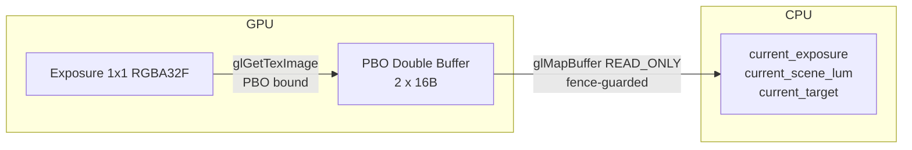

| Property | Value |
|----------|-------|
| **Source** | `src/rendering/postfx/auto_exposure.odin` |
| **Count** | 2 PBOs (double buffer) |
| **Size each** | 16 bytes (4 × f32) |
| **Direction** | GPU → CPU (async readback for GUI display) |
| **Sync** | `glFenceSync` + non-blocking `ClientWaitSync` |
| **Latency** | 2 frames |

---

## Compute Shader Resources

### Auto-Exposure (Single-Pass)

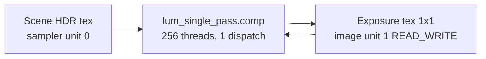

| Property | Value |
|----------|-------|
| **Shader** | `shaders/postfx/lum_single_pass.comp` |
| **Dispatch** | `(1, 1, 1)` — 256 threads do sample + reduce + adapt |
| **Input** | Scene HDR texture (sampler 0) |
| **Output** | 1×1 RGBA32F exposure texture (image unit 1, READ_WRITE) |
| **Barrier** | `SHADER_IMAGE_ACCESS_BARRIER_BIT | TEXTURE_FETCH_BARRIER_BIT` |

---

### Motion Blur Tile Passes

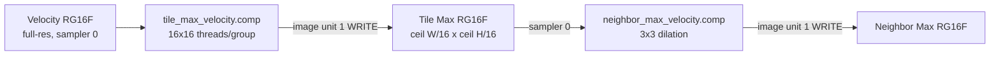

| Pass | Shader | Dispatch | Input | Output |
|------|--------|----------|-------|--------|
| Tile-max | `tile_max_velocity.comp` | (tile_w, tile_h, 1) | Velocity tex (sampler 0) | tile_max_tex (image 1) |
| Neighbor-max | `neighbor_max_velocity.comp` | (ceil(tw/16), ceil(th/16), 1) | tile_max_tex (sampler 0) | neighbor_max_tex (image 1) |

---

### IBL Compute Passes

| Pass | Shader | Output | Size | Binding |
|------|--------|--------|------|---------|
| BRDF LUT | `shaders/IBL/spbrdf.glsl` | brdf_lut (RG16F) | 256×256 | image 0, WRITE_ONLY |
| Irradiance | `shaders/IBL/irmap.glsl` | irradiance_map (RGBA16F) | 128×64 | image 1, WRITE_ONLY |
| Prefilter | `shaders/IBL/spmap.glsl` | prefilter_map (RGBA16F) | 512×256, 7 mips | image 1, WRITE_ONLY |

All IBL compute passes read the environment cubemap from sampler unit 0.

---

## Shader Programs

### Runtime Programs

| Program | Vertex | Fragment/Compute | Used For |
|---------|--------|------------------|----------|
| PBR Billboard | `pbr_billboard.vert` | `pbr_billboard.frag` | Main scene rendering |
| Skybox Cubemap | `background.vert` | `background_cubemap.frag` | Background render |
| Skybox Cubemap Diff | `background.vert` | `background_cubemap_diff.frag` | Debug mipmap diff |
| Skybox Blur Diff | `background.vert` | `background_blur_diff.frag` | Debug blur diff |
| Equirect→Cubemap | `equirect_to_cubemap.vert` | `equirect_to_cubemap.frag` | HDR to cubemap conversion |
| Cubemap Downsample | — | `downsample_cubemap.frag` | Mip generation |
| PostFX Composite | `postfx/postfx.vert` | `postfx/postfx.frag` | Final uber-shader |
| FXAA Pre-pass | `postfx/postfx.vert` | `postfx/fxaa_prepass.frag` | Anti-aliasing pass |
| Bloom Prefilter | `postfx/postfx.vert` | `postfx/bloom_prefilter.frag` | Bloom threshold |
| Bloom Downsample | `postfx/postfx.vert` | `postfx/bloom_downsample.frag` | 13-tap downsample |
| Bloom Upsample | `postfx/postfx.vert` | `postfx/bloom_upsample.frag` | Tent filter upsample |
| Text Overlay | (inline GLSL) | (inline GLSL) | HUD text |
| Auto-Exposure | — | `postfx/lum_single_pass.comp` | Luminance adaptation |
| Tile Max | — | `postfx/tile_max_velocity.comp` | Motion blur tiles |
| Neighbor Max | — | `postfx/neighbor_max_velocity.comp` | Motion blur dilation |
| IBL Irradiance | — | `IBL/irmap.glsl` | Irradiance convolution |
| IBL Prefilter | — | `IBL/spmap.glsl` | Specular prefilter |
| IBL BRDF | — | `IBL/spbrdf.glsl` | Split-sum BRDF LUT |

### Variant Cache (PostFX)

The composite shader uses `#define` permutations based on active effects:

```
bit 0: Vignette         bit 5: WhiteBalance
bit 1: Grain            bit 6: ColorGrading
bit 2: Exposure         bit 7: Tonemap
bit 3: ChromAbbr        bit 8: Bloom
bit 4: FXAA             bit 9: DoF
...
```

Variants are compiled on-demand and cached in `shader_cache.odin`.

---

## Binding Point Map

### Buffer Bindings

| Type | Binding | Resource | GLSL Block Name |
|------|---------|----------|-----------------|
| UBO | 0 | Post_FX_UBO (512B) | `PostProcessBlock` |
| SSBO | 2 | Sphere_Instance[] (N×128B) | `BillboardInstanceSSBO` |

### Texture Unit Assignments (PostFX Composite)

| Unit | Sampler Name | Texture | Format |
|------|-------------|---------|--------|
| 0 | `screenTexture` | Scene color | RGBA16F |
| 1 | `bloomTexture` | Bloom result | RGBA16F |
| 2 | `depthTexture` | Scene depth | D32F |
| 3 | `exposureTexture` | Auto-exposure | RGBA32F |
| 4 | `velocityTexture` | Velocity buffer | RG16F |
| 5 | `dofTexture` | DoF blur | R11G11B10F |
| 6 | `neighborMaxTexture` | Neighbor max velocity | RG16F |
| 7 | `tileMaxTexture` | Tile max velocity | RG16F |
| 8 | `lut3dTexture` | Color LUT | RGB16F (3D) |

### Compute Image Bindings

| Unit | Shader | Access | Texture |
|------|--------|--------|---------|
| 0 | spbrdf.glsl | WRITE_ONLY | BRDF LUT |
| 1 | irmap.glsl | WRITE_ONLY | Irradiance map |
| 1 | spmap.glsl | WRITE_ONLY | Prefilter map |
| 1 | lum_single_pass.comp | READ_WRITE | Exposure 1×1 |
| 1 | tile_max_velocity.comp | WRITE_ONLY | Tile max tex |
| 1 | neighbor_max_velocity.comp | WRITE_ONLY | Neighbor max tex |

---

## Data Flow Timing Diagram

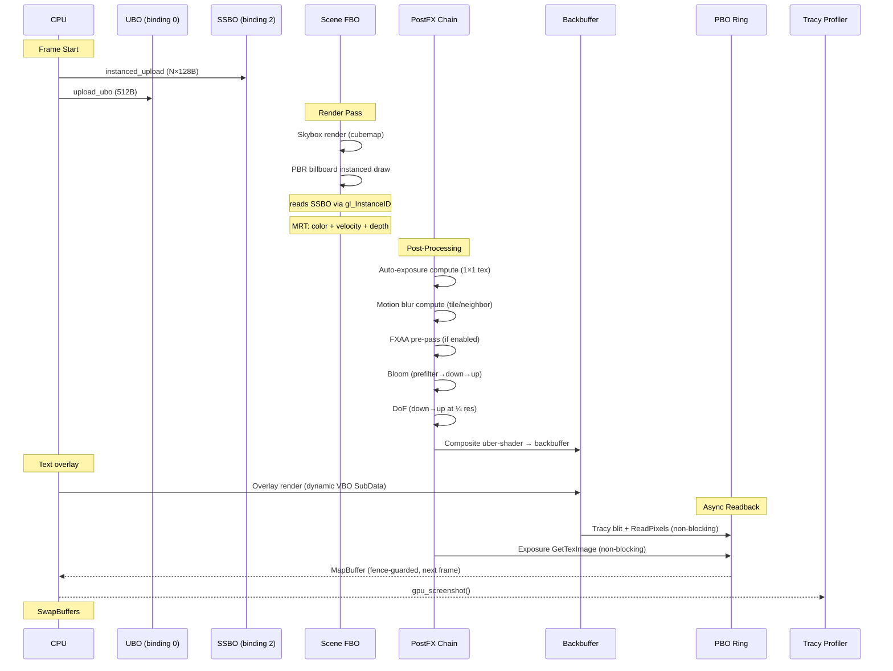

---

## Memory Budget Summary

| Category | Count | Total Size | Upload Freq |
|----------|-------|-----------|-------------|
| UBO | 1 | 512 B | Per frame |
| SSBO | 1 | 12,800 B (100 instances) | Per frame |
| Static VBOs | 4 | ~156 B | Once |
| Dynamic VBO (overlay) | 1 | ~64 KB (pre-allocated) | Per frame |
| PBO (Tracy) | 4 | 921,600 B (4 × 230,400) | Per frame |
| PBO (Exposure) | 2 | 32 B | Per frame |
| Scene FBO textures | 3 | W×H×(8+4+4) = 16 bytes/pixel | Per frame |
| PostFX textures | ~12 | Variable (bloom mips, ¼ res DoF...) | Per frame |
| IBL textures | 3 | ~5 MB (prefilter + irradiance + BRDF) | Once |
| Environment tex | 2 | ~32 MB (4K equirect + cubemap) | Once |
| Font atlas | 1 | 262,144 B (512²) | Once |
| LUT 3D | 1 | ~215 KB (33³×6B typical) | On change |

---

## Source File Index

| File | Responsibility |
|------|---------------|
| `src/rendering/instanced.odin` | SSBO lifecycle, SoA→AoS pack, upload |
| `src/rendering/types/types.odin` | Sphere_Instance struct + layout asserts |
| `src/rendering/billboard.odin` | Billboard quad VAO/VBO creation |
| `src/rendering/overlay.odin` | Dynamic text VAO, font atlas texture |
| `src/rendering/skybox.odin` | Skybox VAO, cubemap conversion FBO |
| `src/rendering/texture.odin` | HDR equirect texture loading |
| `src/rendering/ibl.odin` | IBL compute dispatches + textures |
| `src/rendering/shader/shader.odin` | Shader compile/link utilities |
| `src/rendering/postfx/pipeline.odin` | Scene FBO, UBO, composite program |
| `src/rendering/postfx/types.odin` | Post_FX_UBO struct, TEX_UNIT constants |
| `src/rendering/postfx/quad.odin` | Fullscreen triangle VAO |
| `src/rendering/postfx/bloom.odin` | Bloom FBO + mip chain |
| `src/rendering/postfx/dof.odin` | DoF FBO + ¼ res textures |
| `src/rendering/postfx/fxaa_prepass.odin` | FXAA FBO + program |
| `src/rendering/postfx/auto_exposure.odin` | Exposure compute + PBO readback |
| `src/rendering/postfx/motion_blur.odin` | Tile/neighbor compute + textures |
| `src/rendering/postfx/lut3d.odin` | 3D LUT texture upload |
| `src/rendering/postfx/gl_helpers.odin` | Texture creation helpers |
| `src/rendering/postfx/shader_cache.odin` | Uber-shader variant cache |
| `src/core/tracy/frame_image.odin` | Screenshot PBO ring + blit |
