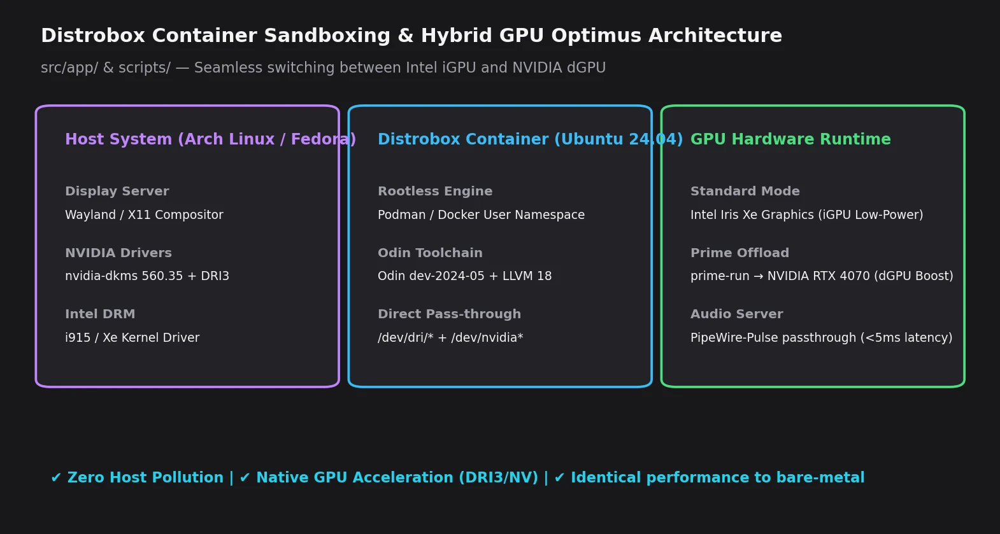

# Distrobox Environment & Native GPU Offloading (Optimus)

This document describes the hybrid architecture used to compile the engine inside an isolated, immutable-friendly container (`distrobox`) while seamlessly offloading the graphical execution to the host's native proprietary drivers (NVIDIA Optimus).

## 1. Transparent Distrobox Compilation

On immutable operating systems like Bazzite, Fedora Silverblue, or uBlue, installing development packages natively (`clang`, `llvm`, etc.) is heavily discouraged. To solve this, `suckless-odin` utilizes a `distrobox` container named `clang-dev` to handle all compilation processes.

### How it works
The `Taskfile.yml` dynamically detects if it is running inside the container (via the `$CONTAINER_ID` environment variable).
- **If executed from the host:** The `Taskfile.yml` aliases core commands (`odin`, `python3`, `cmake`, `bash`) to prefix them with `distrobox enter clang-dev --`.
- **If executed inside the container:** The commands run natively without double-wrapping.

This ensures the developer can run `task build` directly from the host terminal, and the build will transparently occur within the container. 

> [!IMPORTANT]
> The engine's source code depends on `base` packages located in `/usr/lib/odin`. Because `distrobox enter` does not invoke an interactive login shell, `.bashrc` isn't invariably sourced. The `Taskfile.yml` explicitly sets `env ODIN_ROOT=/usr/lib/odin` before injecting the compiler call to prevent an `Internal Compiler Error`.

| Architecture de Sandboxing Distrobox & Commutation GPU Hybride Optimus |
| :---: |
|  |
| *Compilation isolée dans conteneur sans pollution hôte, et rendu graphique direct avec accélération NVIDIA Prime Offload.* |

## 2. Native Execution & NVIDIA Optimus Offloading

While the application **compiles** inside the container, it must **run** directly on the host to properly leverage the proprietary NVIDIA kernel drivers (`libGLX_nvidia.so`) via PRIME Render Offloading.

All `run` targets (like `run-ultra` or `br-ultra`) in the `Taskfile.yml` strip the `distrobox` wrapper, executing the compiled binaries (located in `build/`) strictly on the host system.

### Local `.env` Configuration

To force the native executable to utilize the dedicated NVIDIA GPU (instead of defaulting to the Intel iGPU or Mesa software rendering) without passing verbose inline flags, `Task` is configured with `.env` files. 

You can create a `.env` file at the root of the project with the following configuration:

```env
# NVIDIA PRIME Render Offload Environment Variables
__NV_PRIME_RENDER_OFFLOAD=1
__GLX_VENDOR_LIBRARY_NAME=nvidia
__VK_LAYER_NV_optimus=NVIDIA_onl

# Disable VSync for performance uncapping
vblank_mode=0
__GL_SYNC_TO_VBLANK=0

# Explicitly link system-level proprietary drivers (required for OpenGL ImGui/Glad loading)
LD_LIBRARY_PATH=/usr/lib64

# Enable dynamic MangoHud profiling for the final executable
USE_MANGOHUD=1
```

> [!WARNING]  
> Without `LD_LIBRARY_PATH=/usr/lib64`, the native executable may fail to resolve the NVIDIA implementation of `libGL.so`, causing an immediate crash during application startup (`Failed to initialize OpenGL loader!` inside Dear ImGui).

## 3. Dynamic MangoHud Hooking

The `Taskfile.yml` intercepts the `USE_MANGOHUD` variable from your `.env` file. 

Instead of wrapping the entire `task` execution tree (e.g., `mangohud task br-ultra`), which erroneously initializes MangoHud hooks with the Intel GPU before the `.env` variables take effect, the `Taskfile.yml` explicitly targets the final binary:

```yaml
RUNNER:
  sh: |
    if [ "$USE_MANGOHUD" = "1" ]; then
      echo "mangohud "
    else
      echo ""
    fi
```

**Developer Workflow:**
With the `.env` file correctly configured, you can invoke the maximum-performance workflow natively via a single command:
```bash
task br-ultra
```
This single step compiles the optimized codebase inside the `clang-dev` container, offloads execution directly to the NVIDIA GPU, and displays MangoHud profiling metrics natively on the host.

## 4. Graphical Profiling with Tracy

The `suckless-odin` engine utilizes the **Tracy Profiler**. However, attempting to run the pre-compiled Tracy GUI via Homebrew (`linuxbrew`) directly on immutable systems (like Bazzite) will frequently result in Wayland/X11 Segfaults (`signal 11` during `xkbcommon` initialization).

To resolve this, the `Taskfile.yml` is configured to compile and launch the Tracy Server GUI entirely from within the `clang-dev` Distrobox container:

1. **Compilation**: Running `task build-tracy-server` fetches all complex UI dependencies (ImGui, Capstone, GLFW) and compiles the server using the container's stable library ecosystem.
2. **Execution**: `task tracy-server` executes the binary from inside the container. Distrobox seamlessly forwards the graphical context to the host's Wayland display without native library conflicts.
