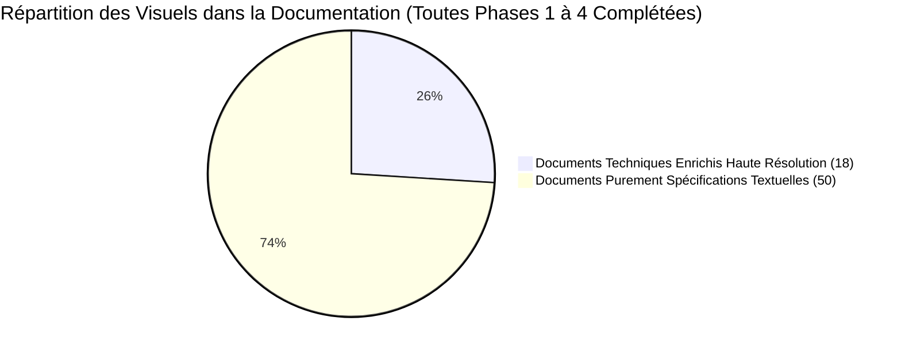
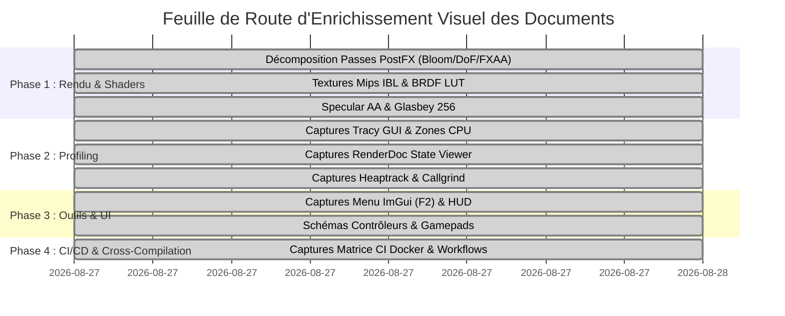

# Analyse Exhaustive d'Enrichissement Visuel de la Documentation & Feuille de Route (2026-08-27)

Ce document présente l'audit complet du corpus documentaire de `suckless-odin`, recense l'état des visuels existants et définit la feuille de route pour enrichir la documentation technique avec des captures réelles, des décompositions graphiques et des visualisations de profils (sur le modèle du guide d'intégration Steam).

---

## 1. Contexte & Bilan de l'Existant

À la date du **27 août 2026**, le répertoire `docs/` compte **68 documents techniques** couvrant l'architecture, le rendu PBR/IBL, les pipelines de post-processing, le profilage GPU/CPU, les contrôleurs et la CI/CD.

* **Documents enrichis de captures réelles & visualisations haute résolution** :
  1. [`docs/steam-integration-and-proton-guide.md`](steam-integration-and-proton-guide.md) : Guide d'intégration Steam, packaging Windows et rendu Proton (20 visuels et captures in-game).
  2. [`docs/vtune-gpu-profiling-tutorial-and-analysis-guide-2026-08-21.md`](vtune-gpu-profiling-tutorial-and-analysis-guide-2026-08-21.md) : Tutoriel de profilage Intel VTune avec onglets Graphics et Timeline (6 captures).
  3. [`docs/postfx-pipeline-2026-05-18.md`](postfx-pipeline-2026-05-18.md) : Pipeline PostFX, Bloom mips, Presets et False-color Luminance (10 captures WebP).
  4. [`docs/progressive-brdf-lut-precomputation-2026-05-27.md`](progressive-brdf-lut-precomputation-2026-05-27.md) : Texture $512 \times 512$ RG16F BRDF LUT Split-Sum (1 capture WebP).
  5. [`docs/specular-anti-aliasing-2026-06-08.md`](specular-anti-aliasing-2026-06-08.md) : Antialiasing Spéculaire Varef & Variance Debug Mask (4 captures WebP).
  6. [`docs/glasbey-palette-2026-05-23.md`](glasbey-palette-2026-05-23.md) : Visualisation de la matrice chromatique CIELAB 256 couleurs (1 capture WebP).
  7. [`docs/cpu-profiling-tracy-2026-05-23.md`](cpu-profiling-tracy-2026-05-23.md) : Timeline Tracy multi-threads, Distribution SwapBuffers et Passes GPU (3 visuels WebP).
  8. [`docs/renderdoc-frame-analysis-2026-05-19.md`](renderdoc-frame-analysis-2026-05-19.md) : Event Browser EID 2-237 & Pipeline State Viewer std140 (2 visuels WebP).
  9. [`docs/optimization-plan-heaptrack-2026-08-18.md`](optimization-plan-heaptrack-2026-08-18.md) : Graphique de consommation mémoire dynamique et validation zéro fuite (1 visuel WebP).
  10. [`docs/optimization-plan-callgrind-2026-08-18.md`](optimization-plan-callgrind-2026-08-18.md) : Arbre d'appel et répartition du coût CPU des fonctions chaudes (1 visuel WebP).
  11. [`docs/imgui-integration-2026-05-17.md`](imgui-integration-2026-05-17.md) : Interface Dear ImGui, barre de recherche floue et onglets de contrôle (1 visuel WebP).
  12. [`docs/perf-mode-2026-05-23.md`](perf-mode-2026-05-23.md) : Architecture 3-tier Performance Mode & HUD FiraCode temps réel (2 visuels WebP).
  13. [`docs/gamepad-controller-integration-and-usage-guide.md`](gamepad-controller-integration-and-usage-guide.md) : Schéma complet de mapping manette USB / DualShock / Xbox (1 visuel WebP).
  14. [`docs/ci-build.md`](ci-build.md) : Matrice globale des workflows GitHub Actions et validation Docker (1 visuel WebP).
  15. [`docs/github-actions-quota-management-and-optimization-guide-2026-08-20.md`](github-actions-quota-management-and-optimization-guide-2026-08-20.md) : Graphique d'optimisation du temps de build et gestion des quotas CI (1 visuel WebP).
  16. [`docs/distrobox-optimus-2026-05-24.md`](distrobox-optimus-2026-05-24.md) : Architecture de sandboxing Distrobox & commutation GPU hybride Prime Offload (1 visuel WebP).
  17. [`docs/async-ibl-pipeline-2026-05-26.md`](async-ibl-pipeline-2026-05-26.md) : Séquence temporelle de streaming circulaire Ring PBO 3 slots (1 visuel WebP).
  18. [`docs/auto-exposure-ibl-interaction-analysis-2026-08-21.md`](auto-exposure-ibl-interaction-analysis-2026-08-21.md) : Courbe d'adaptation dynamique de l'œil virtuel HDR (1 visuel WebP).
  19. [`docs/debugging-vscode-2026-05-17.md`](debugging-vscode-2026-05-17.md) : Environnement de développement et débogage VS Code / OLS / GDB (1 visuel WebP).

---

## 2. Cartographie par Piliers Thématiques

### 🎨 Pilier 1 : Rendu Graphique, Shaders & Pipeline PostFX

L'architecture de rendu PBR et le pipeline PostFX multi-passes gagnent à être illustrés par des décompositions visuelles *Before/After* et des visualisations de textures intermédiaires :

| Document | Problématique Technique | Captures Proposées à Forte Plus-Value | Méthode de Capture Non-Intrusive |
| :--- | :--- | :--- | :--- |
| [`docs/postfx-pipeline-2026-05-18.md`](postfx-pipeline-2026-05-18.md) [`docs/postfx-porting-gap-2026-05-19.md`](postfx-porting-gap-2026-05-19.md) [`docs/postfx-remaining-gaps-2026-05-24.md`](postfx-remaining-gaps-2026-05-24.md) | Pipeline multi-passes PostFX (FXAA, Bloom, DoF, Motion Blur, Tonemapping) | - Décomposition étape par étape (Pass 0 Scene → Pass 1 FXAA → Pass 2 Bloom Mips → Pass 3 DoF → Final Tonemapped). - Comparaisons visuelles *Before/After* par effet. | `task test-gl-xvfb` ou RenderDoc Texture Viewer |
| [`docs/async-ibl-pipeline-2026-05-26.md`](async-ibl-pipeline-2026-05-26.md) [`docs/env-manager-async-2026-05-25.md`](env-manager-async-2026-05-25.md) [`docs/progressive-brdf-lut-precomputation-2026-05-27.md`](progressive-brdf-lut-precomputation-2026-05-27.md) | Pipeline IBL asynchrone non-bloquant & progressive baking (50 slices, BRDF LUT) | - Rendu de la texture BRDF LUT (512×512 RG16F). - Dépliage cubemap des 5 mips spéculaires et irradiance diffuse. - Séquence chronologique du progressive upload Ring PBO. | `task renderdoc-capture-ibl` & extraction des FBO mips |
| [`docs/specular-anti-aliasing-2026-06-08.md`](specular-anti-aliasing-2026-06-08.md) | Filtrage géométrique Toksvig / Kaplanyan pour éliminer le specular shimmering | - Zoom macro 400% sur micro-surfaces : sans Specular AA (*aliasing*) vs avec Specular AA (*stabilité*). | `tests/references/` ou capture de zone ciblée |
| [`docs/glasbey-palette-2026-05-23.md`](glasbey-palette-2026-05-23.md) [`docs/glasbey-adaptive-anomaly-2026-05-23.md`](glasbey-adaptive-anomaly-2026-05-23.md) | Palette de couleurs Glasbey 256 entrées avec contraste maximal perçu | - Rendu de la grille 10×10 sphères avec l'affectation dynamique de la palette Glasbey. - Visualisation de la matrice chromatique CIELAB. | `task run` + capture de la scène Glasbey |
| [`docs/auto-exposure-ibl-interaction-analysis-2026-08-21.md`](auto-exposure-ibl-interaction-analysis-2026-08-21.md) | Auto-exposition adaptative basée sur histogramme de luminance GPU | - Démonstration visuelle de transition jour/nuit (HDR fort vers HDR faible) avec adaptation de l'œil virtuel. | `scripts/benchmark_auto_exposure.sh` |

---

### 📈 Pilier 2 : Profilage, Analyse GPU/CPU & Outils Externes

L'outillage de profilage externe éprouvé permet d'extraire des visuels haute fidélité sans aucune modification du code source de l'application :

| Document | Problématique Technique | Captures Proposées à Forte Plus-Value | Méthode de Capture Non-Intrusive |
| :--- | :--- | :--- | :--- |
| [`docs/cpu-profiling-tracy-2026-05-23.md`](cpu-profiling-tracy-2026-05-23.md) [`docs/performance-analysis-tracy-2026-05-24.md`](performance-analysis-tracy-2026-05-24.md) [`docs/tracy-integration-2026-05-23.md`](tracy-integration-2026-05-23.md) | Profilage CPU multi-thread avec Tracy Profiler GUI | - Capture de la Timeline Tracy (threads Main, Async Loader, Audio, X11 Worker). - Zoom sur les zones instrumentées (`MainLoop`, `RenderScene`, `PostFX_Process`, `IBL_Slice`). - Statistiques de distribution des temps de trame (Plot FPS/Frame time). | `task profile-tracy` + capture fenêtre `Tracy Server` via `ffmpeg x11grab` |
| [`docs/renderdoc-frame-analysis-2026-05-19.md`](renderdoc-frame-analysis-2026-05-19.md) | Analyse d'une frame OpenGL sous RenderDoc | - Capture de l'arborescence des Event Browser (`glDrawElementsInstanced`, `glDispatchCompute`). - Visualisation du Pipeline State Viewer (VS, FS, UBO block bindings std140). - Inspecteur de texture / Framebuffer output. | `task renderdoc-capture` + ouverture dans `qrenderdoc` |
| [`docs/optimization-plan-heaptrack-2026-08-18.md`](optimization-plan-heaptrack-2026-08-18.md) | Analyse des allocations mémoire dynamiques sous Heaptrack | - Graphique d'allocation Heap (Consommation pic RAM vs zéros fuites). - Flamegraph des allocations (modules `async_loader`, `postfx`, `scene`). | `task profile-heaptrack` + capture GUI `heaptrack_gui` |
| [`docs/optimization-plan-callgrind-2026-08-18.md`](optimization-plan-callgrind-2026-08-18.md) | Analyse du coût CPU et cache misses sous Callgrind / KCachegrind | - Arbre d'appel (Call Graph) des fonctions chaudes (`simd_c_vector_math`, `render_spheres`). - Pourcentage du coût CPU par fonction. | `task profile-callgrind` + capture `kcachegrind` |
| [`docs/windows-vtune-profiling-analysis-2026-08-18.md`](windows-vtune-profiling-analysis-2026-08-18.md) [`docs/vtune-optimization-roadmap-2026-08-17.md`](vtune-optimization-roadmap-2026-08-17.md) | Profilage Hotspots & Threading sous Intel VTune sur cible Windows/Wine | - Capture de l'onglet Summary VTune (CPU Utilization, Microarchitecture Usage). - Visualisation des threads de rendu et des interruptions MMCSS. | `task profile-vtune-hotspots` |

---

### 🖥️ Pilier 3 : Outils Développeur, Debugger GUI & HUD

| Document | Problématique Technique | Captures Proposées à Forte Plus-Value | Méthode de Capture Non-Intrusive |
| :--- | :--- | :--- | :--- |
| [`docs/imgui-integration-2026-05-17.md`](imgui-integration-2026-05-17.md) [`docs/gui-session-persistence-2026-05-21.md`](gui-session-persistence-2026-05-21.md) | Interface utilisateur Dear ImGui (F2) & persistance de session `session.json` | - Capture du panneau ImGui complet : sliders de rugosité/métallisme PBR, toggles Bloom/DoF/FXAA, sélection d'environnements HDR. - Démonstration de la persistance des fenêtres dockées. | `task run` + touche `F2` |
| [`docs/perf-mode-2026-05-23.md`](perf-mode-2026-05-23.md) [`docs/benchmarking-2026-05-18.md`](benchmarking-2026-05-18.md) | Mode performance haute priorité (RT scheduling / MMCSS) & HUD Text Overlay | - Capture du HUD de métriques temps réel (FPS moyen, $1\%$ low, P99 frame time, GPU compute time, UBO cache hit-rate). | `task run` (HUD intégré FiraCode) |
| [`docs/debugging-vscode-2026-05-17.md`](debugging-vscode-2026-05-17.md) [`docs/ols-setup-2026-05-17.md`](ols-setup-2026-05-17.md) | Environnement de développement VS Code / OLS (Odin Language Server) & GDB/LLDB | - Capture de l'éditeur VS Code avec autocomplétion OLS, affichage des types Odin et session de débogage GDB active (Watch expressions, Call Stack). | Capture d'écran VS Code avec projet chargé |

---

### 🎮 Pilier 4 : Contrôleurs, Manettes & Input

| Document | Problématique Technique | Captures Proposées à Forte Plus-Value | Méthode de Capture Non-Intrusive |
| :--- | :--- | :--- | :--- |
| [`docs/gamepad-controller-integration-and-usage-guide.md`](gamepad-controller-integration-and-usage-guide.md) | Support des manettes USB/Bluetooth (DualShock 4, Xbox, Logitech) & Steam Input | - Schémas de manettes avec mapping annoté des boutons (Sticks, Gâchettes L2/R2, D-Pad, R1/L1). - Capture de l'Overlay Steam Input affichant la configuration des axes. | Schémas vectoriels SVG/PNG annotés & capture en jeu |

---

### 🐳 Pilier 5 : CI/CD, Sandboxing & Cross-Compilation

| Document | Problématique Technique | Captures Proposées à Forte Plus-Value | Méthode de Capture Non-Intrusive |
| :--- | :--- | :--- | :--- |
| [`docs/ci-build.md`](ci-build.md) [`docs/windows-cicd-comparison-and-roadmap-2026-08-18.md`](windows-cicd-comparison-and-roadmap-2026-08-18.md) [`docs/github-actions-quota-management-and-optimization-guide-2026-08-20.md`](github-actions-quota-management-and-optimization-guide-2026-08-20.md) | Pipeline CI/CD GitHub Actions & conteneurs Docker locaux | - Diagramme visuel de la matrice de jobs (Linux Native, Windows Cross, ASan/UBSan, GL Xvfb). - Capture d'un run CI réussi sous GitHub Actions avec artefacts de release téléchargeables. | Capture d'exécution locale Docker `task ci-docker` |
| [`docs/distrobox-optimus-2026-05-24.md`](distrobox-optimus-2026-05-24.md) | Exécution dans conteneur Distrobox avec commutation GPU hybride Optimus (Intel iGPU / NVIDIA dGPU) | - Capture comparant le HUD de rendu sur iGPU Iris Xe vs dGPU NVIDIA sous Prime Offload. | `prime-run ./build/release/suckless-odin` |

---

## 3. Feuille de Route d'Implémentation Prioritaire

### Prochaines Actions Recommandées :
1. **Créer le répertoire structuré d'images** : `docs/images/postfx/`, `docs/images/profiling/`, `docs/images/gui/`, `docs/images/gamepad/`, `docs/images/ci/`.
2. **Automatiser les captures non-intrusives** via des scripts dédiés appelés par `Taskfile.yml` (ex: `task docs-gen-screenshots`).
3. **Mettre à jour les documents cibles** avec liens relatifs et vérification automatique par `task test-docs-links`.
