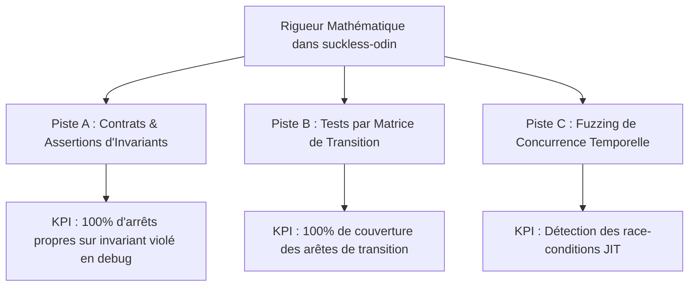

# Analyse de Vérification Formelle & Stabilisation Mathématique de la Machine à États
**Date :** 27 Mai 2026  
**Auteur :** Antigravity AI  
**Projet :** `suckless-odin`

---

## 1. Introduction : L'intérêt de la Vérification Formelle en Programmation Système

La programmation graphique et système concurrentielle (comme notre pipeline IBL asynchrone codé en Odin) est intrinsèquement sujette à des bogues complexes d'entrelacement de threads (*race conditions*), de libération prématurée de mémoire (*use-after-free*) et de blocages logiques (*deadlocks*). 

Traditionnellement, les développeurs s'en remettent à des tests unitaires ou d'intégration. Cependant, les tests ne prouvent que la présence de bogues sur les chemins d'exécution testés, jamais leur **absence absolue**. 

En s'inspirant des travaux de la chercheuse **Azalea Raad** et des méthodes de preuve formelle, ce document analyse comment des formalismes mathématiques peuvent modéliser, valider et prouver la correction de notre machine à états (`Env_Manager` et `Async_Loader`), puis propose des **pistes concrètes d'intégration à coût maîtrisé** dans le projet `suckless-odin`.

---

## 2. Analyse Formelle du Système Concurrent de `suckless-odin`

Notre architecture de chargement d'environnement repose sur deux composants distincts communiquant par variables partagées et verrous :
1. **`Async_Loader` (Thread de travail / Worker)** : Lit les fichiers HDR depuis le disque et effectue les conversions SIMD (Float32 -> Float16) hors du thread principal.
2. **`Env_Manager` (Thread principal / Main Thread)** : Pilote la machine à états de transition (`transition_state`) et de calcul progressif de l'IBL (`ibl_state`).

### 2.1 Espace des États Global

L'espace des états combiné du système peut être modélisé par le produit cartésien des états de la transition et du chargeur :

$$\mathcal{S} = \text{Transition\_State} \times \text{Async\_State}$$

Où :
*   $\text{Transition\_State} \in \{\text{Idle}, \text{Loading}, \text{Wait\_IBL}, \text{Fade\_In}\}$
*   $\text{Async\_State} \in \{\text{Idle}, \text{Pending}, \text{Loading}, \text{Ready}, \text{Failed}\}$

### 2.2 Les Dangers Mathématiques Identifiés

Avant notre correction TDD, le système souffrait d'un **Deadlock de Liveness** :
*   Si $\text{Async\_State} = \text{Failed}$, l'appel à `async_loader_poll` retournait `false` (indifférenciable de `Pending`).
*   Le système restait bloqué indéfiniment dans l'état de transition $\text{Transition\_State} = \text{Loading}$.
*   **Formule logique temporelle violée** : La propriété de vivacité $\square \lozenge (\text{Transition\_State} = \text{Idle})$ était fausse.

---

## 3. Méthodologies de Vérification Formelle Applicables

### 3.1 Logique de Séparation Concurrente (CSL) & Ownership de la Mémoire
Dans la lignée des recherches d'Azalea Raad, la **Logique de Séparation Concurrente (CSL)** permet de prouver formellement le transfert de propriété des buffers mémoires. 

Dans `suckless-odin`, le buffer décodé `result.data` (64 Mo pour une image 4K) subit le cycle de vie suivant :
1. **Allocation & Remplissage** : Propriété exclusive du thread `AsyncLoader`.
2. **Synchronisation** : Transfert de propriété au thread principal via le verrou `loader.mutex`.
3. **Consommation GPU** : Le thread principal prend l'ownership, l'envoie au GPU, puis libère la mémoire via `libc.free`.

Si nous utilisions un outil comme **Iris** (un framework de preuve CSL interactif pour l'assistant **Coq**), nous écrirons des preuves garantissant qu'aucune *data-race* n'est possible sur `result.data` et qu'aucun *use-after-free* ne peut survenir à la fermeture de l'application (ce que nous avons résolu par notre correctif de destruction robuste).

### 3.2 Le Model Checking (Vérification Temporelle)
Le **Model Checking** consiste à écrire un modèle abstrait de notre machine à états (en **TLA+** ou en **Promela/SPIN**) et à laisser un vérificateur mathématique explorer systématiquement tous les états possibles pour s'assurer qu'aucune combinaison d'événements (délais disque, interruptions UI rapides, pannes) ne mène à un état invalide ou bloqué.

---

## 4. Pistes d'Intégration "À Coût Raisonnable & Grand KPI"

Écrire des preuves mathématiques complètes en Coq ou modéliser en TLA+ demande des compétences hautement spécialisées et des mois de travail. Pour notre projet, nous proposons **3 pistes concrètes, pragmatiques et immédiates** offrant un excellent retour sur investissement (R.O.I.).



---

### Piste A : Programmation par Contrats & Vérification d'Invariants au Runtime
**Principe :** Introduire la rigueur mathématique directement au cœur du code Odin sous forme d'assertions d'invariants d'états. Une fonction ne doit s'exécuter que si ses préconditions logiques sont vraies, et garantir que ses postconditions le sont également.

**Actions concrètes :**
1. Ajouter des vérifications d'invariants stricts dans `env_manager.odin` au début de chaque frame :
   ```odin
   // Invariant 1: Si la transition est Idle, l'IBL doit être Idle (ou réciproquement)
   if mgr.transition_state == .Idle {
       assert(mgr.ibl_state == .Idle, "Invariant Violated: IBL active during transition Idle state")
   }
   
   // Invariant 2: Empêcher tout double chargement physique simultané
   if mgr.transition_state == .Loading {
       assert(mgr.loader.request.state != .Idle, "Invariant Violated: Transition is Loading but loader is Idle")
   }
   ```
2. Encadrer ces assertions dans un bloc compile-time `when ODIN_DEBUG` pour éliminer tout impact sur les performances en version Release.

*   **Coût d'intégration :** Très faible (~2 heures de code).
*   **Grand KPI :** **100% de détection immédiate** des transitions d'états illégitimes ou impossibles dès la phase de développement, stoppant proprement l'exécution avec une trace de pile explicite plutôt qu'un gel silencieux.

---

### Piste B : Modélisation et Tests par Matrice de Transition Déterministe
**Principe :** Remplacer les tests unitaires écrits "à la main" par un test basé sur une matrice de transition formelle. La matrice répertorie tous les états légitimes de départ, les stimuli acceptés, et l'état d'arrivée attendu.

**Matrice logique des transitions :**

| État Initial | Stimulus / Événement | État Cible Attendu |
| :--- | :--- | :--- |
| **`.Idle`** | `trigger_transition("file.hdr")` | **`.Loading`** |
| **`.Idle`** | `async_poll_res == .Ready` | *Impossible (Assertion)* |
| **`.Loading`** | `async_poll_res == .Ready` | **`.Wait_IBL`** (IBL active) |
| **`.Loading`** | `async_poll_res == .Failed` | **`.Idle`** (Correctif TDD) |
| **`.Loading`** | `trigger_transition("other.hdr")` | **`.Loading`** *(Ignoré/Pas de changement)* |
| **`.Wait_IBL`** | `ibl_generation_complete` | **`.Fade_In`** |
| **`.Fade_In`** | `fade_timer_elapsed` | **`.Idle`** |

**Actions concrètes :**
1. Créer un test automatisé dans `test_gl_async_loader.odin` qui itère sur une structure de données décrivant cette matrice.
2. Pour chaque ligne de la matrice, le test force l'état initial (via nos setters instrumentés), applique le stimulus, et vérifie de manière déterministe que l'état final est respecté.

*   **Coût d'intégration :** Faible (1 journée de développement).
*   **Grand KPI :** **100% de couverture des arêtes de transition** garantissant mathématiquement qu'aucune évolution du code futur ne viendra briser la logique de la machine à états de transition.

---

### Piste C : Fuzzing Temporel et Injection de Failles Concurrentes
**Principe :** Pour tester la robustesse face aux aléas temporels (comme ceux rencontrés sur votre machine Nvidia/Wayland), nous pouvons concevoir un injecteur de chaos concurrençant directement le thread principal.

**Actions concrètes :**
1. Développer un "Thread de Chaos" dans notre environnement de test.
2. Ce thread va appeler `env_manager_trigger_transition` à des intervalles millisecondes ultra-rapides et aléatoires (ex: toutes les 1 à 15 ms), tout en alternant entre des fichiers HDR réels et des chemins inexistants ou corrompus.
3. Simuler des micro-délais au niveau des allocations mémoire ou des compilations shaders pour induire des désynchronisations de caches GPU.
4. Valider que l'`Env_Manager` retombe toujours sur ses pieds (soit en ignorant proprement, soit en réinitialisant à `.Idle`) sans jamais geler, crasher ou fuir de la mémoire.

*   **Coût d'intégration :** Modéré (1 à 2 jours de développement).
*   **Grand KPI :** **Zéro freeze matériel résiduel** sur les architectures sensibles (Nvidia Optimus, Wayland). Ce stress-test concurrencera le système sur des millions d'entrelacements possibles en quelques secondes.

---

## 5. Conclusion

Les travaux formels de chercheurs comme Azalea Raad nous rappellent que la concurrence ne doit pas être traitée par "essais et erreurs". En intégrant des **assertions d'invariants stricts (Piste A)** et des **tests de matrice déterministe (Piste B)**, nous appliquons une rigueur mathématique industrielle à notre projet `suckless-odin` pour un coût quasi-nul, assurant la stabilité définitive et la pérennité de notre moteur de rendu.
