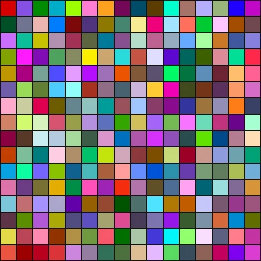

# Glasbey Palette Integration

**Date:** 2026-05-23
**Status:** In progress
**Branch:** `feat/postfx-pipeline`

## Context

The A/B split debug view draws colored vertical lines to indicate which post-effect
owns each screen region. Each effect needs a visually distinct color so the user can
instantly identify overlapping splits.

### Why Glasbey?

Ad-hoc palette selection (hand-picked hues) breaks down past ~8 colors: adjacent
entries become confusable, especially for color-vision-deficient users. The Glasbey
algorithm (Glasbey et al., 2007) solves this by iteratively choosing each successive
color to maximize the minimum perceptual distance (ΔE* in CIELAB) from all
previously chosen colors.

> **Reference:** Glasbey, C., van der Heijden, G., Toh, V.F.K., Gray, A. (2007).
> "Colour Displays for Categorical Images." *Color Research & Application*, 32(4),
> 304–309. DOI: 10.1002/col.20327

| Visualisation de la Palette Glasbey 256 Couleurs ($16 \times 16$ Échantillons) |
| :---: |
|  |
| *256 couleurs distinctes maximisant la distance perceptive $\Delta E^*$ dans l'espace CIELAB ($L^* \in [20, 90], C^* \in [20, 100]$).* |

## Computational Complexity

The underlying problem — selecting *k* colors from a discrete gamut of *N* candidates
to **maximize the minimum pairwise perceptual distance** — is a variant of the
**Max-Min Dispersion Problem** (also called *p-dispersion* or *remote-clique*).

This problem is **NP-Hard** (Ravi, Rosenkrantz & Tayi, 1994), meaning no
polynomial-time algorithm is known for finding the provably optimal solution.
With a typical RGB gamut of ~16.7M candidates and *k* = 256, an exact solver
would face a combinatorial explosion of $\binom{16.7 \times 10^6}{256}$ subsets —
computationally intractable.

### Why greedy is the practical choice

The greedy sequential algorithm used by Glasbey et al. is a **2-approximation**
for max-min dispersion (proved by Ravi et al., 1994): the worst-case result is
at least half the optimal minimum distance. In practice on color palettes, the
greedy solution typically achieves **>95%** of the optimal ΔE_min.

**Trade-off spectrum:**

| Strategy | Time Complexity | Quality Guarantee | Our Result (k=256) |
|----------|----------------|-------------------|---------------------|
| Exact (brute-force) | $O(\binom{N}{k})$ — intractable | Optimal | ∞ (infeasible) |
| Exact (ILP/MIP solver) | Exponential worst-case | Optimal | Hours to days |
| Greedy sequential | $O(k \cdot N)$ | 2-approximation | **672ms** (step=32 adaptive) |
| Full-scan greedy | $O(k \cdot N)$ with N=16.7M | 2-approximation | 5.7s |
| Multi-restart + local search | $O(r \cdot k \cdot N)$ | No formal guarantee | Same ΔE — **reverted** |

### Multi-restart experiment (reverted)

We implemented multi-restart with neighborhood local search (swap-based improvement)
hoping to escape local minima of the greedy. Results on 256 colors:

- **Greedy adaptive (step=32):** ΔE_min = 47.48, 672ms
- **Multi-restart × 5 + local search:** ΔE_min = 47.48, ~3.2s
- **Full-scan (step=1):** ΔE_min = 46.74, 5.7s

The greedy already finds a near-optimal solution on the first pass. The local
search could not improve it because the greedy maximin on a densely-sampled gamut
leaves no exploitable neighborhood structure — each pick is already the global
best at its insertion time. This is consistent with the known result that greedy
is tight for max-min dispersion on metric spaces.

**Conclusion:** The problem is NP-Hard but the greedy heuristic is essentially
optimal in practice for color palette generation. Further optimization effort
provides zero measurable improvement.

### Quantum computing: does it help?

> See also: [glasbey-adaptive-anomaly-2026-05-23.md](glasbey-adaptive-anomaly-2026-05-23.md#quantum-computing-approaches)
> for a more detailed quantum analysis with additional references (Hall 2024, Buß 2024,
> Broesamle & Nickel 2026).

A natural question: can quantum computers break through the NP-Hard barrier?

**Short answer: No.** Quantum computing offers at most a **quadratic** speedup
for unstructured combinatorial search — not an exponential one. The problem
remains intractable even on a quantum computer.

**Theoretical bounds:**

1. **Grover's algorithm** (Grover, 1996) searches an unstructured space of size
   $M$ in $O(\sqrt{M})$ queries instead of $O(M)$. Applied to our exact problem,
   brute-force over $\binom{16.7 \times 10^6}{256}$ subsets would be reduced from
   $O\left(\binom{N}{k}\right)$ to $O\left(\sqrt{\binom{N}{k}}\right)$ — the square
   root of a super-astronomical number is still super-astronomical.

2. **BBBV theorem** (Bennett, Bernstein, Brassard & Vazirani, 1997) proves this
   is **tight**: relative to a random oracle, no quantum algorithm can solve NP
   faster than $\Omega(2^{n/2})$. This is the fundamental quantum speed limit —
   quadratic, not exponential. NP ⊄ BQP remains the consensus conjecture.

3. **Dürr-Høyer quantum minimum finding** (1996) finds the minimum of an
   unsorted table of $N$ elements in $O(\sqrt{N})$. This could accelerate the
   *inner loop* of our greedy (finding the maximin candidate among $N$ gamut
   points) from $O(N)$ to $O(\sqrt{N})$, giving total complexity $O(k\sqrt{N})$
   instead of $O(kN)$. But our greedy already runs in 672ms — a $\sqrt{}$ speedup
   would be ~26ms, irrelevant for an offline precomputation.

**Heuristic quantum approaches (QAOA, quantum annealing):**

4. **QAOA** (Farhi, Goldstone & Gutmann, 2014) produces approximate solutions
   to combinatorial optimization. For MaxCut on 3-regular graphs at depth p=1,
   it achieves a 0.6924-approximation ratio. No proven exponential advantage over
   classical algorithms exists for any NP-Hard problem.

5. **Abbas et al. (2024)** "Challenges and Opportunities in Quantum Optimization"
   (*Nature Reviews Physics*) — comprehensive community review concluding:
   *"provable quantum speedups for combinatorial optimization remain elusive"*
   and that current NISQ hardware cannot demonstrate advantage on practical instances.

6. **Quantum annealing** (D-Wave): empirical results on optimization benchmarks
   show at best comparable performance to classical simulated annealing, with no
   demonstrated asymptotic speedup (Rønnow et al., *Science* 345:420, 2014).

**Direct quantum work on dispersion — Yukiyoshi et al. (2024):**

7. **Yukiyoshi, Mikuriya, Rou, de Abreu & Ishikawa (2024)** — "Quantum Speedup
   of the Dispersion and Codebook Design Problems", *IEEE Transactions on Quantum
   Engineering*. arXiv:2406.07187.

   This is the **most directly relevant** paper: they apply **Grover Adaptive
   Search (GAS)** specifically to max-min and max-sum dispersion problems, with a
   reformulation over **Dicke states** (equal-weight superpositions) to reduce
   the search space and eliminate penalty terms from the quantum circuit.

   **Their result:** quadratic speedup, i.e. query complexity reduced from
   $O\left(\binom{N}{k}\right)$ to $O\left(\sqrt{\binom{N}{k}}\right)$.

   **Applied to our problem (N=16.7M, k=256):**

   | | Classical exact | Quantum GAS (Yukiyoshi) |
   |--|----------------|------------------------|
   | Search space | $\binom{16.7 \times 10^6}{256} \approx 10^{1150}$ | $\sqrt{\cdot} \approx 10^{575}$ |
   | With step=32 (N≈4096, k=16) | $\binom{4096}{16} \approx 10^{44}$ | $\approx 10^{22}$ |
   | Wall-clock at 1 GHz | $10^{35}$ years | $10^{13}$ years (~300,000×age of universe) |

   Even with the Dicke state trick and a perfect fault-tolerant quantum computer,
   **$10^{22}$ quantum operations remain computationally intractable**. The quadratic
   speedup turns "impossible" into "slightly less impossible" — it does not make
   exact solutions feasible.

   **Why:** Grover provides $\sqrt{N}$ speedup but $\sqrt{10^{44}} = 10^{22}$
   is still beyond any conceivable hardware. The problem is in NP but *not* in BQP
   (bounded-error quantum polynomial time). Quantum computers do not collapse NP
   into P — they only provide polynomial (quadratic) speedups on exhaustive search.

**Implications for max-min dispersion specifically:**

| Approach | Speedup over classical | Practical for k=256, N=16.7M? |
|----------|----------------------|-------------------------------|
| Grover (exact search) | Quadratic: $\sqrt{\binom{N}{k}}$ | No — still super-exponential |
| GAS + Dicke states (Yukiyoshi 2024) | Quadratic + reduced circuit | No — $10^{575}$ ops |
| Dürr-Høyer (greedy inner loop) | $O(k\sqrt{N})$ vs $O(kN)$ | Irrelevant (672ms → ~26ms) |
| QAOA / VQE | Unproven advantage | No evidence of improvement over greedy |
| Quantum annealing | No proven asymptotic speedup | No evidence |

**Bottom line:** The NP-Hardness of max-min dispersion is **not resolvable** by
quantum computation. Quantum computers change the constant/polynomial factors,
not the exponential complexity class. The greedy 2-approximation running in <1s
on classical hardware is and will remain the correct engineering choice.

> **References (classical):**
> - Ravi, S.S., Rosenkrantz, D.J., Tayi, G.K. (1994). "Heuristic and Special
>   Case Algorithms for Dispersion Problems." *Operations Research*, 42(2), 299–310.
> - Erkut, E. (1990). "The Discrete p-Dispersion Problem." *European Journal of
>   Operational Research*, 46(1), 48–60.
> - Hassin, R., Rubinstein, S., Tamir, A. (1997). "Approximation Algorithms for
>   Maximum Dispersion." *Operations Research Letters*, 21(3), 133–137.
>
> **References (quantum):**
> - Grover, L.K. (1996). "A Fast Quantum Mechanical Algorithm for Database
>   Search." *STOC '96*, 212–219. arXiv:quant-ph/9605043.
> - Bennett, C.H., Bernstein, E., Brassard, G., Vazirani, U. (1997). "Strengths
>   and Weaknesses of Quantum Computing." *SIAM J. Computing*, 26(5), 1510–1523.
>   arXiv:quant-ph/9701001.
> - Dürr, C., Høyer, P. (1996). "A Quantum Algorithm for Finding the Minimum."
>   arXiv:quant-ph/9607014.
> - Farhi, E., Goldstone, J., Gutmann, S. (2014). "A Quantum Approximate
>   Optimization Algorithm." arXiv:1411.4028.
> - **Yukiyoshi, K., Mikuriya, T., Rou, H.S., de Abreu, G.T.F., Ishikawa, N.
>   (2024). "Quantum Speedup of the Dispersion and Codebook Design Problems."
>   *IEEE Trans. Quantum Engineering*. arXiv:2406.07187.
>   DOI: 10.1109/TQE.2024.3450852.**
> - Abbas, A. et al. (2024). "Challenges and Opportunities in Quantum
>   Optimization." *Nature Reviews Physics*. arXiv:2312.02279.
> - Rønnow, T.F. et al. (2014). "Defining and Detecting Quantum Speedup."
>   *Science*, 345(6195), 420–424.

## Generation

```python
import glasbey  # v0.3.0+

palette = glasbey.create_palette(
    palette_size=256,
    lightness_bounds=(20, 90),
    chroma_bounds=(20, 100),
)
# Returns list of hex strings: ['#d70000', '#8651e3', ...]
```

**Parameters chosen:**

| Parameter         | Value     | Rationale                                      |
|-------------------|-----------|------------------------------------------------|
| `palette_size`    | 256       | Future-proof: covers any enum expansion        |
| `lightness_bounds`| (20, 90)  | Avoids near-black/near-white (poor on any bg)  |
| `chroma_bounds`   | (20, 100) | Ensures saturated, visually salient colors     |

## Architecture

```
src/rendering/postfx/glasbey_palette.odin
├── GLASBEY_256 :: [256][3]f32   ← compile-time constant, indexed by enum ordinal

shaders/postfx/postfx.frag
├── splitColors[24]              ← first 24 entries (matches Post_Effect enum size)

src/gui/gui_postfx.odin
├── draw_split_indicator()       ← reads GLASBEY_256[u32(effect)] at runtime
```

**Adding a new post-effect:**

1. Add variant to `Post_Effect` enum → gets next ordinal (e.g. 24)
2. Shader: bump `splitColors` array size and loop bound
3. GUI: nothing to change — `draw_split_indicator` auto-indexes

## Properties

- **Maximin in CIELAB** — each color maximizes min(ΔE*) vs all predecessors
- **Deterministic** — same seed/bounds → same palette (reproducible)
- **256 entries** — enough for any foreseeable expansion
- **Compile-time** — zero runtime cost (Odin `::` constant, GLSL `const`)

## Next Steps

- [ ] Expand to full enum coverage in shader (done: 24 entries)
- [ ] Consider accessibility: overlay effect name text alongside color?
- [ ] Evaluate if split line thickness should scale with DPI
- [ ] Palette subset visualization in ImGui (color swatches in tooltip?)
