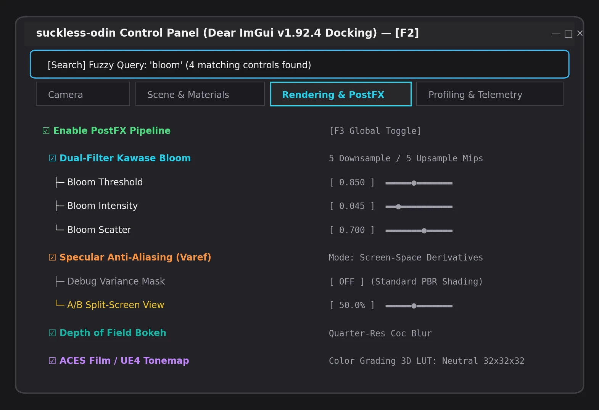

# Dear ImGui Integration — suckless-odin

**Date**: 2026-05-17  
**Branch**: `feat/imgui-integration`  
**Status**: Fonctionnel, tests verts

## Contexte

Intégration de Dear ImGui (v1.92.4-docking) dans le moteur PBR Odin pour
remplacer les raccourcis clavier par une interface graphique unifiée. Toutes
les options de rendu, debug et post-processing sont exposées dans une fenêtre
unique à onglets.

## Dépendance : odin-imgui (submodule)

| Aspect | Valeur |
|--------|--------|
| Upstream | [steinarb1234/odin-imgui](https://github.com/steinarb1234/odin-imgui) |
| Version ImGui | v1.92.4-docking |
| Gestion | Git submodule (`deps/odin-imgui`) |
| Binaire `.a` | Non versionné, construit localement (`task build-imgui`) |
| Mise à jour | `task update-imgui` (pull latest + rebuild) |

### Setup initial après clone

```bash
git submodule update --init              # Récupérer le submodule
task build-imgui                         # Compiler imgui_linux_x64.a (~90s)
task build                               # Build du projet
```

### Mise à jour de la dépendance

```bash
task update-imgui                        # Pull latest upstream + rebuild
# Vérifier que le build + tests passent, puis commit le nouveau pointeur
git add deps/odin-imgui && git commit -m "deps: update odin-imgui to <commit>"
```

## Architecture

```
deps/odin-imgui/          ← Submodule steinarb1234/odin-imgui
├── imgui_linux_x64.a     ← Construit localement (non versionné)
├── imgui.odin            ← Bindings Odin (system:c++ → linker flags)
├── imgui_impl_glfw/      ← Backend GLFW (requiert -lX11)
└── imgui_impl_opengl3/   ← Backend OpenGL3

src/gui/gui.odin          ← Package GUI
├── Gui struct            ← État lifecycle ImGui + focus_search
├── Scene_State struct    ← Pointeurs vers l'état mutable de la scène
├── init/destroy          ← Lifecycle (GLFW + OpenGL3 backends)
├── new_frame/render      ← Frame ImGui
├── update(state)         ← Fenêtre unique + search bar + tab bar
├── draw_tab_camera()     ← Onglet Camera (connecté live)
├── draw_tab_scene()      ← Onglet Scene (connecté live)
├── draw_tab_rendering()  ← Onglet Rendering (placeholders grisés)
├── draw_filtered_view()  ← Vue filtrée par recherche (toutes sections)
├── fuzzy_match()         ← Matching multi-termes insensible à la casse
├── wants_keyboard()      ← Query: ImGui capture-t-il le clavier ?
└── wants_mouse()         ← Query: ImGui capture-t-il la souris ?
```

| Interface Graphique Développeur Dear ImGui ([F2] Docking & Multi-Onglets) |
| :---: |
|  |
| *Panneau unifié : Recherche floue (Fuzzy Search), onglets Camera / Scene / Rendering / Telemetry, sliders PBR et toggles PostFX.* |

## Design decisions

| Décision | Justification |
|----------|---------------|
| Fenêtre unique + onglets | UX simple, pas de fenêtres multiples à gérer |
| Pas de raccourcis clavier pour les toggles | Tout passe par ImGui (sauf F2 toggle, WASD, Escape) |
| `Scene_State` avec pointeurs | Évite l'import circulaire gui→scene |
| Placeholders `BeginDisabled()` | Interface prête pour le futur, visuellement claire |
| Extra linker flags dans Taskfile.yml | libc++ dans linuxbrew + X11 pour imgui_impl_glfw |

## Contrôles connectés (live)

### Onglet Camera
- Position / Yaw / Pitch (lecture seule)
- Speed, Acceleration, Friction (sliders)
- Sensitivity, Rotation Smoothing, Mouse Smoothing (sliders)
- FOV (slider)
- Head Bobbing enable + fréquence/amplitude
- Reset Camera (bouton)

### Onglet Scene
- Skybox visible (checkbox)
- Skybox Blur LOD (slider)
- Exposure (slider — grisé, pas de tone mapping actif)
- Wireframe (checkbox)

### Onglet Rendering (tout grisé — non implémenté)
- **PBR Debug Modes**: Combo 10 modes (Final PBR, Albedo, Normal, Metallic, Roughness, AO, Irradiance, Prefilter, BRDF LUT, GI Probes)
- **Post-Processing**: Bloom, DoF, Auto-Exposure, Motion Blur, FXAA, Vignette, Film Grain, Chromatic Aberration, Color Grading
- **Debug Views**: Bloom/DoF/Exposure/MB/FXAA/Stencil debug
- **Profiling**: GPU Timeline, GPU Metrics, Perf Mode, Effect Benchmark
- **Scene Debug**: Light Probes, N-Body sim, GI mode, Sort mode
- **Environment**: HDR env cycling, Env LOD blur, Screenshot, Hot-Reload

## Raccourcis clavier restants

| Touche | Action |
|--------|--------|
| Escape | Quitter (toujours actif) |
| F2 | Toggle fenêtre ImGui (toujours actif) |
| Ctrl+F | Focus barre de recherche (quand GUI visible) |
| F1 | Cycle overlay texte |
| F | Fullscreen |
| C | Toggle contrôle caméra souris |
| Space | Reset caméra |
| WASD / QE | Mouvement caméra |
| Scroll | Impulsion vélocité |

## Gestion du focus clavier

| Situation | Comportement |
|-----------|-------------|
| GUI visible, focus sur search input | Touches imprimables (A-Z, 0-9, ponctuation) capturées par ImGui — keybindings app désactivés |
| GUI visible, focus ailleurs dans la fenêtre | Tous les keybindings app actifs |
| GUI visible, Ctrl+F | Place le focus sur la barre de recherche |
| GUI masqué | Tous les keybindings app actifs |
| Touches F1/F2/Escape | Toujours actifs quel que soit le focus ImGui |
| Mouvement caméra (WASD/QE) | Désactivé quand ImGui capture le clavier |

## Recherche de paramètres (fuzzy search)

Barre de recherche en haut de la fenêtre "Engine Controls" :

- **Multi-termes** : les mots séparés par des espaces doivent tous matcher (AND)
- **Insensible à la casse** : `bloom` = `Bloom` = `BLOOM`
- **Recherche sur** : label affiché + mots-clés techniques + nom de section
- **Exemples** :
  - `blur` → Skybox Blur, Env LOD Blur
  - `post-processing` → tous les effets post-FX
  - `debug` → tous les modes debug/profiling
  - `camera speed` → uniquement le slider Speed
- **Mode filtré** : affichage plat groupé par catégorie (remplace les onglets)
- **Aucun résultat** : message rouge "No matching parameters"
- **Ctrl+F** : raccourci pour placer le focus sur la barre

## Compilation

```bash
task build-imgui    # (initial) Compile imgui_linux_x64.a depuis les sources
task build          # Build debug (linke ImGui via extra-linker-flags)
task update-imgui   # Met à jour le submodule + rebuild
task lint           # odin check -vet -strict-style -warnings-as-errors
task test           # 16 tests GL + 31 unit tests
```

## Problèmes résolus

1. **`-lc++` linker error** → `extra-linker-flags:"-L/home/linuxbrew/.linuxbrew/lib"` dans Taskfile.yml
2. **X11 undefined refs** → `-lX11` dans extra-linker-flags (imgui_impl_glfw v1.92+ appelle X11 directement)
3. **Unused import `gl`** → Retiré du package gui
4. **Tone mapping cassait le rendu ISO** → Retiré du shader, exposure grisée dans l'UI
5. **Import circulaire gui↔scene** → `Scene_State` struct avec pointeurs bruts
6. **`glfwGetPlatform` undefined in CI** → Ubuntu `libglfw3-dev` = 3.3.x, GLFW 3.4+ requis → build from source via `deps/odin-imgui/backend_deps/glfw`
7. **Memory leaks (7, 23 KB)** → `os.read_entire_file` sans `defer delete`, `strings.clone_to_cstring` sans free → corrigé avec defer discipline systématique

## Prochaines étapes

1. Implémenter le tone mapping via post-process FBO (dé-griser Exposure)
2. Brancher PBR debug mode (uniform `debugMode` dans le shader)
3. Ajouter hot-reload shaders
4. Implémenter le pipeline post-process (bloom, DoF, etc.)
5. Screenshot via `glReadPixels` + stb_image_write
