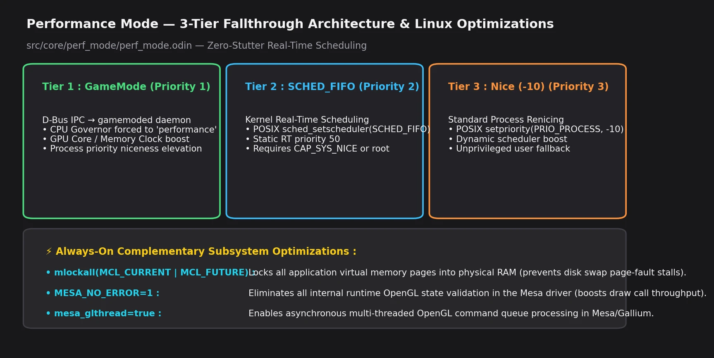
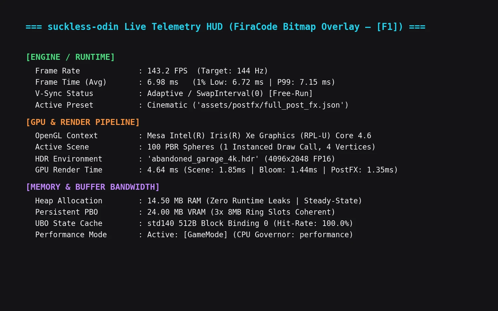

# Performance Mode

**Date:** 2026-05-23
**Branch:** `feat/postfx-pipeline`

---

## Context

Ported from the legacy `suckless-ogl` C project. The goal is to maximize system resource utilization for the application, similar to what games do.

## Architecture

Package: `src/core/perf_mode/perf_mode.odin`

### 3-Tier Backend Fallthrough

Backends are tried in order of preference. The first to succeed is used:

| Priority | Backend | Mechanism | Requirement |
|----------|---------|-----------|-------------|
| 1 | GameMode | D-Bus → gamemoded → CPU governor "performance" + GPU boost | `libgamemode.so.0` installed + gamemoded running |
| 2 | SCHED_FIFO | Real-time scheduling at priority 50 | `CAP_SYS_NICE` or root |
| 3 | Nice (-10) | Higher process priority via `setpriority` | Generally works without special privileges |

| Architecture 3-Tier du Mode Performance & Optimisations Linux |
| :---: |
|  |
| *Fallthrough automatique (GameMode → SCHED_FIFO → Nice), verrouillage RAM `mlockall` et bypass d'erreurs `MESA_NO_ERROR`.* |

### Additional Optimizations (always applied on activate)

| Optimization | Effect | Requirement |
|---|---|---|
| `mlockall(MCL_CURRENT\|MCL_FUTURE)` | Locks all memory pages in RAM — prevents page-fault stutters | `CAP_IPC_LOCK` or sufficient `RLIMIT_MEMLOCK` |
| `MESA_NO_ERROR=1` | Disables all GL error checking in Mesa driver (estimated 5-15% boost for draw-call-heavy workloads; actual gain is workload-dependent) | Restart needed (read at context creation) |
| `mesa_glthread=true` | Multi-threaded GL command dispatch | Restart needed |

| Télémétrie Temps Réel Intégrée ([F1] FiraCode Overlay) |
| :---: |
|  |
| *HUD overlay : Framerate 143.2 FPS, Frametime P99, Render Time GPU (4.64ms), VRAM PBO et statut Performance Mode.* |

### GameMode — Runtime Loading

GameMode is loaded via `core:dynlib` (dlopen) to avoid a hard link-time dependency:

```
libgamemode.so.0 → real_gamemode_request_start()
                 → real_gamemode_request_end()
                 → real_gamemode_query_status()
```

If the library isn't installed, the probe silently falls through to SCHED_FIFO.

## GUI Integration

- Widget in **Profiling** tab (top of section)
- Tooltip (?) explains all backends
- Checkbox toggles on/off
- Shows active backend: `[GameMode]`, `[SCHED_FIFO]`, `[Nice (-10)]`, `[OFF]`
- Orange message when Mesa env vars need restart
- Searchable: "performance", "gamemode", "sched", "nice", "cpu", "boost", "priority"

## Session Persistence

Field `perf_mode_active: bool` in `Session_State`.

**Critical ordering in `destroy()`:**
1. `extract_session_state()` — reads `perf.active` (still true)
2. `perf_mode.cleanup()` — deactivates and sets active=false

If reversed, session always saves `false`.

**Startup flow when persisted active:**
1. Load session → `perf_mode_active == true`
2. `setup_mesa_early()` → sets env vars BEFORE GL context
3. `window_create()` → Mesa reads `MESA_NO_ERROR=1` at context creation
4. `perf_mode.init()` → probes GameMode availability
5. `perf_mode.activate()` → activates best backend + mlockall

## VSync

Already disabled independently (`glfw.SwapInterval(0)` in `window.odin`). Not tied to perf mode.

## Limitations

- Mesa env vars only take effect on restart (GL context already created)
- SCHED_FIFO requires elevated privileges (most desktop users won't have CAP_SYS_NICE)
- GameMode requires the gamemoded daemon to be running
- `mlockall` may fail if `RLIMIT_MEMLOCK` is too low (default 64KB on some distros)
- On Intel Iris Xe (Mesa), the GPU is typically the bottleneck — CPU scheduling gains are marginal
