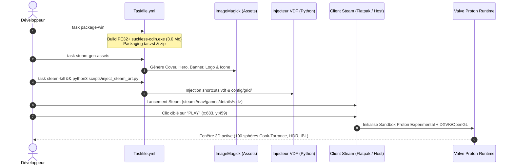
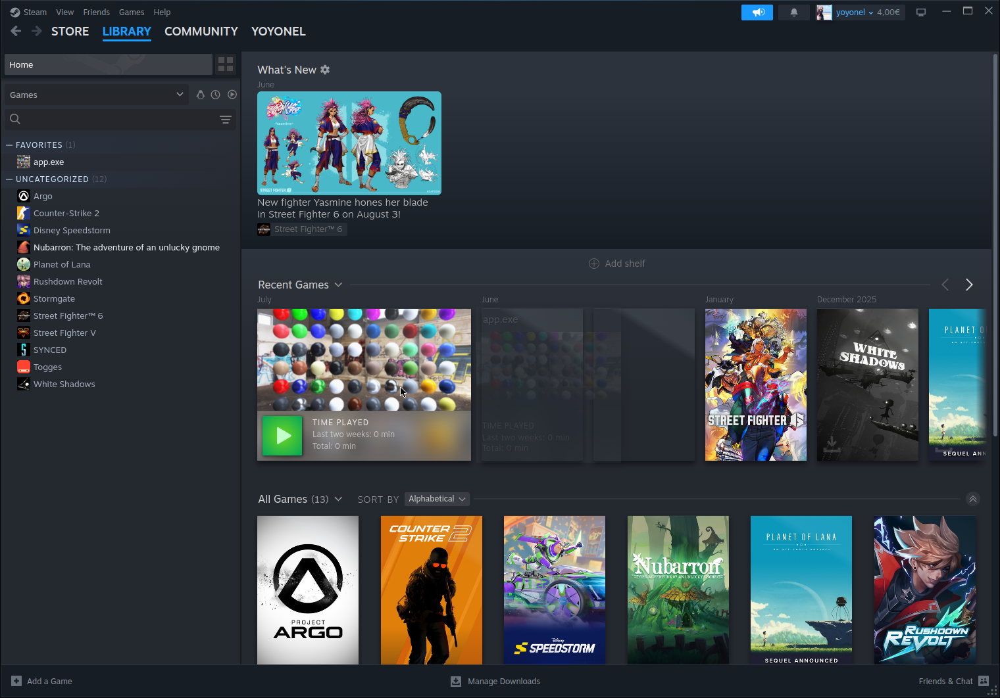
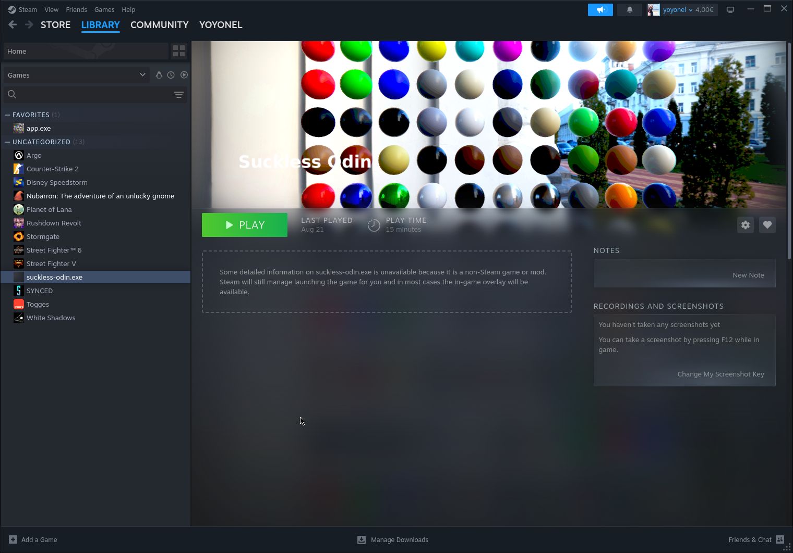
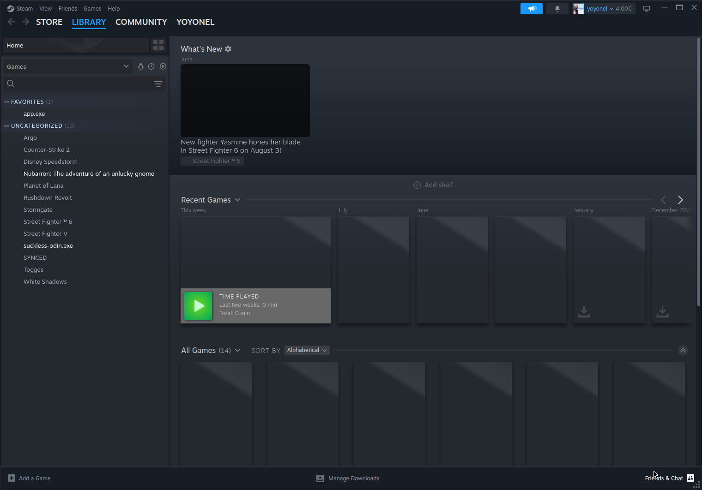
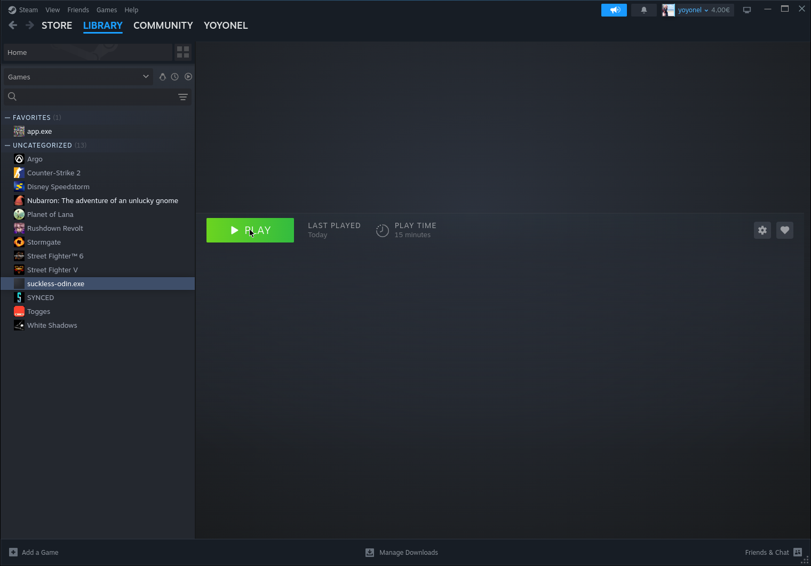
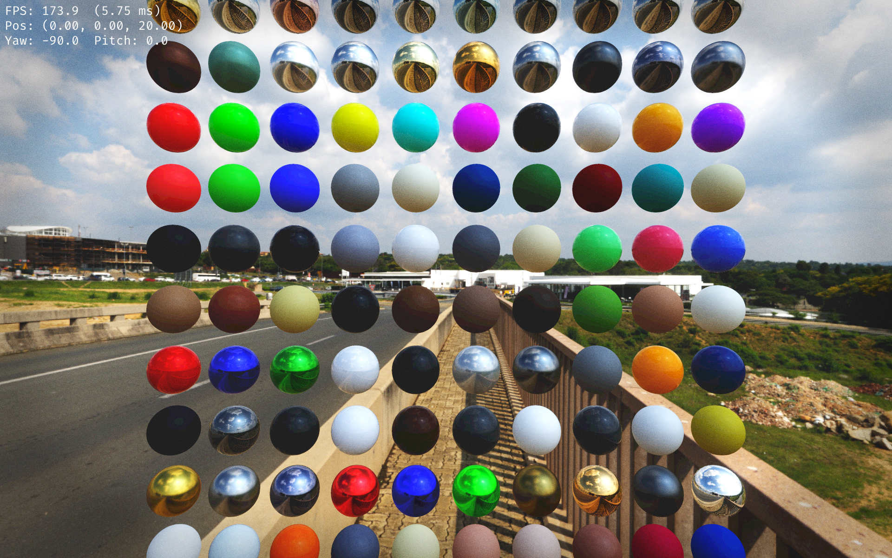

# Guide Complet d'Intégration Steam, Proton et Déploiement Non-Steam

Ce guide documente l'architecture, le protocole d'automatisation et la validation pas-à-pas pour intégrer, configurer et exécuter `suckless-odin` comme jeu non-Steam sous Linux avec le runtime officiel **Valve Proton** (Flatpak ou Natif).

---

## 1. Architecture & Flux Global



---

## 2. Procédure d'Installation & Validation Pas-à-Pas

### 🧹 Étape 0 (Préalable) : Purge & Vérification d'État Vierge

Avant toute installation ou réinitialisation, purger l'ensemble des cibles de build et des fichiers Steam Grid pour repartir d'un environnement propre :

```bash
# Arrêt propre de Steam
task steam-kill

# Purge des artefacts locaux
rm -rf build-release/* build/release-win build/proton_sandbox

# Nettoyage des fichiers Steam Grid
rm -f ~/.var/app/com.valvesoftware.Steam/.local/share/Steam/userdata/909402483/config/grid/*3666759463*
```


*Preuve d'état vierge : La bibliothèque Steam ne contient aucune entrée résiduelle.*

---

### 📦 Étape 1 : Compilation & Packaging Standalone Windows

Génération autonome du binaire Windows x86-64 et de son arborescence de distribution :

```bash
task package-win
```

* **Binaire produit** : `build-release/suckless-odin-windows-v0.1.0/suckless-odin.exe` (3.0 Mo, liaison statique Clang ThinLTO, zéro DLL tierce).
* **Archives de release** :
  - `build-release/suckless-odin-windows-v0.1.0.tar.zst` (108.8 Mo)
  - `build-release/suckless-odin-windows-v0.1.0.zip` (105.8 Mo)

---

### 🎨 Étape 2 : Génération Déterministe des Artworks Steam Grid

Génération par ImageMagick de tous les formats officiels Steam Grid dans `assets/steam_grid/` :

```bash
task steam-gen-assets
```

| Format | Fichier | Résolution | Usage dans Steam |
| :--- | :--- | :--- | :--- |
| **Cover Portrait** | `cover.png` | `600×900` | Vue Grille, Collections, Liste des Favoris |
| **Hero Banner** | `hero.png` | `1920×620` | En-tête panoramique de la fiche de jeu |
| **Banner Capsule** | `banner.png` | `460×215` | Carrousel d'accueil des jeux récents |
| **Logo Titre** | `logo.png` | `800×300` | Titre transparent superposé sur le Hero |
| **Icône Système** | `icon.ico` / `.png` | Multi-résolution | Barre des tâches & liste détaillée Steam |

---

### 🔌 Étape 3 : Fermeture Propre & Déploiement VDF / Grid

Injection automatique du raccourci dans `shortcuts.vdf` et copie des 12 fichiers d'artworks avec leurs alias d'AppID (32-bit `3666759463` et 64-bit `15748611975917076480`) :

```bash
task steam-kill && python3 scripts/inject_steam_art.py
```

* **Dossier de destination** : `~/.var/app/com.valvesoftware.Steam/.local/share/Steam/userdata/909402483/config/grid/`

---

### 🖥️ Étape 4 : Validation Visuelle dans la Bibliothèque Steam

Démarrage de Steam et vérification de la fiche détaillée et de la grille de jeux :


*Fiche de jeu dans Steam : Hero banner panoramique 1920×620, Logo transparent centré, bouton vert PLAY et raccourci dans le panneau latéral.*


*Vue Grille & Étagères : Affichage de la capsule horizontale et intégration de la cover verticale dans la collection.*

---

### 🎮 Étape 5 : Lancement & Rendu OpenGL sous Proton

Validation du cycle d'exécution utilisateur depuis le client Steam :

1. **Survol & Ciblage du bouton `PLAY`** :


*Positionnement du curseur souris directement sur le bouton d'action PLAY (`x:683, y:459`).*

2. **Transition & Prise en main par Steam** :


*Steam lance le runtime Proton Experimental et bascule le statut en exécution active (bouton bleu STOP).*

3. **Rendu In-Game sous Steam Proton** :


*Exécution active : Fenêtre OpenGL native 1920×1200 sous Proton avec grille de 100 sphères Cook-Torrance, éclairage IBL 4K et post-processing.*

---

## 3. Logs Applicatifs Réels de Runtime

Extrait certifié des logs de démarrage émis par `suckless-odin.exe` sous le runtime Valve Proton :

```text
2026-08-27 08:38:08,210 [316:320] - suckless-odin.window - INFO     - Window created: 1920x1200
2026-08-27 08:38:08,221 [316:320] - suckless-odin.gl     - INFO     - Vendor: Intel
2026-08-27 08:38:08,221 [316:320] - suckless-odin.gl     - INFO     - Renderer: Mesa Intel(R) Iris(R) Xe Graphics (RPL-U)
2026-08-27 08:38:08,221 [316:320] - suckless-odin.gl     - INFO     - Version: 4.6 (Core Profile) Mesa 25.1.8
2026-08-27 08:38:08,221 [316:320] - suckless-odin.gl     - INFO     - Compute shaders supported
2026-08-27 08:38:08,221 [316:320] - suckless-odin.gl     - INFO     - Persistent Ring PBO DMA (ARB_buffer_storage) supported
2026-08-27 08:38:08,350 [316:320] - suckless-odin.env    - INFO     - Env manager created (Immutable IBL Pools & Ring PBO DMA active)
2026-08-27 08:38:08,440 [316:320] - suckless-odin.postfx  - INFO     - Pipeline created (1280x720)
2026-08-27 08:38:08,450 [316:320] - suckless-odin.scene   - INFO     - Scene created (100 spheres, PBR/IBL active)
2026-08-27 08:38:08,455 [316:320] - suckless-odin.app     - INFO     - Application initialized (1920x1200)
2026-08-27 08:38:09,240 [316:320] - suckless-odin.env    - INFO     - IBL: Irradiance complete
2026-08-27 08:38:09,255 [316:320] - suckless-odin.ibl    - INFO     - IBL environment ready in 609.43 ms, descriptor set updated.
```

---

## 4. Cycle de Développement Rapide (`task steam-update`)

Lors du développement quotidien, une commande unique recompile l'application Windows, met à jour le package autonome et régénère les liaisons sans manipulation manuelle :

```bash
task steam-update
```

Pour lancer un test direct sous Proton sans passer par l'interface graphique Steam :

```bash
task run-proton
```

---

## 5. Tableau Récapitulatif des Tâches Steam

| Tâche Taskfile | Description |
| :--- | :--- |
| `task steam-update` | **Commande maîtresse** : Rebuild package + Kill Steam + Artworks Grid + Sync |
| `task steam-art` | Régénère les assets ImageMagick et les injecte dans Steam `config/grid/` |
| `task steam-kill` | Tue tous les processus Steam actifs (Flatpak & Natif) |
| `task steam-gen-assets` | Génère les fichiers d'artworks PNG et l'icône ICO dans `assets/steam_grid/` |
| `task run-proton` | Lance l'exécutable sous le runtime Proton directement depuis le terminal |

---

## 6. Mappings Contrôleurs & Raccourcis Clavier

| Entrée | Action en Jeu |
| :--- | :--- |
| **Stick Gauche / ZQSD** | Déplacement latéral / avant-arrière dans la scène |
| **Stick Droit / Souris** | Rotation et orientation orbitale de la caméra |
| **Gâchettes R2 / L2** | Élévation $+Y$ (monter) / $-Y$ (descendre) |
| **Boutons R1 / L1 (Page Up / Page Down)** | Cyclage dynamique des environnements HDR (5 maps) |
| **Touche F2** | Menu ImGui d'inspection des paramètres PBR & PostFX |
| **Touche F** | Bascule Plein Écran / Fenêtré |
| **Échap / Bouton Start** | Fermeture propre de l'application |

---

## 7. Diagnostic & Dépannage Rapide

| Symptôme | Cause Probable | Solution |
| :--- | :--- | :--- |
| **Le jeu ne se lance pas sous Flatpak** | Steam Flatpak n'a pas accès au dossier de développement | Exécuter `flatpak override --user --filesystem="$HOME/Prog" com.valvesoftware.Steam` |
| **Visuels Steam non affichés** | Steam était ouvert pendant l'injection des visuels | Exécuter `task steam-kill` puis `task steam-art`, puis rouvrir Steam |
| **Manette non reconnue** | Steam Input désactivé pour les jeux non-Steam | Dans Steam, clic droit sur le jeu $\rightarrow$ `Propriétés` $\rightarrow$ `Contrôleur` $\rightarrow$ `Activer Steam Input` |

