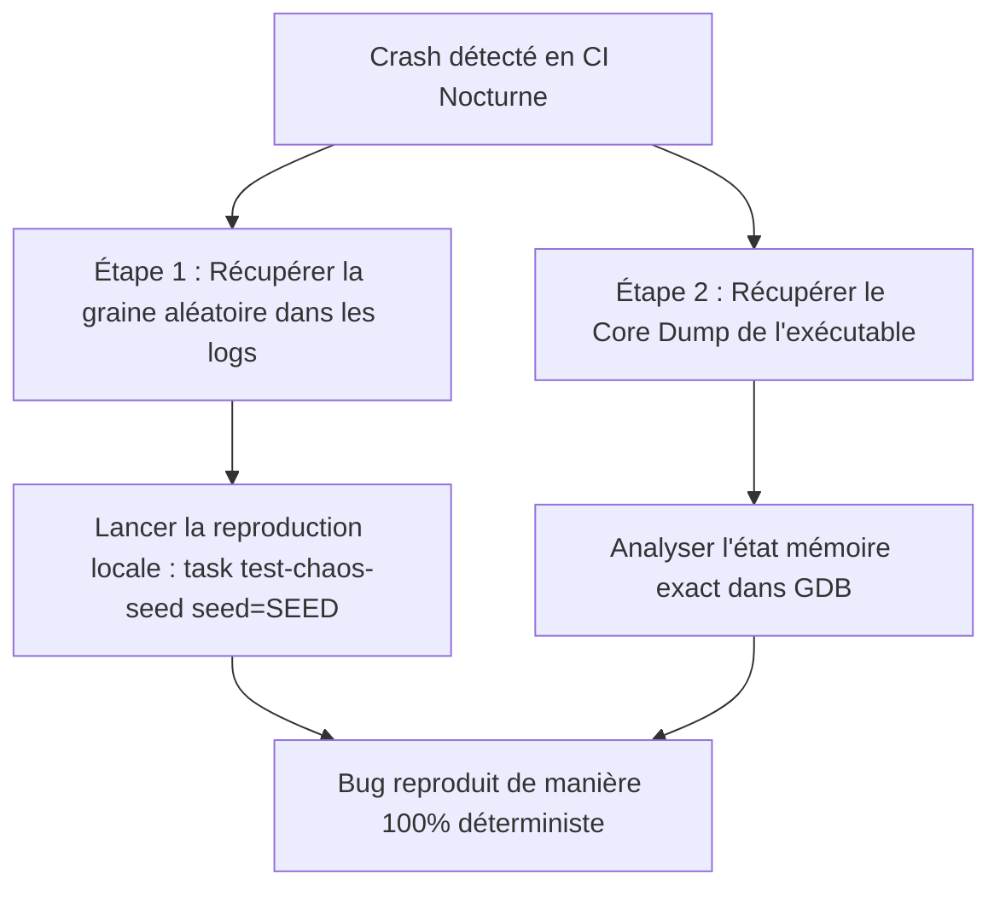

# Stratégie de Fuzzing Temporel & Intégration CI Nocturne

Afin de garantir une stabilité absolue et zéro-deadlock sur les machines Linux/Wayland sous haute charge, nous avons mis en place un **Fuzzer Temporel Stochastique**. Ce document détaille le fonctionnement exploratoire de ce fuzzer, justifie l'intérêt d'une exécution nocturne en Intégration Continue (CI), et propose un protocole complet de capture, de reproduction et de débogage des anomalies détectées.

---

## 1. Nature du Test de Chaos : Exploratoire & Non-Exhaustif

Contrairement aux tests unitaires classiques ou à la matrice de transition de la Phase 2, le test de chaos (`test_env_manager_chaos_stress`) est **intrinsèquement stochastique (probabiliste)**.

### Pourquoi est-ce exploratoire ?
1. **Désynchronisation des Threads** : Le worker thread déclenche des requêtes à des intervalles hautement instables et aléatoires ($[1, 15]$ ms). La boucle principale tournant à $\approx 16$ ms, chaque run provoque des collisions temporelles uniques. La requête de transition peut frapper pendant un transfert progressive de texture, pendant le calcul d'une tranche de mipmap spéculaire, ou pile lors du swap de buffers OpenGL.
2. **Entropie des Données** : Les chemins de fichiers sont sélectionnés au hasard, alternant succès instantanés, chargements progressifs lourds, erreurs d'E/S immédiates (fichiers inexistants) et échecs de validation de chemin.

> [!NOTE]
> À chaque exécution de `task test-chaos`, l'espace des états exploré est totalement différent. C'est l'outil idéal pour attraper des **Heisenbugs** (des bugs de timing critiques qui n'apparaissent qu'une fois sur un million).

---

## 2. Opportunité d'une CI Nocturne (Nightly Run)

**Oui, intégrer ce stress-test dans un pipeline nocturne est une excellente pratique d'ingénierie.**

Dans un moteur graphique hautes performances, les conditions de timing dépendent fortement des charges CPU/GPU de la machine hôte. Faire tourner un stress-test de chaos pendant une période prolongée (ex: 5 minutes chaque nuit sur un runner CI dédié) permet de :
* Découvrir de manière proactive les dérives de performance ou les fuites de ressources.
* Valider la robustesse de l'ordonnanceur et du driver OpenGL (ex. Mesa LLVMpipe ou Nvidia proprietary) sous des millions de permutations d'états.
* Éviter que des régressions asynchrones subtiles n'atteignent la branche principale (`master`/`main`).

---

## 3. Protocole de Reproductibilité sur Poste de Développeur

Pour résoudre efficacement un bug asynchrone détecté sur le runner de CI nocturne, nous devons le rendre **déterministe et reproductible**. Voici le mécanisme en 3 piliers mis en place :



### Pilier A : Reproductibilité de la Graine Aléatoire (Seed)
Le générateur pseudo-aléatoire d'Odin (`core:math/rand`) est déterministe à partir d'une graine de départ.
À chaque exécution de test, le compilateur affiche la graine utilisée dans la console :
```bash
[INFO ] --- Starting test runner.
[INFO ] --- The random seed sent to every test is: 7617283902538. Set with -define:ODIN_TEST_RANDOM_SEED=n.
```

Si le test échoue en CI, il vous suffit de récupérer cette valeur `7617283902538` et de relancer les tests localement avec cette graine exacte. L'enchaînement des chemins et des temps de pause du fuzzer sera **rigoureusement identique** :
```bash
# Lancer la reproduction avec la graine exacte de l'échec
odin test tests/gl/ -define:CHAOS_STRESS=true -define:ODIN_TEST_RANDOM_SEED=7617283902538
```

### Pilier B : Capture des Core Dumps en CI
Pour les crashs brutaux (Segmentation Fault, Assertion ratée), le runner CI (GitHub Actions ou GitLab CI) doit capturer l'image mémoire exacte au moment de l'erreur.

#### Configuration du runner CI (dans `.github/workflows/nightly.yml`) :
```yaml
- name: Enable Core Dumps
  run: ulimit -c unlimited

- name: Run Nightly Chaos Fuzzer
  run: task test-chaos-xvfb || true

- name: Upload Core Dumps & Binaries on Failure
  if: failure()
  uses: actions/upload-artifact@v4
  with:
    name: chaos-crash-report
    path: |
      /tmp/core.*
      /tmp/odin-test-chaos
```

#### Débogage local avec GDB :
Une fois le rapport récupéré, vous chargez le binaire et le core dump dans GDB pour inspecter instantanément la pile d'exécution de tous les threads :
```bash
# Ouvrir GDB avec le binaire de test et le core dump récupéré
gdb /tmp/odin-test-chaos /tmp/core.xxxx

# Dans GDB, afficher l'état de tous les threads
(gdb) info threads
(gdb) thread apply all bt
```

### Pilier C : Analyse par Sanitizers (ThreadSanitizer)
Certaines défaillances de concurrence n'entraînent pas de crash immédiat mais corrompent silencieusement la mémoire.
Nous pouvons configurer une recette de stress nocturne compilée avec le support de **ThreadSanitizer (TSan)** ou **AddressSanitizer (ASan)**.

Nous avons ajouté une cible de diagnostic dédiée dans notre plan d'action de test :
```bash
# Tester localement avec ThreadSanitizer actif pour intercepter les Data Races invisibles
odin test tests/gl/ -sanitize:thread -define:CHAOS_STRESS=true
```

---

## 4. Intégration de la Recette de Reproduction dans le Taskfile.yml

Pour faciliter le travail de l'équipe de dev, nous pouvons ajouter une recette simple au `Taskfile.yml` pour rejouer instantanément une graine de crash :

```yaml
test-chaos-seed:
  desc: Replay the temporal chaos fuzzer with a specific random seed
  cmds:
    - "{{.ODIN}} test tests/gl/ -out:/tmp/odin-test-chaos -debug -thread-count:{{.TEST_THREADS}} -define:ODIN_TEST_THREADS=1 -define:CHAOS_STRESS=true -define:ODIN_TEST_RANDOM_SEED={{.seed}} -extra-linker-flags:\"{{.EXTRA_LINKER_FLAGS}}\""
  vars:
    seed: '{{default "" .seed}}'
```

Pour l'exécuter, utilisez la syntaxe de variable Task :
```bash
task test-chaos-seed seed=7617283902538
```

Cette intégration complète fait du stress-test de chaos un allié de confiance, à la fois exploratoire pour découvrir l'inconnu, et déterministe pour résoudre le connu.
